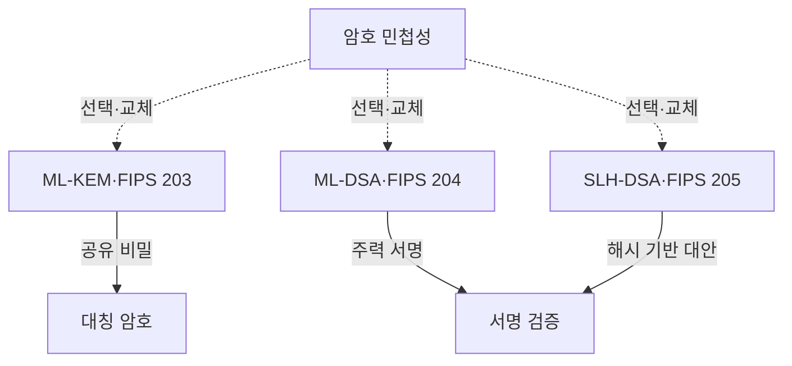
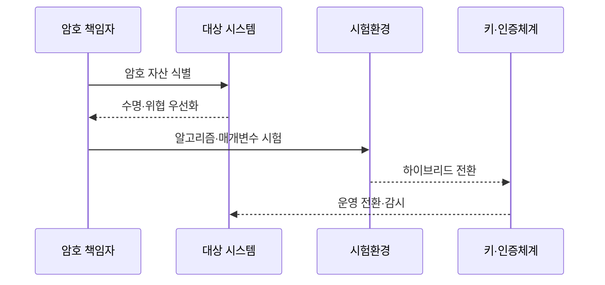

---
sidebar:
  order: 39
  label: "039. NIST PQC 표준화 — FIPS 203/204/205 (NIST PQC FIPS)"
  badge:
    text: "기출 · 70%"
    variant: note
title: "NIST PQC 표준화 — FIPS 203/204/205 (NIST PQC FIPS)"
date: "2026-07-27T23:59:59+09:00"
tags:
  - "notes-law-policy"
weight: 39
extra:
  question_no: "039"
  source_status: "기출"
  source_history: "135회"
  priority: 70
  priority_note: "135회 기출, 양자내성 표준 전환의 핵심축"
---

## 미리 알고가기

- **양자내성암호(Post-Quantum Cryptography, PQC)**: 양자컴퓨터의 공격에도 안전하도록 설계한 공개키 암호기술
- **연방정보처리표준(Federal Information Processing Standards, FIPS)**: 미국 연방기관이 정보시스템에 적용하는 기술 표준
- **지금 수집, 나중 해독(Harvest Now, Decrypt Later, HNDL)**: 현재 암호문을 수집해 두었다가 양자컴퓨터가 실용화된 뒤 해독하는 위협
- **키 캡슐화 메커니즘(Key Encapsulation Mechanism, KEM)**: 공개키를 이용해 공유 비밀키를 안전하게 설정하는 방식
- **디지털 서명 알고리즘(Digital Signature Algorithm, DSA)**: 서명자의 신원과 데이터 무결성을 검증하는 공개키 알고리즘
- **ML-KEM**: 모듈 격자 문제를 기반으로 공유 비밀키를 설정하는 FIPS 203 양자내성 알고리즘
- **ML-DSA**: 모듈 격자 문제를 기반으로 서명과 검증을 수행하는 FIPS 204 양자내성 알고리즘
- **SLH-DSA**: 해시 함수를 기반으로 서명과 검증을 수행하는 FIPS 205 양자내성 알고리즘
- **모듈 격자**: 다차원 격자의 모듈 구조에서 어려운 수학 문제를 보안 근거로 사용하는 방식
- **무상태 해시 서명**: 이전 서명 횟수나 상태를 저장하지 않고 해시 함수로 만드는 디지털 서명
- **암호 민첩성(Crypto Agility)**: 프로토콜·데이터 형식을 크게 바꾸지 않고 알고리즘과 매개변수를 교체하는 능력
- **하이브리드 전환**: 기존 공개키 알고리즘과 PQC를 함께 적용해 한쪽 실패에도 보안을 유지하는 과도기 방식
- **하드웨어 보안 모듈(Hardware Security Module, HSM)**: 암호키를 안전하게 생성·저장하고 암호 연산을 수행하는 전용 장치
- **RSA(Rivest-Shamir-Adleman)**: 큰 정수의 인수분해 난도를 보안 근거로 사용하는 공개키 암호 알고리즘
- **타원곡선암호(Elliptic Curve Cryptography, ECC)**: 타원곡선 이산대수 문제의 난도를 보안 근거로 사용하는 공개키 암호기술

## Ⅰ. 개요

- 정의/개념: NIST가 양자내성 **키 설정·디지털 서명 알고리즘을 규정한 FIPS 203·204·205**
- 기존 한계: RSA·ECC 유지 시 **HNDL·장기 인증 신뢰성 상실 위험** 증가

### 쉽게 이해하기 (학습용)
- 충분한 양자 컴퓨터가 RSA·ECC를 깨기 전에 오래 보호할 데이터와 인증 체계부터 새 공개키 방식으로 옮김

## Ⅱ. 특징

- **FIPS 203 ML-KEM**은 공유 비밀을 설정하고 실제 데이터는 대칭키로 보호한다.
- **FIPS 204 ML-DSA·205 SLH-DSA**는 격자·해시 기반 디지털 서명을 제공한다.
- **매개변수·키·서명 크기·성능·구현 지원**을 용도별로 시험해 전환한다.

### 쉽게 이해하기 (학습용)
- PQC 하나를 설치하는 것이 아니라 통신 키 설정과 인증서·코드 서명을 각각 호환 알고리즘으로 바꿈

## Ⅲ. 아키텍처 및 구성요소

| 설계 요소 | 설명 |
|:---|:---|
| ML-KEM·FIPS 203 | 공유 비밀을 설정하는 KEM |
| 대칭 암호 | 공유 비밀로 실제 데이터 보호 |
| ML-DSA·FIPS 204 | 범용 주력 격자 서명 |
| SLH-DSA·FIPS 205 | 수학 기반을 분산한 해시 서명 |
| 서명 검증 | 송신자 인증·무결성 확인 |
| 암호 민첩성 | 알고리즘·매개변수 선택·교체 |

### 쉽게 이해하기 (학습용)
- ML-KEM은 통신 비밀을 만들고 두 DSA는 서명하며 민첩성이 용도별 교체를 가능하게 함

## Ⅳ. 원리 및 절차 흐름도

| 절차 | 설명 |
|:---|:---|
| 암호 자산 식별 | 알고리즘·키·인증서·장비·데이터 목록화 |
| 수명·위협 우선화 | HNDL·보호기간·교체 난도 평가 |
| 알고리즘·매개변수 시험 | 용도별 크기·지연·상호운용 검증 |
| 하이브리드 전환 | 기존·PQC 병행과 롤백 준비 |
| 운영 전환·감시 | 키·인증서 교체와 오류정정 추적 |

### 쉽게 이해하기 (학습용)
- 오래 숨겨야 할 데이터와 교체가 느린 장비부터 찾고 실제 프로토콜 크기·지연을 시험해 단계적으로 바꿈

## Ⅴ. 종류 및 비교

| NIST PQC 표준 | ML-KEM | ML-DSA | SLH-DSA |
|:---|:---|:---|:---|
| 적용 기준 | 통신·저장 암호용 공유 비밀 | 일반 인증서·코드·문서 서명 | 격자와 다른 보안 근거가 필요할 때 |
| 핵심 특징 | 모듈 격자 기반 키 설정 | 모듈 격자 기반 서명 | 무상태 해시 기반 서명 |
| 한계 | 키·암호문·구현 부담 | 키·서명·구현 부담 | 큰 서명·처리량 부담 |

### 쉽게 이해하기 (학습용)
- 비밀 통신의 키는 ML-KEM, 일반 서명은 ML-DSA, 다른 수학 기반의 대안은 SLH-DSA를 검토함

## Ⅵ. 실무 사례

1. VPN: ML-KEM 하이브리드 연결의 패킷 검증

### 쉽게 이해하기 (학습용)
- 기존 키 설정과 ML-KEM을 함께 써 패킷 분할·지연·중간장비 실패를 확인한 뒤 전환함

## Ⅶ. 결론

- 양자 위협 대응을 위해 수명·상호운용성을 검토하여 **PQC FIPS** 활용

### 쉽게 이해하기 (학습용)
- FIPS 번호만 고르지 말고 키 설정·서명 용도와 데이터 수명에 맞춰 시험·교체 가능한 구조로 옮겨야 함
