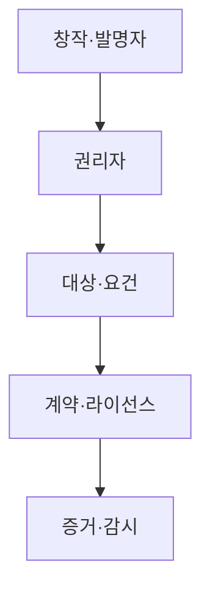
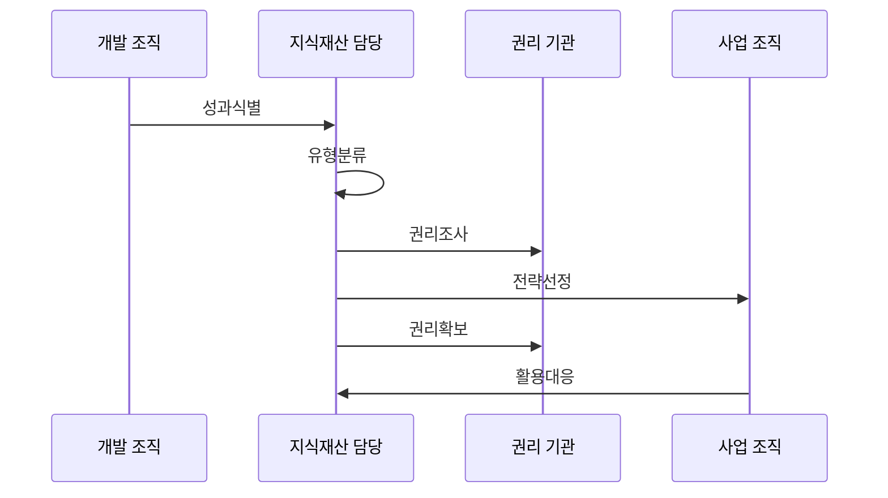

---
sidebar:
  order: 40
  label: "040. 지식재산권 — 특허·저작권·상표·영업비밀 (Intellectual Property Rights)"
  badge:
    text: "기출 · 50%"
    variant: note
title: "지식재산권 — 특허·저작권·상표·영업비밀 (Intellectual Property Rights)"
date: "2026-07-25T01:45:00+09:00"
tags:
  - "notes-law-policy"
weight: 40
extra:
  question_no: "040"
  source_status: "기출"
  source_history: "135회"
  priority: 50
  priority_note: "135회 기출, 권리 유형·보호 요건 비교"
---

## 미리 알고가기

- **지식재산권(Intellectual Property Rights, IPR)**: '아이피아르'로 읽고 영문 머리글자로 발명·창작·표현물에 대한 법적 권리를 표시
- **실시 자유(Freedom to Operate, FTO)**: '에프티오'로 읽고 영문 머리글자로 타인 특허를 침해하지 않고 사업화할 수 있는지를 표시
- **인공지능(Artificial Intelligence, AI)**: '에이아이'로 읽고 영문 머리글자로 창작 주체와 학습 데이터 침해 쟁점이 되는 기술을 표시

## Ⅰ. 개요

- **정의/개념**: 발명·표현·비밀 정보의 법적 보호와 활용 체계
- **배경/필요성**: 독점권 보장과 타인 권리 침해 분쟁 예방

### 쉽게 이해하기 (학습용)
- 기술 개발 성과물을 특허로 공개해 독점할지, 아니면 내부 노하우(영업비밀)로 감추어 평생 지킬지 결정하고 보호받는 수단입니다.

## Ⅱ. 특징

- 권리별 보호 요건·기간이 서로 다르다.
- 특허·상표는 등록, 저작권은 창작 즉시 효력이 난다.
- 영업비밀은 비공지·비밀 관리가 보호를 좌우한다.
- 외주 계약은 직무 발명 귀속을 명시해야 한다.

### 쉽게 이해하기 (학습용)
- 개발 외주 비용을 다 지급했더라도 계약서에 저작권이나 특허 귀속 주체를 적지 않으면 분쟁이 발생할 수 있습니다.

## Ⅲ. 아키텍처 및 구성요소

| 설계 요소 | 설명 |
|:---|:---|
| 창작·발명자 | 기여 내용·시점과 직무발명을 기록함 |
| 권리자 | 출원·관리·허락·분쟁 권한을 보유함 |
| 대상·요건 | 권리별 보호 대상과 성립 요건을 검토함 |
| 계약·라이선스 | 소유권·이용범위·기간·대가를 정함 |
| 증거·감시 | 등록·비밀조치·사용·침해 증거를 관리함 |

> 요약: 성과 성격에 따른 권리별 포트폴리오 결합

### 쉽게 이해하기 (학습용)
- 특허와 저작권, 영업비밀은 배타적 성격이 있으므로 신기술 공개 전 자산의 보호 방식을 확정해야 합니다.

## Ⅳ. 원리 및 절차 흐름도

| 절차 | 설명 |
|:---|:---|
| 성과식별 | 보호할 개발 성과와 기여자를 기록 |
| 유형분류 | 특허·저작권·상표·비밀로 분류 |
| 권리조사 | 선행기술과 타인 권리를 검색 |
| 전략선정 | 공개·등록·비밀 유지 방식을 결정 |
| 권리확보 | 출원·계약·비밀 관리 조치를 수행 |
| 활용대응 | 허락·감시·분쟁 대응을 운영 |

> 요약: 성과 기반 공개·등록·비밀 전략 선택

### 쉽게 이해하기 (학습용)
- 선행기술 조사는 내 특허 등록을 보장하고, FTO 조사는 자사 제품 출시 시 남의 특허 침해 여부를 걸러내는 예방 조치입니다.

## Ⅴ. 종류 및 비교

| 판단 기준 | 특허·상표 | 저작권 | 영업비밀 |
|:---|:---|:---|:---|
| 핵심 특징 | 등록된 발명·표지 보호 | 창작 표현을 즉시 보호 | 비공개 정보 보호 |
| 적용 기준 | 기술 독점·브랜드 보호 시 | 표현물 복제를 통제할 때 | 비밀 유지가 가능할 때 |
| 주요 위험 | 등록 전 공개·침해 | 권리 귀속·무단 복제 | 비밀 관리 조치 상실 |

> 요약: 성립 방식에 따른 보호체계 차이

### 쉽게 이해하기 (학습용)
- 경쟁사에 기술을 공개하더라도 20년간 독점할지, 영업비밀로 유지하여 영구적으로 독점할지 사업 전략에 맞춰 판단합니다.

## Ⅵ. 실무 사례

1. 공개 전 신규성 예외 및 출원 우선순위 검토
2. 생성형 AI 개발 성과 기여도와 출처 별도 관리

### 쉽게 이해하기 (학습용)
- 논문 발표 후에는 특허 요건인 신규성이 사라지므로 법적 예외 규정을 신속히 확인하여 기한 내 출원합니다.
- 인공지능이 그린 그림이나 코드의 경우 원작자 유무와 사용 라이선스 증빙 자료를 보관해 저작권 분쟁을 막습니다.

## Ⅶ. 결론

- 사업 목표에 맞춘 지식재산 유형별 통합 위험 관리

### 쉽게 이해하기 (학습용)
- 단순히 특허 개수를 늘리기보다 실제 사업 영역에서 침해 시 즉각 소송으로 대응 가능한 실효성 있는 포트폴리오가 핵심입니다.
