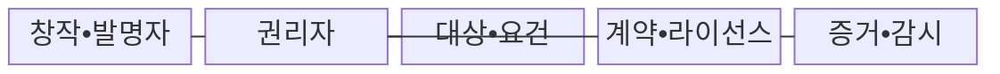
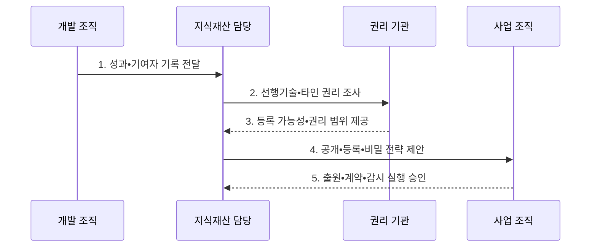

---
sidebar:
  order: 40
  label: "040. 지식재산권 — 특허•저작권•상표•영업비밀 (Intellectual Property Rights)"
  badge:
    text: "기출 • 50%"
    variant: note
title: "지식재산권 — 특허•저작권•상표•영업비밀 (Intellectual Property Rights)"
date: "2026-08-04T11:33:39+09:00"
tags:
  - "notes-law-policy"
weight: 40
extra:
  question_no: "040"
  source_status: "기출"
  source_history: "135회"
  priority: 50
  priority_note: "135회 기출, 권리 유형•보호 요건 비교"
---

## Ⅰ. 개요

핵심 용어

- **지식재산 체계**: 발명•표현•표지•비밀을 특허권•저작권•상표권•영업비밀의 서로 다른 성립 요건과 권리 범위로 보호하는 체계이다.

- 정의/개념: 발명•표현•표지•비밀을 성립 요건별 **법적 권리** 로 보호하는 **지식재산 체계**
- 배경/필요성: 단일 보호 방식은 자산별 **권리 공백** 과 불필요한 공개•침해 초래

#### 한줄 요약
- 기술을 공개하고 심사•등록을 거쳐 특허로 보호할지, 비밀관리 요건을 유지해 영업비밀로 보호할지 결정한다

## Ⅱ. 특징

핵심 용어

- **복합 보호성**: 하나의 기술•제품을 보호 대상•요건•기간이 다른 복수의 지식재산권으로 조합해 보호하는 특성이다.
- **권리 성립성**: 특허•상표는 등록, 저작권은 창작, 영업비밀은 비공지성•경제적 유용성•비밀관리로 보호 근거를 얻는 특성이다.
- **실시 자유(Freedom to Operate, FTO)**: 제품•서비스를 출시•판매할 때 타인의 유효한 특허권을 침해하지 않고 사업을 수행할 수 있는 상태이다.
- **선제 확인성**: 공개•출시 전에 권리 귀속•이용 범위•등록 가능성과 FTO를 점검하는 특성이다.

- 보호 대상•요건•기간별 복수 권리를 조합하는 **복합 보호성**
- 등록•창작•비밀관리로 보호 근거를 얻는 **권리 성립성**
- 공개•출시 전에 귀속•이용 범위•FTO를 보는 **선제 확인성**

#### 한줄 요약
- 개발 외주 비용을 다 지급했더라도 계약서에 저작권이나 특허 귀속 주체를 적지 않으면 분쟁이 발생할 수 있습니다.

## Ⅲ. 구조 및 구성요소

핵심 용어

- **창작자**: 저작권 보호 대상 표현을 만든 사람이다.
- **발명자**: 특허 보호 대상 기술적 사상을 완성한 사람이다.
- **권리자**: 지식재산권을 소유하고 출원•관리•이용 허락•분쟁 대응 권한을 행사하는 주체이다.
- **직무발명**: 종업원이 직무에 관해 한 발명으로서 사용자와 발명자의 권리 승계•보상 기준을 정해야 하는 성과이다.
- **계약**: 개발 성과의 권리 귀속과 이용 조건을 당사자 간 정한 합의이다.
- **라이선스**: 권리자가 이용 범위•기간•지역•대가를 정해 허락하는 계약이다.
- **증거**: 등록•비밀관리•사용 사실을 입증하는 기록이다.
- **감시**: 침해나 무단 이용을 탐지하는 권리 관리 활동이다.

| 구성요소 | 책임 |
|:---|:---|
| **창작•발명자** | 기여 내용•시점•**직무발명 기록** |
| **권리자** | 출원•관리•허락•**분쟁 권한** |
| **대상•요건** | 권리별 보호 대상•**성립 요건** |
| **계약•라이선스** | 귀속•이용 범위•기간•**대가** |
| **증거•감시** | 등록•비밀조치•**사용 증거** |

#### 한줄 요약
- 특허와 저작권, 영업비밀은 배타적 성격이 있으므로 신기술 공개 전 자산의 보호 방식을 확정해야 합니다.

## Ⅳ. 흐름도

핵심 용어

- **성과 기록**: 보호할 개발 결과의 내용•완성 시점을 남긴 자료이다.
- **기여자 기록**: 참여자의 기여 내용•시점을 남겨 발명자•창작자를 판단하는 자료이다.
- **선행기술 조사**: 출원 전에 이미 공개된 기술을 찾아 특허의 신규성•진보성과 등록 가능성을 검토하는 조사이다.
- **FTO 조사**: 출시 기술이 사업 대상 국가에서 타인의 유효 특허권을 침해하는지 검토하는 조사이다.
- **공개 전략**: 기술 공개의 사업 이익과 권리 소멸 위험을 비교하는 전략이다.
- **등록 전략**: 심사•등록으로 배타권을 확보할 자산을 정하는 전략이다.
- **비밀 전략**: 역설계 가능성과 보호기간을 보고 영업비밀 유지 여부를 정하는 전략이다.

1. **성과•기여자 기록 전달**: 보호할 개발 성과와 기여 내용•시점 기록
2. **선행기술•타인 권리 조사**: 등록 가능성과 FTO를 구분해 검색
3. **등록 가능성•권리 범위 제공**: 권리 취득 가능성과 침해 위험 분석
4. **공개•등록•비밀 전략 제안**: 사업 가치와 역설계 가능성에 따라 보호 방식 조합
5. **출원•계약•감시 실행 승인**: 권리 확보와 이용 허락 및 침해 대응 체계 운영

#### 한줄 요약
- 선행기술 조사는 특허 가능성을 검토하고 FTO 조사는 출시 기술의 타인 특허 침해 위험을 평가한다

## Ⅴ. 종류 및 비교

핵심 용어

- **특허권**: 공개된 기술 발명을 심사•등록한 뒤 일정 기간•지역에서 배타적으로 실시할 수 있는 권리이다.
- **저작권**: 아이디어가 아닌 창작적 표현에 창작 시 발생하여 복제•배포•전송 등의 이용을 통제하는 권리이다.
- **상표권**: 상품•서비스의 출처를 식별하는 표지를 지정 상품•지역에 등록하여 보호하는 권리이다.
- **영업비밀**: 비공지성•경제적 유용성•비밀관리성을 유지하는 동안 기술•경영 정보를 공개 없이 보호하는 권리이다.

| 지식재산 보호 유형 | 특허권 | 저작권 | 상표권 | 영업비밀 |
|:---|:---|:---|:---|:---|
| **적용 기준** | 기술 발명의 **공개•독점** | 창작 표현의 **이용 통제** | 상품•서비스의 **출처 식별** | **비공개 정보** 유지 |
| **핵심 특징** | 심사•등록 후 **배타권** | 창작 시 **권리 발생** | 심사•등록•**갱신** | 비밀 유지 중 **보호** |
| **한계** | 공개•기간•**지역 제한** | 아이디어 자체 **미보호** | 지정 상품•**지역 제한** | 독자 개발•**역설계** 가능 |

#### 한줄 요약
- 특허는 기술 공개와 보호기간을 감수할 때, 영업비밀은 비공지성과 비밀관리 요건을 유지할 수 있을 때 선택한다

## Ⅵ. 실무 고려사항 및 대책

핵심 용어

- **특허 신규성 상실**: 출원 전에 논문•시연•납품 등으로 발명을 공개하여 특허의 신규성 요건을 충족하지 못하는 문제이다.
- **귀속 분쟁**: 공동•외주 개발에서 배경 지식재산과 신규 성과의 소유•이용 범위를 계약으로 정하지 않을 때 발생하는 분쟁이다.
- **생성형 인공지능(Generative Artificial Intelligence, Generative AI) 권리 위험**: 생성물의 인간 창작 기여, 입력 자료•학습 데이터의 이용 권한과 서비스 약관이 불명확해 생기는 저작권 위험이다.

| 문제 | 대책 | 효과 |
|:---|:---|:---|
| 공개 전 **특허 신규성 상실** | 논문•시연•납품 전에 발명 신고•**출원 심의** | 특허 취득 가능성 **보존** |
| 공동개발 성과의 **귀속 분쟁** | 계약에 배경•성과 지식재산의 **소유•이용 범위** 명시 | 사업화 권한의 **불확실성 축소** |
| 생성형 AI의 **권리 위험** | 인간 기여•약관•입력 자료•**프롬프트 증빙** 보관 | 저작권 귀속•**침해 대응력** 확보 |

#### 한줄 요약
- 생성형 AI로 만든 그림이나 코드는 인간의 창작 기여와 학습•입력 자료의 라이선스 증빙을 보관해 권리 분쟁에 대비합니다.

## Ⅶ. 결론

핵심 용어

- 역설계•공개 이익에 따라 **특허•영업비밀** 을 고르고 표현•표지는 **저작권•상표권** 으로 보호

#### 한줄 요약
- 단순히 특허 개수를 늘리기보다 실제 사업 영역에서 침해 시 즉각 소송으로 대응 가능한 실효성 있는 포트폴리오가 핵심입니다.
