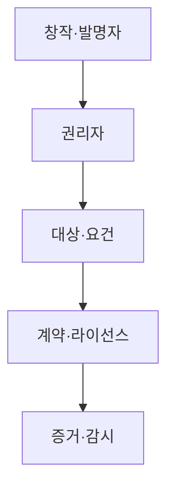

---
sidebar:
  order: 40
  label: "040. 지식재산권 — 특허·저작권·상표·영업비밀 (Intellectual Property Rights)"
  badge:
    text: "기출 · 50%"
    variant: note
title: "지식재산권 — 특허·저작권·상표·영업비밀 (Intellectual Property Rights)"
date: "2026-07-27T23:59:59+09:00"
tags:
  - "notes-law-policy"
weight: 40
extra:
  question_no: "040"
  source_status: "기출"
  source_history: "135회"
  priority: 50
  priority_note: "135회 기출, 권리 유형·보호 요건 비교"
---

## 미리 알고가기

- **지식재산권(Intellectual Property Rights, IPR)**: 발명·저작물·상표·영업비밀 등 지식 창작물과 성과를 보호하는 법적 권리
- **실시 자유(Freedom to Operate, FTO)**: 제품이나 서비스를 사업화할 때 타인의 유효한 특허를 침해하지 않는 상태
- **인공지능(Artificial Intelligence, AI)**: 학습 데이터의 이용과 생성물의 권리 귀속·침해 여부가 지식재산 쟁점이 되는 기술
- **특허권**: 신규성·진보성·산업상 이용 가능성을 갖춘 발명을 출원·등록해 보호하는 권리
- **저작권**: 인간의 사상·감정을 창작적으로 표현한 저작물에 창작 시 발생하는 권리
- **상표권**: 상품·서비스의 출처를 식별하는 표지를 출원·등록해 보호하는 권리
- **영업비밀**: 비공지성·경제적 유용성·비밀관리성을 갖춘 기술·경영 정보를 보호하는 제도

## Ⅰ. 개요

- 정의/개념: 발명·창작 표현·상품 표지·비밀 정보를 **권리 유형별로 보호·활용하는 법 체계**
- **배경/필요성**: 단일 보호 방식만 선택할 때 생기는 **권리 공백·공개 손실·타인 권리 침해 방지**

### 쉽게 이해하기 (학습용)
- 기술을 공개하고 심사·등록으로 특허 보호를 받을지, 비밀 요건을 유지해 영업비밀로 보호할지 결정함

## Ⅱ. 특징

- **보호 대상·성립 요건·존속 기간·권리 범위**가 권리 유형별로 다르다.
- **특허·상표는 등록**, 저작권은 창작 시 발생하고 영업비밀은 비밀관리가 필요하다.
- **기여자·권리 귀속·이용 범위·FTO**를 공개·계약·출시 전에 확인한다.

### 쉽게 이해하기 (학습용)
- 개발 외주 비용을 다 지급했더라도 계약서에 저작권이나 특허 귀속 주체를 적지 않으면 분쟁이 발생할 수 있습니다.

## Ⅲ. 아키텍처 및 구성요소

| 설계 요소 | 설명 |
|:---|:---|
| 창작·발명자 | **기여 내용·시점·직무발명 기록** |
| 권리자 | **출원·관리·허락·분쟁 권한** |
| 대상·요건 | **권리별 보호 대상·성립 요건** |
| 계약·라이선스 | **귀속·이용 범위·기간·대가** |
| 증거·감시 | **등록·비밀조치·사용 증거** |

> 요약: 성과 성격에 따른 권리별 포트폴리오 결합

### 쉽게 이해하기 (학습용)
- 특허와 저작권, 영업비밀은 배타적 성격이 있으므로 신기술 공개 전 자산의 보호 방식을 확정해야 합니다.

## Ⅳ. 원리 및 절차 흐름도

| 절차 | 설명 |
|:---|:---|
| 성과 식별 | 보호할 개발 성과와 기여자를 기록 |
| 유형 분류 | 특허·저작권·상표·비밀로 분류 |
| 권리 조사 | 선행기술과 타인 권리를 검색 |
| 전략 선정 | 공개·등록·비밀 유지 방식 결정 |
| 권리 확보 | 출원·계약·비밀 관리 조치 수행 |
| 활용·대응 | 허락·감시·분쟁 대응 운영 |

> 요약: 성과 기반 공개·등록·비밀 전략 선택

### 쉽게 이해하기 (학습용)
- 선행기술 조사는 특허 가능성을 검토하고 FTO 조사는 출시 기술이 타인 권리를 침해할 위험을 줄임

## Ⅴ. 종류 및 비교

| 지식재산 보호 유형 | 특허권 | 저작권 | 상표권 | 영업비밀 |
|:---|:---|:---|:---|:---|
| 적용 기준 | 기술 발명 공개·독점 | 창작 표현 이용 통제 | 상품·서비스 출처 식별 | 비공개 정보 유지 |
| 핵심 특징 | 심사·등록 후 배타권 | 창작 시 권리 발생 | 심사·등록·갱신 | 비밀 유지 동안 보호 |
| 한계 | 공개·기간·지역 제한 | 아이디어 자체 미보호 | 지정 상품·지역 제한 | 독자 개발·역설계 가능 |

> 요약: 성립 방식에 따른 보호체계 차이

### 쉽게 이해하기 (학습용)
- 특허는 출원·등록과 기간 제한을 감수하고, 영업비밀은 비공지·비밀관리 요건을 유지할 수 있을 때 선택함

## Ⅵ. 실무 사례

1. 생성형 AI 성과는 **인간 기여·권리 귀속·출처** 관리

### 쉽게 이해하기 (학습용)
- 생성형 AI로 만든 그림이나 코드는 인간의 창작 기여와 학습·입력 자료의 라이선스 증빙을 보관해 권리 분쟁에 대비합니다.

## Ⅶ. 결론

- 지식재산 보호를 위해 대상·요건을 검토하여 **지식재산권** 활용

### 쉽게 이해하기 (학습용)
- 단순히 특허 개수를 늘리기보다 실제 사업 영역에서 침해 시 즉각 소송으로 대응 가능한 실효성 있는 포트폴리오가 핵심입니다.
