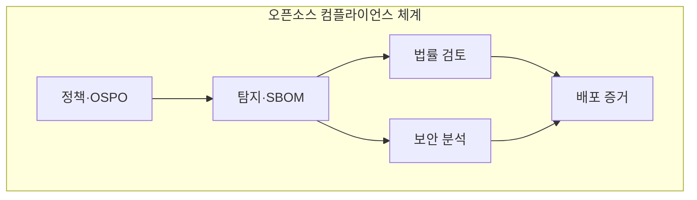
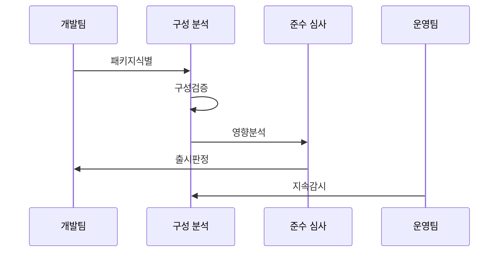

---
sidebar:
  order: 41
  label: "041. 오픈소스 컴플라이언스·SBOM (Open Source Compliance SBOM)"
  badge:
    text: "기출 · 70%"
    variant: note
title: "오픈소스 컴플라이언스·SBOM (Open Source Compliance SBOM)"
date: "2026-07-25T01:50:00+09:00"
tags:
  - "notes-law-policy"
weight: 41
extra:
  question_no: "041"
  source_status: "기출"
  source_history: "134회, 135회"
  priority: 70
  priority_note: "반복 기출, SBOM·라이선스 의무의 공급망축"
---

## 미리 알고가기

- **소프트웨어 명세서(Software Bill of Materials, SBOM)**: '에스봄'으로 읽고 영문 머리글자로 제품의 구성요소·버전·관계를 기록한 명세임을 표시
- **오픈소스 프로그램 사무국(Open Source Program Office, OSPO)**: '오스포'로 읽고 영문 머리글자로 조직의 오픈소스 정책·승인·준수를 맡는 전담 조직을 표시
- **취약점 영향 정보 교환(Vulnerability Exploitability eXchange, VEX)**: '벡스'로 읽고 가운데 대문자 X가 정보 교환을 강조하며 SBOM 취약점의 실제 영향 상태를 전달
- **공개 소프트웨어 패키지 데이터 교환(Software Package Data Exchange, SPDX)**: '에스피디엑스'로 읽고 영문 머리글자로 패키지·라이선스 정보를 교환하는 SBOM 표준을 표시
- **소프트웨어 구성 분석(Software Composition Analysis, SCA)**: '에스시에이'로 읽고 영문 머리글자로 오픈소스 구성·취약점·라이선스를 분석하는 도구를 표시
- **공통 취약점 및 노출(Common Vulnerabilities and Exposures, CVE)**: '씨브이이'로 읽고 영문 머리글자로 공개 취약점의 공통 식별 체계를 표시
- **패키지 URL(Package URL, PURL)**: '피유알엘'로 읽고 URL 표기처럼 패키지 생태계·이름·버전을 식별하는 주소임을 표시

## Ⅰ. 개요

- **정의/개념**: 오픈소스 의무·취약점을 SBOM으로 관리
- **배경/필요성**: 공급망 침해와 라이선스 분쟁을 예방

### 쉽게 이해하기 (학습용)
- 소프트웨어 제품에 들어간 모든 외부 부품(오픈소스)의 명세서를 작성하여 라이선스 위반이나 해킹 취약점을 사전에 차단하는 기법입니다.

## Ⅱ. 특징

- 다층 분석이 전이 의존성 누락을 줄인다.
- 식별자·버전·해시가 구성 동일성을 검증한다.
- 의무·도달성을 분리해 조치 우선순위를 정한다.
- CI/CD·VEX 연계가 출시 뒤 위험을 추적한다.

### 쉽게 이해하기 (학습용)
- 오픈소스가 포함하고 있는 또 다른 하위 오픈소스(전이 의존성)까지 깊숙이 추적하여 잠재된 위험을 걸러냅니다.

## Ⅲ. 아키텍처 및 구성요소

| 설계 요소 | 설명 |
|:---|:---|
| 정책·OSPO | 허용 라이선스와 예외 승인 기준 수립 |
| 탐지·SBOM | 실제 빌드 컴포넌트와 연관 관계 기록 |
| 법률 검토 | 라이선스 의무 및 배포 고지 판정 |
| 보안 분석 | CVE 도달성과 VEX 영향 상태 판단 |
| 배포 증거 | 고지·소스·SBOM·승인 이력 보존 |

> 요약: 컴플라이언스 정책 수립과 SBOM 기반 의무 분석

### 쉽게 이해하기 (학습용)
- 거버넌스 정책에 따라 빌드 단계에서 제품 구성을 탐지하고, 법적 의무와 취약점 영향을 교차 검증하여 최종 승인 증적을 남깁니다.

## Ⅳ. 원리 및 절차 흐름도

| 절차 | 설명 |
|:---|:---|
| 패키지식별 | 소스·빌드에서 PURL을 수집 |
| 구성검증 | 해시로 실제 빌드 구성을 확인 |
| 영향분석 | 라이선스 의무와 도달성을 판정 |
| 출시판정 | 고지·예외 심사 후 출시를 승인 |
| 지속감시 | 신규 취약점과 변경을 대조 |

> 요약: 식별·분석·출시·감시를 증적으로 연결

### 쉽게 이해하기 (학습용)
- 실제 배포된 빌드의 디지털 서명(해시)을 기반으로 명세서를 만들고, 출시 이후 매일 새로 발표되는 보안 취약점 데이터베이스와 대조합니다.

## Ⅴ. 종류 및 비교

| 판단 기준 | 라이선스 목록 | SBOM | VEX |
|:---|:---|:---|:---|
| 핵심 특징 | 라이선스 의무 고지 | 제품 구성 전달 | 영향 및 조치 전달 |
| 적용 기준 | 저작권 표시·의무 고지 필요 시 | 제품 구성 투명성 공개 시 | 취약점 영향·조치 상태 통지 시 |
| 주요 위험 | 의무 조건 누락 | 전이 의존성 누락 | 영향 상태 오판 |

> 요약: SBOM은 구성, 목록은 의무, VEX는 영향 전달

### 쉽게 이해하기 (학습용)
- 무엇을 썼는지 투명하게 드러내고(SBOM), 법적 의무 조건을 준수하며(라이선스 목록), 실제 작동 여부를 외부에 알려(VEX) 보안을 증명합니다.

## Ⅵ. 실무 사례

1. 식별 불일치 오류의 수동 검증 및 보완
2. SBOM 배포 범위와 기밀 보존 정책 수립

### 쉽게 이해하기 (학습용)
- 자동 도구가 탐지하지 못한 이름 불일치나 누락된 원본 코드를 법무 및 개발 부서가 직접 확인하여 정정합니다.
- 고객사나 규제 기관에 공개할 SBOM의 양식과 기밀로 유지할 독자 컴포넌트의 노출 범위를 차등 설계합니다.

## Ⅶ. 결론

- 오픈소스 준수를 위한 SBOM 기반 사후 감시 체계

### 쉽게 이해하기 (학습용)
- 개발 완료 시점의 1회성 검사를 넘어 제품 배포 이후 발생하는 신규 취약점과 라이선스 충돌을 지속 감시해야 합니다.
