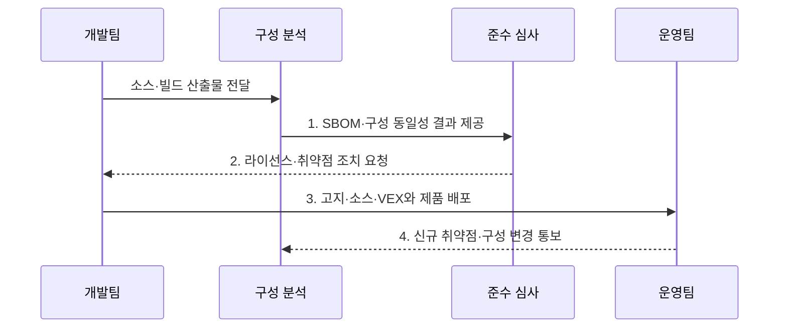

---
sidebar:
  order: 41
  label: "041. 오픈소스 컴플라이언스·SBOM (Open Source Compliance SBOM)"
  badge:
    text: "기출 · 70%"
    variant: note
title: "오픈소스 컴플라이언스·SBOM (Open Source Compliance SBOM)"
date: "2026-07-31T11:40:33+09:00"
tags:
  - "notes-law-policy"
weight: 41
extra:
  question_no: "041"
  source_status: "기출"
  source_history: "134회, 135회"
  priority: 70
  priority_note: "반복 기출, SBOM·라이선스 의무의 공급망축"
---

## 미리 알고가기

- **소프트웨어 자재명세서(Software Bill of Materials, SBOM)**: 소프트웨어를 구성하는 컴포넌트의 이름·버전·공급자·의존관계를 기록한 명세서
- **오픈소스 프로그램 사무국(Open Source Program Office, OSPO)**: 조직의 오픈소스 활용·기여·라이선스 준수 정책을 총괄하는 전담 조직
- **취약점 영향 정보 교환(Vulnerability Exploitability eXchange, VEX)**: SBOM에 포함된 취약점이 해당 제품에 실제 영향을 미치는지 전달하는 문서 형식
- **소프트웨어 패키지 데이터 교환(Software Package Data Exchange, SPDX)**: 소프트웨어 구성요소·라이선스·저작권 정보를 교환하는 표준 형식
- **소프트웨어 구성 분석(Software Composition Analysis, SCA)**: 소프트웨어의 오픈소스 구성요소와 취약점·라이선스 위험을 식별하는 분석
- **공통 취약점 및 노출(Common Vulnerabilities and Exposures, CVE)**: 공개된 보안 취약점에 공통 식별번호를 부여하는 체계
- **패키지 URL(Package URL, PURL)**: 패키지의 생태계·이름·버전·배포 위치를 일관되게 식별하는 표준 주소
- **통합 자원 위치 지정자(Uniform Resource Locator, URL)**: 인터넷 자원의 위치와 접근 방법을 나타내는 주소
- **CISA 2025 SBOM 최소 요소**: SBOM의 데이터 필드·자동화 지원·관행을 규정한 최신 미국 지침
- **SPDX 3.0**: 소프트웨어·보안·AI 등 공급망 정보를 표현하는 현행 SPDX 명세

## Ⅰ. 개요

- 정의/개념: 배포 구성과 의존관계의 **SBOM**으로 라이선스·취약점을 관리하는 **공급망 준수 체계**
- 배경/필요성: 직접 의존성만으로는 전이 버전·배포 의무·**신규 취약점** 추적 곤란

### 쉽게 이해하기 (학습용)
- 소프트웨어 제품에 들어간 모든 외부 부품(오픈소스)의 명세서를 작성하여 라이선스 위반이나 해킹 취약점을 사전에 차단하는 기법입니다.

## Ⅱ. 특징

- 소스·빌드에서 직접·전이 요소를 찾는 **SCA** 기반 추적성
- PURL·버전·해시로 배포본을 검증하는 **구성 동일성**
- 라이선스와 CVE·VEX 판단을 나누는 **위험 분리성**

### 쉽게 이해하기 (학습용)
- 오픈소스가 포함하고 있는 또 다른 하위 오픈소스(전이 의존성)까지 깊숙이 추적하여 잠재된 위험을 걸러냅니다.

## Ⅲ. 구조 및 구성요소

```mermaid
block-beta
    columns 5
    P["정책·OSPO"] S["탐지·SBOM"] L["법률 검토"] V["보안 분석"] E["배포 증거"]
    P -- S
    S -- L
    S -- V
    L -- E
    V -- E
```

| 구성요소 | 책임 |
|:---|:---|
| **정책·OSPO** | 허용 라이선스·**예외 기준** 수립 |
| **탐지·SBOM** | 실제 빌드의 구성·관계 기록 |
| **법률 검토** | 라이선스·**배포 의무** 판정 |
| **보안 분석** | CVE 도달성·**VEX 상태** 판정 |
| **배포 증거** | 고지·소스·SBOM·**승인 보존** |

### 쉽게 이해하기 (학습용)
- 거버넌스 정책에 따라 빌드 단계에서 제품 구성을 탐지하고, 법적 의무와 취약점 영향을 교차 검증하여 최종 승인 증적을 남깁니다.

## Ⅳ. 흐름도



1. **SBOM·구성 동일성 결과 제공**: 버전·해시·관계로 실제 배포 구성 확인
2. **라이선스·취약점 조치 요청**: 배포 의무와 CVE 도달성·VEX 상태 판정
3. **고지·소스·VEX와 제품 배포**: 예외 심사와 의무 이행 후 출시 승인
4. **신규 취약점·구성 변경 통보**: 운영 중 SBOM을 신규 CVE·변경과 대조

### 쉽게 이해하기 (학습용)
- 실제 배포 빌드의 해시로 SBOM과 구성의 동일성을 확인하고 출시 후에도 신규 취약점과 계속 대조한다

## Ⅴ. 종류 및 비교

| 오픈소스 공급망 정보 | 라이선스 목록 | SBOM | VEX |
|:---|:---|:---|:---|
| **적용 기준** | 저작권 표시·**의무 고지** | 제품 구성의 **투명성 공개** | 취약점 영향·**조치 상태** 통지 |
| **핵심 특징** | 라이선스·**고지 정보** | 구성·버전·**관계 정보** | 취약점 영향·**조치 정보** |
| **한계** | 실제 구성의 **누락 가능** | 의무·악용 가능성 **미판정** | 근거 없는 **상태 오판** |

### 쉽게 이해하기 (학습용)
- 무엇을 썼는지 투명하게 드러내고(SBOM), 법적 의무 조건을 준수하며(라이선스 목록), 실제 작동 여부를 외부에 알려(VEX) 보안을 증명합니다.

## Ⅵ. 실무 고려사항 및 대책

| 고려사항 | 대책 | 효과 |
|:---|:---|:---|
| 목록과 **배포 구성 불일치** | 빌드에서 PURL·버전·해시를 추출해 **SBOM 대조** | 누락된 **전이 의존성** 식별 |
| 라이선스·취약점의 **판단 혼동** | 법률 의무와 도달성·**VEX**를 분리 | 출시 판정의 **정확성 향상** |
| 출시 후 **신규 CVE 발생** | SBOM과 취약점 피드를 대조해 **VEX 갱신** | 영향 제품의 **신속한 선별** |
| 최소 요소·형식의 **불일치** | CISA 2025 요소와 **SPDX 3.0** 검증 | 정보 교환의 **상호운용성** 확보 |

### 쉽게 이해하기 (학습용)
- 자동 도구가 탐지하지 못한 이름 불일치나 누락된 원본 코드를 법무 및 개발 부서가 직접 확인하여 정정합니다.

## Ⅶ. 결론

- 구성 공개는 **SBOM**, 법적 의무는 라이선스 심사, 실제 취약점 영향은 **VEX**로 전달

### 쉽게 이해하기 (학습용)
- 개발 완료 시점의 1회성 검사를 넘어 제품 배포 이후 발생하는 신규 취약점과 라이선스 충돌을 지속 감시해야 합니다.
