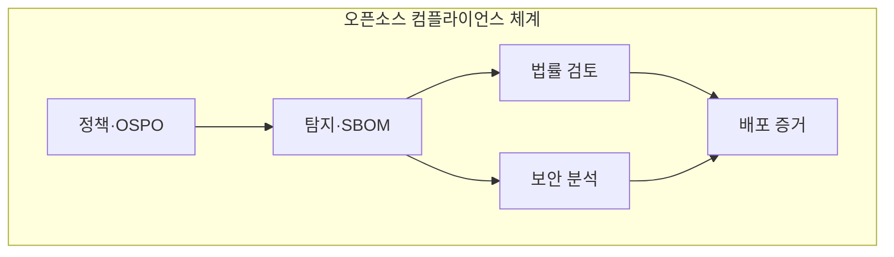

---
sidebar:
  order: 41
  label: "041. 오픈소스 컴플라이언스·SBOM (Open Source Compliance SBOM)"
  badge:
    text: "기출 · 70%"
    variant: note
title: "오픈소스 컴플라이언스·SBOM (Open Source Compliance SBOM)"
date: "2026-07-27T23:59:59+09:00"
tags:
  - "notes-law-policy"
weight: 41
extra:
  question_no: "041"
  source_status: "기출"
  source_history: "134회, 135회"
  priority: 70
  priority_note: "반복 기출, SBOM·라이선스 의무의 공급망축"
---

## 미리 알고가기

- **소프트웨어 자재명세서(Software Bill of Materials, SBOM)**: 소프트웨어를 구성하는 컴포넌트의 이름·버전·공급자·의존관계를 기록한 명세서
- **오픈소스 프로그램 사무국(Open Source Program Office, OSPO)**: 조직의 오픈소스 활용·기여·라이선스 준수 정책을 총괄하는 전담 조직
- **취약점 영향 정보 교환(Vulnerability Exploitability eXchange, VEX)**: SBOM에 포함된 취약점이 해당 제품에 실제 영향을 미치는지 전달하는 문서 형식
- **소프트웨어 패키지 데이터 교환(Software Package Data Exchange, SPDX)**: 소프트웨어 구성요소·라이선스·저작권 정보를 교환하는 표준 형식
- **소프트웨어 구성 분석(Software Composition Analysis, SCA)**: 소프트웨어의 오픈소스 구성요소와 취약점·라이선스 위험을 식별하는 분석
- **공통 취약점 및 노출(Common Vulnerabilities and Exposures, CVE)**: 공개된 보안 취약점에 공통 식별번호를 부여하는 체계
- **패키지 URL(Package URL, PURL)**: 패키지의 생태계·이름·버전·배포 위치를 일관되게 식별하는 표준 주소
- **통합 자원 위치 지정자(Uniform Resource Locator, URL)**: 인터넷 자원의 위치와 접근 방법을 나타내는 주소

## Ⅰ. 개요

- 정의/개념: 실제 배포 구성의 SBOM을 기준으로 **오픈소스 라이선스 의무·취약점 영향을 관리**
- 기존 한계: 직접 의존성 목록만으로 **전이 의존성·버전·배포 의무·신규 취약점** 추적 곤란

### 쉽게 이해하기 (학습용)
- 소프트웨어 제품에 들어간 모든 외부 부품(오픈소스)의 명세서를 작성하여 라이선스 위반이나 해킹 취약점을 사전에 차단하는 기법입니다.

## Ⅱ. 특징

- **소스·의존성·빌드 산출물 분석**으로 직접·전이 구성요소를 식별한다.
- **PURL·버전·해시·관계**로 실제 배포 구성과 SBOM의 동일성을 검증한다.
- **라이선스 의무와 CVE 도달성·VEX 상태**를 분리해 출시·사후 조치를 정한다.

### 쉽게 이해하기 (학습용)
- 오픈소스가 포함하고 있는 또 다른 하위 오픈소스(전이 의존성)까지 깊숙이 추적하여 잠재된 위험을 걸러냅니다.

## Ⅲ. 아키텍처 및 구성요소

| 설계 요소 | 설명 |
|:---|:---|
| 정책·OSPO | **허용 라이선스·예외 기준 수립** |
| 탐지·SBOM | **실제 빌드 구성·관계 기록** |
| 법률 검토 | **라이선스·배포 의무 판정** |
| 보안 분석 | **CVE 도달성·VEX 상태 판정** |
| 배포 증거 | **고지·소스·SBOM·승인 보존** |

> 요약: 컴플라이언스 정책 수립과 SBOM 기반 의무 분석

### 쉽게 이해하기 (학습용)
- 거버넌스 정책에 따라 빌드 단계에서 제품 구성을 탐지하고, 법적 의무와 취약점 영향을 교차 검증하여 최종 승인 증적을 남깁니다.

## Ⅳ. 원리 및 절차 흐름도

| 절차 | 설명 |
|:---|:---|
| 패키지 식별 | 소스·빌드에서 PURL 수집 |
| 구성 검증 | 해시로 실제 빌드 구성 확인 |
| 영향 분석 | 라이선스 의무·도달성 판정 |
| 출시 판정 | 고지·예외 심사 후 출시 승인 |
| 지속 감시 | 신규 취약점·변경 대조 |

> 요약: 식별·분석·출시·감시를 증적으로 연결

### 쉽게 이해하기 (학습용)
- 실제 배포 빌드의 해시로 구성 동일성을 확인하고 출시 후 신규 취약점과 계속 대조함

## Ⅴ. 종류 및 비교

| 오픈소스 공급망 정보 | 라이선스 목록 | SBOM | VEX |
|:---|:---|:---|:---|
| 적용 기준 | 저작권 표시·의무 고지 필요 시 | 제품 구성 투명성 공개 시 | 취약점 영향·조치 상태 통지 시 |
| 핵심 특징 | 라이선스·고지 정보 | 구성·버전·관계 정보 | 취약점 영향·조치 정보 |
| 한계 | 실제 구성 누락 가능 | 의무·악용 가능성 미판정 | 근거 없는 상태 오판 |

> 요약: SBOM은 구성, 목록은 의무, VEX는 영향 전달

### 쉽게 이해하기 (학습용)
- 무엇을 썼는지 투명하게 드러내고(SBOM), 법적 의무 조건을 준수하며(라이선스 목록), 실제 작동 여부를 외부에 알려(VEX) 보안을 증명합니다.

## Ⅵ. 실무 사례

1. 빌드 산출물은 **PURL·버전·해시 불일치를 수동 검증**

### 쉽게 이해하기 (학습용)
- 자동 도구가 탐지하지 못한 이름 불일치나 누락된 원본 코드를 법무 및 개발 부서가 직접 확인하여 정정합니다.

## Ⅶ. 결론

- 오픈소스 준수를 위해 구성·영향을 검토하여 **SBOM·VEX** 활용

### 쉽게 이해하기 (학습용)
- 개발 완료 시점의 1회성 검사를 넘어 제품 배포 이후 발생하는 신규 취약점과 라이선스 충돌을 지속 감시해야 합니다.
