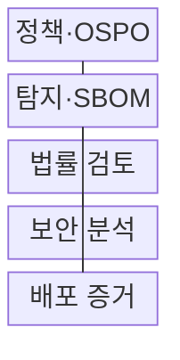
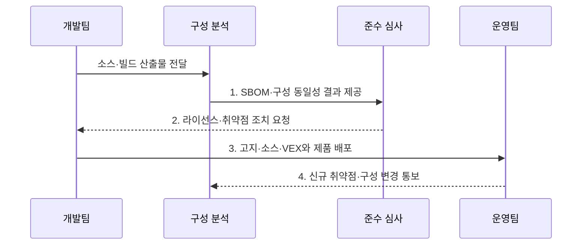

---
sidebar:
  order: 41
  label: "041. 오픈소스 컴플라이언스·SBOM (Open Source Compliance SBOM)"
  badge:
    text: "기출 · 70%"
    variant: note
title: "오픈소스 컴플라이언스·SBOM (Open Source Compliance SBOM)"
date: "2026-08-02T13:41:00+09:00"
tags:
  - "notes-law-policy"
weight: 41
extra:
  question_no: "041"
  source_status: "기출"
  source_history: "134회, 135회"
  priority: 70
  priority_note: "반복 기출, SBOM·라이선스 의무의 공급망축"
---

## Ⅰ. 개요

핵심 용어

- **오픈소스 컴플라이언스**: 배포 소프트웨어의 오픈소스 구성·라이선스 의무·보안 취약점을 식별하고 이행 증거를 관리하는 공급망 준수 체계이다.
- **소프트웨어 자재명세서(Software Bill of Materials, SBOM)**: 소프트웨어를 구성하는 컴포넌트의 이름·버전·공급자·의존관계를 기록한 명세서이다.

- 정의/개념: **오픈소스 컴플라이언스·SBOM**은 배포 소프트웨어의 구성과 의존관계를 명세하고 라이선스 의무·취약점·이행 증거를 관리하는 **소프트웨어 공급망 준수 체계**
- 배경/필요성: 직접 의존성만으로는 전이 버전·배포 의무·**신규 취약점** 추적 곤란

#### 한줄 요약
- 소프트웨어 제품에 들어간 모든 외부 부품(오픈소스)의 명세서를 작성하여 라이선스 위반이나 해킹 취약점을 사전에 차단하는 기법입니다.

## Ⅱ. 특징

핵심 용어

- **전이 의존성**: 직접 사용한 패키지가 다시 참조하여 제품에 포함되는 하위 구성요소 관계이다.
- **지속 갱신**: 새 빌드·패키지 변경·취약점 공개에 따라 SBOM과 위험 판정을 계속 최신화하는 관리이다.
- **소프트웨어 구성 분석(Software Composition Analysis, SCA)**: 소스와 빌드 산출물에서 직접·전이 오픈소스 구성요소와 라이선스·취약점 위험을 식별하는 분석이다.
- **패키지 URL(Package URL, PURL)**: 패키지 생태계·이름·버전·배포 위치를 표준 형식으로 식별하는 주소이다.
- **공통 취약점 및 노출(Common Vulnerabilities and Exposures, CVE)**: 공개된 보안 취약점에 공통 식별번호를 부여하는 체계이다.
- **취약점 악용 가능성 교환(Vulnerability Exploitability eXchange, VEX)**: 알려진 취약점이 특정 제품에 실제 영향을 미치는지와 조치 상태를 전달하는 문서이다.

- 소스·빌드에서 직접·전이 요소를 찾는 **SCA** 기반 추적성
- PURL·버전·해시로 배포본을 검증하는 **구성 동일성**
- 라이선스와 CVE·VEX 판단을 나누는 **위험 분리성**

#### 한줄 요약
- 오픈소스가 포함하고 있는 또 다른 하위 오픈소스(전이 의존성)까지 깊숙이 추적하여 잠재된 위험을 걸러냅니다.

## Ⅲ. 구조 및 구성요소

핵심 용어

- **오픈소스 프로그램 사무국(Open Source Program Office, OSPO)**: 조직의 오픈소스 활용·기여·라이선스 준수 정책을 총괄하는 전담 조직이다.
- **소프트웨어 구성 분석(Software Composition Analysis, SCA)**: 소프트웨어의 오픈소스 구성요소와 취약점·라이선스 위험을 식별하는 분석이다.
- **소프트웨어 자재명세서(Software Bill of Materials, SBOM)**: 실제 빌드에 포함된 구성요소·버전·관계를 기록하여 법률·보안 검토의 기준으로 쓰는 명세서이다.
- **패키지 URL(Package URL, PURL)**: 패키지의 생태계·이름·버전·배포 위치를 일관되게 식별하는 표준 주소이다.
- **공통 취약점 및 노출(Common Vulnerabilities and Exposures, CVE)**: 보안 분석에서 구성요소의 알려진 취약점을 식별하는 공통 번호 체계이다.
- **취약점 악용 가능성 교환(Vulnerability Exploitability eXchange, VEX)**: 특정 취약점의 제품 영향·도달성·조치 상태를 전달하는 문서이다.

| 구성요소 | 책임 |
|:---|:---|
| **정책·OSPO** | 허용 라이선스·**예외 기준** 수립 |
| **탐지·SBOM** | 실제 빌드의 구성·관계 기록 |
| **법률 검토** | 라이선스·**배포 의무** 판정 |
| **보안 분석** | CVE 도달성·**VEX 상태** 판정 |
| **배포 증거** | 고지·소스·SBOM·**승인 보존** |

#### 한줄 요약
- 거버넌스 정책에 따라 빌드 단계에서 제품 구성을 탐지하고, 법적 의무와 취약점 영향을 교차 검증하여 최종 승인 증적을 남깁니다.

## Ⅳ. 흐름도

핵심 용어

- **소프트웨어 패키지 데이터 교환(Software Package Data Exchange, SPDX)**: 소프트웨어 구성요소·라이선스·저작권과 공급망 정보를 교환하는 표준 형식이다.
- **소프트웨어 자재명세서(Software Bill of Materials, SBOM)**: 버전·해시·관계로 실제 배포 구성을 확인하고 신규 취약점과 지속 대조하는 구성 명세서이다.
- **공통 취약점 및 노출(Common Vulnerabilities and Exposures, CVE)**: 공개된 보안 취약점에 공통 식별번호를 부여하는 체계이다.
- **취약점 악용 가능성 교환(Vulnerability Exploitability eXchange, VEX)**: 해당 제품에서 취약점의 실제 영향과 조치 상태를 전달하는 문서이다.

1. **SBOM·구성 동일성 결과 제공**: 버전·해시·관계로 실제 배포 구성 확인
2. **라이선스·취약점 조치 요청**: 배포 의무와 CVE 도달성·VEX 상태 판정
3. **고지·소스·VEX와 제품 배포**: 예외 심사와 의무 이행 후 출시 승인
4. **신규 취약점·구성 변경 통보**: 운영 중 SBOM을 신규 CVE·변경과 대조

#### 한줄 요약
- 실제 배포 빌드의 해시로 SBOM과 구성의 동일성을 확인하고 출시 후에도 신규 취약점과 계속 대조한다

## Ⅴ. 종류 및 비교

핵심 용어

- **라이선스 목록**: 제품에 포함된 오픈소스의 라이선스·저작권 표시와 배포 의무 정보를 정리한 목록이다.
- **소프트웨어 자재명세서(Software Bill of Materials, SBOM)**: 제품에 어떤 컴포넌트와 버전·의존관계가 포함되었는지 전달하는 구성 명세이다.
- **취약점 악용 가능성 교환(Vulnerability Exploitability eXchange, VEX)**: 알려진 취약점이 해당 제품 구성과 실행 조건에서 실제 영향을 미치는지 전달하는 문서이다.

| 오픈소스 공급망 정보 | 라이선스 목록 | SBOM | VEX |
|:---|:---|:---|:---|
| **적용 기준** | 저작권 표시·**의무 고지** | 제품 구성의 **투명성 공개** | 취약점 영향·**조치 상태** 통지 |
| **핵심 특징** | 라이선스·**고지 정보** | 구성·버전·**관계 정보** | 취약점 영향·**조치 정보** |
| **한계** | 실제 구성의 **누락 가능** | 의무·악용 가능성 **미판정** | 근거 없는 **상태 오판** |

#### 한줄 요약
- 무엇을 썼는지 투명하게 드러내고(SBOM), 법적 의무 조건을 준수하며(라이선스 목록), 실제 작동 여부를 외부에 알려(VEX) 보안을 증명합니다.

## Ⅵ. 실무 고려사항 및 대책

핵심 용어

- **라이선스 의무**: 고지·저작권 표시·소스 제공 등 배포 조건에 따라 이행해야 하는 요구이다.
- **소프트웨어 자재명세서(Software Bill of Materials, SBOM)-실제 빌드 불일치**: 명세에 기록된 컴포넌트와 최종 배포 이미지의 실제 파일·버전이 다른 문제이다.
- **취약점 오탐**: 패키지 버전만 일치하지만 취약 코드가 포함·도달되지 않아 실제 악용 가능성이 없는 경고이다.
- **취약점 악용 가능성 교환(Vulnerability Exploitability eXchange, VEX)**: 취약점 오탐을 구분하고 실제 영향과 조치 상태를 기록하는 문서이다.
- **미국 사이버보안·인프라보안국(Cybersecurity and Infrastructure Security Agency, CISA) 최소 요소**: SBOM 자동 교환을 위해 요구되는 기본 데이터 필드와 관행이다.
- **소프트웨어 패키지 데이터 교환 3.0(Software Package Data Exchange 3.0, SPDX 3.0)**: 소프트웨어 구성과 공급망 정보를 구조화해 교환하는 표준 형식의 버전이다.

| 문제 | 대책 | 효과 |
|:---|:---|:---|
| 목록과 **배포 구성 불일치** | 빌드에서 PURL·버전·해시를 추출해 **SBOM 대조** | 누락된 **전이 의존성** 식별 |
| 라이선스·취약점의 **판단 혼동** | 법률 의무와 도달성·**VEX**를 분리 | 출시 판정의 **정확성 향상** |
| 출시 후 **신규 CVE 발생** | SBOM과 취약점 피드를 대조해 **VEX 갱신** | 영향 제품의 **신속한 선별** |
| 최소 요소·형식의 **불일치** | CISA 2025 요소와 **SPDX 3.0** 검증 | 정보 교환의 **상호운용성** 확보 |

#### 한줄 요약
- 자동 도구가 탐지하지 못한 이름 불일치나 누락된 원본 코드를 법무 및 개발 부서가 직접 확인하여 정정합니다.

## Ⅶ. 결론

핵심 용어

- **공급망 추적성**: 제품에서 컴포넌트·공급자·라이선스·취약점·수정 버전까지 역으로 연결할 수 있는 성질이다.
- **소프트웨어 자재명세서(Software Bill of Materials, SBOM)**: 제품 구성과 의존관계를 공개하여 공급망 추적성의 기준이 되는 명세서이다.
- **취약점 악용 가능성 교환(Vulnerability Exploitability eXchange, VEX)**: 제품 구성에서 알려진 취약점의 실제 영향과 대응 상태를 전달하는 문서이다.

- 구성 공개는 **SBOM**, 법적 의무는 라이선스 심사, 실제 취약점 영향은 **VEX**로 전달

#### 한줄 요약
- 개발 완료 시점의 1회성 검사를 넘어 제품 배포 이후 발생하는 신규 취약점과 라이선스 충돌을 지속 감시해야 합니다.
