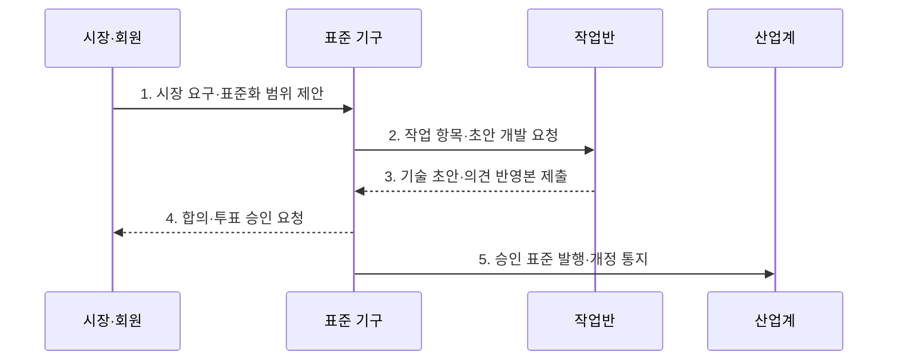

---
sidebar:
  order: 42
  label: "042. ITU·ISO·IEEE·IETF 표준화 기구 (International Standards Bodies)"
  badge:
    text: "기출 · 50%"
    variant: note
title: "ITU·ISO·IEEE·IETF 표준화 기구 (International Standards Bodies)"
date: "2026-07-30T14:37:00+09:00"
tags:
  - "notes-law-policy"
weight: 42
extra:
  question_no: "042"
  source_status: "기출"
  source_history: "123회, 137회"
  priority: 50
  priority_note: "반복 기출, 표준화 기구별 역할 비교"
---

## 미리 알고가기

- **표준화 기구(Standards Development Organization, SDO)**: 이해관계자의 합의를 통해 기술 규격을 개발·승인·배포하는 조직
- **국제전기통신연합(International Telecommunication Union, ITU)**: 전기통신과 전파 분야의 국제표준·주파수·위성궤도를 조정하는 유엔 전문기구
- **국제표준화기구(International Organization for Standardization, ISO)**: 국가 표준기관이 참여해 산업 전반의 국제표준을 제정하는 기구
- **국제전기기술위원회(International Electrotechnical Commission, IEC)**: 전기·전자·정보기술 분야의 국제표준을 제정하는 기구
- **국제전기전자공학회(Institute of Electrical and Electronics Engineers, IEEE)**: 전기·전자·컴퓨터 분야의 연구와 기술표준 개발을 수행하는 전문기관
- **인터넷 엔지니어링 태스크 포스(Internet Engineering Task Force, IETF)**: 공개 논의와 합의를 통해 인터넷 기술표준을 개발하는 공동체
- **의견 요청서(Request for Comments, RFC)**: 인터넷 프로토콜·절차·기술 정보를 정의해 IETF가 공개하는 문서군
- **합리적·비차별적 조건(Reasonable and Non-Discriminatory, RAND)**: 표준필수특허를 합리적이고 차별 없는 조건으로 허락하는 원칙

## Ⅰ. 개요

- 정의/개념: 국가·산업·전문가의 합의를 정해진 절차로 수렴해 국제 기술 규격과 권고문을 개발·발행하는 표준개발 조직
- 배경/필요성: 개별 국가나 기업의 규격만으로는 국가 간 상호운용성과 무역 및 안전 기준을 일관되게 맞추기 곤란

### 쉽게 이해하기 (학습용)
- 무선 랜이나 인터넷 프로토콜처럼 전 세계 모든 제조사와 통신사가 동일한 기술 규격으로 시스템을 만들도록 약속을 정하는 단체들입니다.

## Ⅱ. 특징

- ITU·ISO·IEC는 국가 회원과 국가 표준기관의 공식 합의 절차로 표준을 개발
- IEEE SA·IETF는 전문가 참여와 공개 토론 및 구현 경험으로 기술 규격을 구체화
- 기구 간 공동 작업과 참조 관계로 중복 표준을 줄이고 적용 범위를 연결

### 쉽게 이해하기 (학습용)
- 국가 표준기관의 합의가 중심인 기구(ISO)와 실무 개발자의 토론·구현이 표준을 결정하는 기술 공동체(IETF)로 나뉩니다.

## Ⅲ. 구조 및 구성요소

| 설계 요소 | 설명 |
|:---|:---|
| 회원·참여자 | 국가·기업·개인이 기구 규정에 따라 참여 |
| 기술조직 | 위원회와 작업반 중심의 기술 초안 개발 |
| 합의·투표 | 의견 조율 및 회원국 다수결 투표 승인 |
| 표준 산출물 | 공식 권고문·국제표준·RFC 규격 발행 |

### 쉽게 이해하기 (학습용)
- 전문가들이 기술 위원회에서 규격 초안을 작성하면, 회원들이 모여 합의 투표 절차를 진행하고 최종 공식 문서로 배포합니다.

## Ⅳ. 흐름도

| 절차 | 설명 |
|:---|:---|
| 시장 요구·표준화 범위 제안 | 기술 속성과 이해관계자를 기준으로 작업 범위 정의 |
| 작업 항목·초안 개발 요청 | 담당 위원회와 작업반 및 일정 확정 |
| 기술 초안·의견 반영본 제출 | 요구사항·규격 작성과 공개 의견 조정 |
| 합의·투표 승인 요청 | 기구별 규칙에 따른 회원 합의와 공식 승인 |
| 승인 표준 발행·개정 통지 | 산업 적용을 확산하고 버전·개정 이력 관리 |

### 쉽게 이해하기 (학습용)
- 기술 규격을 먼저 기획하고 위원회별로 기술 문서를 심사하여 대다수의 제조사 동의를 얻어 국제 규격으로 등재합니다.

## Ⅴ. 종류 및 비교

| 구분 | 국가·회원 기구형 | 기술 공동체형 |
|:---|:---|:---|
| 적용 기준 | 국가·산업 합의가 필요할 때 | 구현 중심 합의가 필요할 때 |
| 핵심 특징 | 국가 대표·회원 합의 | 전문가·공개 공동체 합의 |
| 한계 | 합의·승인 기간 장기화 | 공식 채택 범위의 한계 |

### 쉽게 이해하기 (학습용)
- 국가 간 합의가 필수인 인프라 규격은 ISO·ITU 등 공식 기구를 따르고, 실무적인 인터넷 기술은 IETF 등의 규격을 우선 선택합니다.

## Ⅵ. 실무 고려사항 및 대책

| 고려사항 | 대책 | 효과 |
|:---|:---|:---|
| 기술 영역과 기구의 불일치 | 통신·산업·전기전자·인터넷 등 적용 범위와 산출물 효력을 비교 | 적합한 표준화 경로 선택 |
| 복수 기구의 중복·충돌 규격 | 공동 작업·상호 참조와 국내 채택 상태를 추적 | 구현 기준의 모순 방지 |
| 표준 버전과 특허 조건 변경 | 개정 이력과 표준필수특허의 RAND 조건을 제품 수명주기 동안 관리 | 호환성·라이선스 위험 축소 |

### 쉽게 이해하기 (학습용)
- 신기술 적용 시 해당 규격의 승인 연도와 유효한 버전 번호를 추적해 호환성 오류를 차단합니다.

## Ⅶ. 결론

- 국가 간 공식 합의가 필요하면 ITU·ISO·IEC를, 전문가 구현 합의가 핵심이면 IEEE·IETF를 우선 선택하고, 최종 제품에는 승인 버전과 특허 조건까지 반영

### 쉽게 이해하기 (학습용)
- 자사 기술이 국제 표준으로 채택되도록 기구별 투표권 행사 규정과 표준 제정 동향을 실시간 감시해야 합니다.
