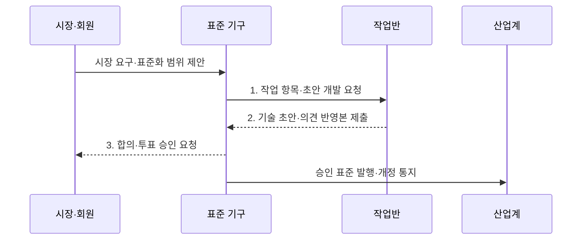

---
sidebar:
  order: 42
  label: "042. ITU·ISO·IEEE·IETF 표준화 기구 (International Standards Bodies)"
  badge:
    text: "기출 · 50%"
    variant: note
title: "ITU·ISO·IEEE·IETF 표준화 기구 (International Standards Bodies)"
date: "2026-07-31T11:43:07+09:00"
tags:
  - "notes-law-policy"
weight: 42
extra:
  question_no: "042"
  source_status: "기출"
  source_history: "123회, 137회"
  priority: 50
  priority_note: "반복 기출, 표준화 기구별 역할 비교"
---

## 미리 알고가기

- **표준화 기구(Standards Development Organization, SDO)**: 이해관계자의 합의를 통해 기술 규격을 개발·승인·배포하는 조직
- **국제전기통신연합(International Telecommunication Union, ITU)**: 전기통신과 전파 분야의 국제표준·주파수·위성궤도를 조정하는 유엔 전문기구
- **국제표준화기구(International Organization for Standardization, ISO)**: 국가 표준기관이 참여해 산업 전반의 국제표준을 제정하는 기구
- **국제전기기술위원회(International Electrotechnical Commission, IEC)**: 전기·전자·정보기술 분야의 국제표준을 제정하는 기구
- **국제전기전자공학회(Institute of Electrical and Electronics Engineers, IEEE)**: 전기·전자·컴퓨터 분야의 연구와 기술표준 개발을 수행하는 전문기관
- **인터넷 엔지니어링 태스크 포스(Internet Engineering Task Force, IETF)**: 공개 논의와 합의를 통해 인터넷 기술표준을 개발하는 공동체
- **의견 요청서(Request for Comments, RFC)**: 인터넷 프로토콜·절차·기술 정보를 정의해 IETF가 공개하는 문서군
- **합리적·비차별적 조건(Reasonable and Non-Discriminatory, RAND)**: 표준필수특허를 합리적이고 차별 없는 조건으로 허락하는 원칙

> **키워드:** ITU·ISO·IEEE·IETF 표준화 기구 (International Standards Bodies)

## Ⅰ. 개요

- 정의/개념: 국가·산업·전문가 합의로 국제 규격·권고를 만드는 **표준화 기구(SDO)**
- 배경/필요성: 개별 규격만으로는 국가 간 **상호운용성**과 무역·안전 기준 통일 곤란

### 쉽게 이해하기 (학습용)
- 무선 랜이나 인터넷 프로토콜처럼 전 세계 모든 제조사와 통신사가 동일한 기술 규격으로 시스템을 만들도록 약속을 정하는 단체들입니다.

## Ⅱ. 특징

- 회원국·국가위원회의 절차를 따르는 **공식 합의**
- 전문가 토론과 구현 경험에 기초한 **개방 참여**
- 공동 작업·상호 참조로 중복을 줄이는 **기구 간 연계**

### 쉽게 이해하기 (학습용)
- 국가 표준기관의 합의가 중심인 기구(ISO)와 실무 개발자의 토론·구현이 표준을 결정하는 기술 공동체(IETF)로 나뉩니다.

## Ⅲ. 구조 및 구성요소

```mermaid
block-beta
    columns 4
    M["회원·참여자"] T["기술조직"] C["합의·투표"] S["표준 산출물"]
    M -- T
    T -- C
    C -- S
```

| 구성요소 | 책임 |
|:---|:---|
| **회원·참여자** | 국가·기업·개인의 규정별 참여 |
| **기술조직** | 위원회·작업반 중심의 초안 개발 |
| **합의·투표** | 의견 조율과 회원 절차별 승인 |
| **표준 산출물** | 권고문·국제표준·RFC 발행 |

### 쉽게 이해하기 (학습용)
- 전문가들이 기술 위원회에서 규격 초안을 작성하면, 회원들이 모여 합의 투표 절차를 진행하고 최종 공식 문서로 배포합니다.

## Ⅳ. 흐름도



1. **작업 항목·초안 개발 요청**: 담당 위원회·작업반·일정 확정
2. **기술 초안·의견 반영본 제출**: 요구사항·규격 작성과 공개 의견 조정
3. **합의·투표 승인 요청**: 기구별 규칙에 따른 회원 합의와 공식 승인

### 쉽게 이해하기 (학습용)
- 기술 규격을 먼저 기획하고 위원회별로 기술 문서를 심사하여 대다수의 제조사 동의를 얻어 국제 규격으로 등재합니다.

## Ⅴ. 종류 및 비교

| 구분 | 국가·회원 기구형 | 기술 공동체형 |
|:---|:---|:---|
| **적용 기준** | 국가·산업의 **공식 합의** | 구현 중심의 **기술 합의** |
| **핵심 특징** | 국가 대표·**회원 합의** | 전문가·**공개 공동체 합의** |
| **한계** | 합의·승인 기간의 **장기화** | 공식 채택 범위의 **한계** |

### 쉽게 이해하기 (학습용)
- 국가 간 합의가 필수인 인프라 규격은 ISO·ITU 등 공식 기구를 따르고, 실무적인 인터넷 기술은 IETF 등의 규격을 우선 선택합니다.

## Ⅵ. 실무 고려사항 및 대책

| 고려사항 | 대책 | 효과 |
|:---|:---|:---|
| 기술 영역과 **기구 불일치** | 적용 범위와 산출물의 **효력 비교** | 적합한 **표준화 경로** 선택 |
| 복수 기구의 **중복·충돌 규격** | 공동 작업·상호 참조·**국내 채택** 추적 | 구현 기준의 **모순 방지** |
| 버전과 **특허 조건 변경** | 개정 이력과 **RAND 조건** 관리 | 호환성·**라이선스 위험** 축소 |

### 쉽게 이해하기 (학습용)
- 신기술 적용 시 해당 규격의 승인 연도와 유효한 버전 번호를 추적해 호환성 오류를 차단합니다.

## Ⅶ. 결론

- 공식 합의는 **ITU·ISO·IEC**, 구현 합의는 **IEEE·IETF**로 정하고 버전·특허 조건 반영

### 쉽게 이해하기 (학습용)
- 자사 기술이 국제 표준으로 채택되도록 기구별 투표권 행사 규정과 표준 제정 동향을 실시간 감시해야 합니다.
