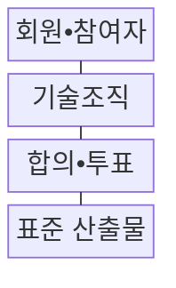
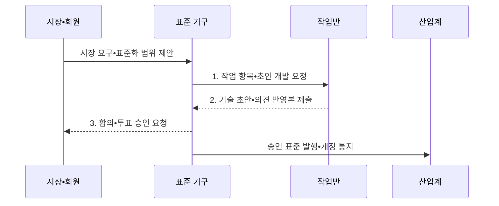

---
sidebar:
  order: 42
  label: "042. ITU•ISO•IEEE•IETF 표준화 기구 (International Standards Bodies)"
  badge:
    text: "기출 • 50%"
    variant: note
title: "ITU•ISO•IEEE•IETF 표준화 기구 (International Standards Bodies)"
date: "2026-08-03T08:48:47+09:00"
tags:
  - "notes-law-policy"
weight: 42
extra:
  question_no: "042"
  source_status: "기출"
  source_history: "123회, 137회"
  priority: 50
  priority_note: "반복 기출, 표준화 기구별 역할 비교"
---

## Ⅰ. 개요

핵심 용어

- **표준개발기구(Standards Development Organization, SDO)**: 이해관계자의 합의를 통해 기술 규격을 개발•승인•배포하는 조직이다.
- **국제표준**: 국가•산업 간 상호운용성•안전•품질•무역 기준을 통일하기 위해 합의한 규격이다.

- 정의/개념: 국제 권고•표준•RFC를 개발•승인•배포하는 **표준개발기구(Standards Development Organization, SDO)**
- 배경/필요성: 개별 규격만으로는 국가 간 **상호운용성 확보** 및 무역•안전 기준 통일 곤란

#### 한줄 요약
- 무선 랜이나 인터넷 프로토콜처럼 전 세계 모든 제조사와 통신사가 동일한 기술 규격으로 시스템을 만들도록 약속을 정하는 단체들입니다.

## Ⅱ. 특징

핵심 용어

- **합의 절차**: 제안•초안•공개 검토•의견 해결•투표를 통해 이해관계자 동의를 형성하는 과정이다.
- **개방성**: 표준 초안과 의견 수렴에 다양한 국가•기업•전문가가 참여할 수 있는 성질이다.
- **표준필수특허**: 표준을 구현하려면 반드시 사용해야 하는 특허로 허가 조건 관리가 필요한 권리이다.
- **공식 합의**: 회원국•국가위원회의 대표성과 투표 절차를 통해 표준을 승인하는 방식이다.
- **개방 참여**: 기술 전문가와 구현자가 공개 토론•검토•시험에 참여하여 기술 합의를 만드는 방식이다.
- **기구 간 연계**: 여러 표준화 기구가 공동 작업과 상호 참조로 중복•충돌 규격을 줄이는 협력 방식이다.

- 회원국•국가위원회의 절차를 따르는 **공식 합의**
- 전문가 토론과 구현 경험에 기초한 **개방 참여**
- 공동 작업•상호 참조로 중복을 줄이는 **기구 간 연계**

#### 한줄 요약
- 국가 표준기관의 합의가 중심인 기구(ISO)와 실무 개발자의 토론•구현이 표준을 결정하는 기술 공동체(IETF)로 나뉩니다.

## Ⅲ. 구조 및 구성요소

핵심 용어

- **국제전기통신연합(International Telecommunication Union, ITU)**: 전기통신•전파 분야의 국제표준과 주파수•위성궤도를 조정하는 유엔 전문기구이다.
- **국제표준화기구(International Organization for Standardization, ISO)•국제전기기술위원회(International Electrotechnical Commission, IEC)**: 산업 전반과 전기•전자•정보기술 분야의 국제표준을 국가 표준기관 참여로 제정하는 기구이다.
- **전기전자공학자협회(Institute of Electrical and Electronics Engineers, IEEE)•인터넷국제표준화기구(Internet Engineering Task Force, IETF)**: 전기•전자•컴퓨터 기술표준과 인터넷 표준을 각각 전문가 합의로 개발하는 조직이다.
- **의견요청서(Request for Comments, RFC)**: 인터넷 프로토콜•절차•기술 정보를 공개하고 합의 결과를 기록하는 IETF 문서군이다.

| 구성요소 | 책임 |
|:---|:---|
| **회원•참여자** | 국가•기업•개인의 규정별 참여 |
| **기술조직** | 위원회•작업반 중심의 초안 개발 |
| **합의•투표** | 의견 조율과 회원 절차별 승인 |
| **표준 산출물** | 권고문•국제표준•RFC 발행 |

#### 한줄 요약
- 전문가들이 기술 위원회에서 규격 초안을 작성하면, 회원들이 모여 합의 투표 절차를 진행하고 최종 공식 문서로 배포합니다.

## Ⅳ. 흐름도

핵심 용어

- **작업 항목**: 표준화 필요성•범위•일정•참여 조직을 정하여 공식 개발을 시작하는 제안이다.
- **의견 해결**: 초안 검토에서 제기된 기술•법적 의견을 반영하거나 근거를 들어 처리하는 절차이다.
- **합의•투표**: 기구별 승인 규칙에 따라 이해관계자의 동의를 확인하고 표준안을 공식 채택하는 절차이다.

1. **작업 항목•초안 개발 요청**: 담당 위원회•작업반•일정 확정
2. **기술 초안•의견 반영본 제출**: 요구사항•규격 작성과 공개 의견 조정
3. **합의•투표 승인 요청**: 기구별 규칙에 따른 회원 합의와 공식 승인

#### 한줄 요약
- 기술 규격을 먼저 기획하고 위원회별로 기술 문서를 심사하여 대다수의 제조사 동의를 얻어 국제 규격으로 등재합니다.

## Ⅴ. 종류 및 비교

핵심 용어

- **권고•국제표준**: 국제전기통신연합(International Telecommunication Union, ITU)•국제표준화기구(International Organization for Standardization, ISO)•국제전기기술위원회(International Electrotechnical Commission, IEC)가 회원 절차로 승인하여 발행하는 규격이다.
- **전기전자공학자협회(Institute of Electrical and Electronics Engineers, IEEE) 표준**: 기술 전문가•산업 참여자가 위원회와 투표 절차로 개발하는 표준이다.
- **의견요청서(Request for Comments, RFC)**: 인터넷국제표준화기구(Internet Engineering Task Force, IETF)가 인터넷 프로토콜•절차•기술 정보를 정의하여 공개하는 문서군이다.

| 구분 | 국가•회원 기구형 | 기술 공동체형 |
|:---|:---|:---|
| **적용 기준** | 국가•산업의 **공식 합의** | 구현 중심의 **기술 합의** |
| **핵심 특징** | 국가 대표•**회원 합의** | 전문가•**공개 공동체 합의** |
| **한계** | 합의•승인 기간의 **장기화** | 공식 채택 범위의 **한계** |

#### 한줄 요약
- 국가 간 합의가 필수인 인프라 규격은 ISO•ITU 등 공식 기구를 따르고, 실무적인 인터넷 기술은 IETF 등의 규격을 우선 선택합니다.

## Ⅵ. 실무 고려사항 및 대책

핵심 용어

- **합리적이고 비차별적인 조건(Reasonable and Non-Discriminatory, RAND)**: 표준필수특허를 합리적이고 차별 없는 조건으로 허락하는 원칙이다.
- **표준 중복**: 여러 기구가 유사 범위의 규격을 별도로 개발하여 구현 선택과 적합성 판정이 충돌하는 문제이다.
- **버전 고정**: 제품 요구에서 표준 이름만 쓰지 않고 판•개정연도•프로파일•선택 항목까지 명시하는 조치이다.

| 문제 | 대책 | 효과 |
|:---|:---|:---|
| 기술 영역과 **기구 불일치** | 적용 범위와 산출물의 **효력 비교** | 적합한 **표준화 경로** 선택 |
| 복수 기구의 **중복•충돌 규격** | 공동 작업•상호 참조•**국내 채택** 추적 | 구현 기준의 **모순 방지** |
| 버전과 **특허 조건 변경** | 개정 이력과 **RAND 조건** 관리 | 호환성•**라이선스 위험** 축소 |

#### 한줄 요약
- 신기술 적용 시 해당 규격의 승인 연도와 유효한 버전 번호를 추적해 호환성 오류를 차단합니다.

## Ⅶ. 결론

핵심 용어

- **적합성 평가**: 제품•서비스가 표준의 규범 요구사항과 선택한 프로파일을 충족하는지 시험•인증하는 활동이다.
- **상호운용성**: 서로 다른 구현이 합의한 형식•절차•의미에 따라 정보를 교환하고 함께 동작하는 능력이다.

- 공식 합의는 **국제전기통신연합(International Telecommunication Union, ITU)•국제표준화기구(International Organization for Standardization, ISO)•국제전기기술위원회(International Electrotechnical Commission, IEC)**, 구현 합의는 **전기전자공학자협회(Institute of Electrical and Electronics Engineers, IEEE)•인터넷국제표준화기구(Internet Engineering Task Force, IETF)** 중심으로 선정

#### 한줄 요약
- 자사 기술이 국제 표준으로 채택되도록 기구별 투표권 행사 규정과 표준 제정 동향을 실시간 감시해야 합니다.
