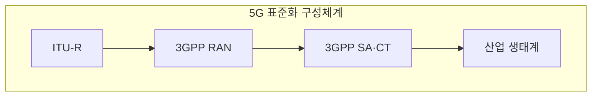
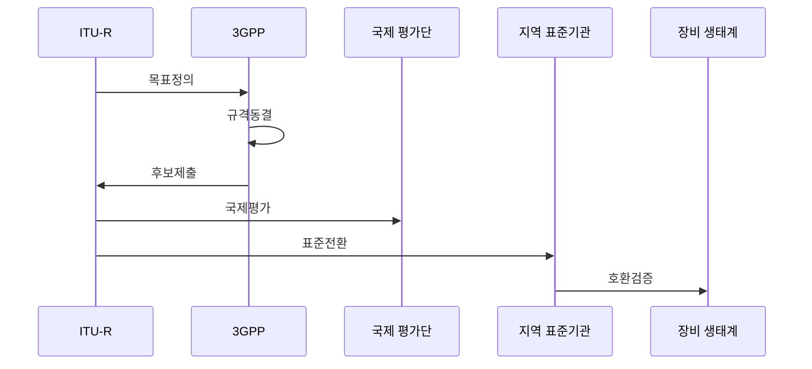

---
sidebar:
  order: 43
  label: "043. 5G 국제 표준 — 3GPP·IMT-2020 (5G International Standards)"
  badge:
    text: "기출 · 50%"
    variant: note
title: "5G 국제 표준 — 3GPP·IMT-2020 (5G International Standards)"
date: "2026-07-27T23:59:59+09:00"
tags:
  - "notes-law-policy"
weight: 43
extra:
  question_no: "043"
  source_status: "기출"
  source_history: "128회, 135회"
  priority: 50
  priority_note: "반복 기출, 3GPP·IMT 표준화 구조"
---

## 미리 알고가기

- **5세대 이동통신(5th-Generation, 5G)**: 초고속·초저지연·초연결 서비스를 지원하는 이동통신 기술
- **국제 이동통신 표준(International Mobile Telecommunications, IMT)**: ITU가 세대별 이동통신의 성능 요구와 무선 인터페이스를 정의한 국제표준 체계
- **국제전기통신연합 무선통신부문(International Telecommunication Union Radiocommunication Sector, ITU-R)**: 국제 주파수 이용을 조정하고 무선통신 표준 권고를 개발하는 ITU 부문
- **3세대 파트너십 프로젝트(3rd Generation Partnership Project, 3GPP)**: 이동통신 시스템의 무선·코어망 상세 규격을 개발하는 국제 표준협력체
- **5G 신규 무선 접속 기술(New Radio, NR)**: 5G 단말과 기지국 사이의 무선 전송을 정의한 접속 규격
- **무선 접속망(Radio Access Network, RAN)**: 단말을 기지국을 통해 이동통신 코어망에 연결하는 무선 네트워크 영역
- **비독립모드(Non-Standalone, NSA)**: 기존 LTE 코어망과 제어 기능을 활용하면서 5G 무선망을 함께 사용하는 구성
- **독립모드(Standalone, SA)**: 5G 전용 코어망과 무선망으로 모든 기능을 제공하는 구성
- **기술 규격·기술 보고서(Technical Specification·Technical Report, TS·TR)**: 구현에 필요한 규범 요구사항과 기술 조사·검토 결과를 각각 담는 3GPP 문서

## Ⅰ. 개요

- 정의/개념: ITU-R 성능 요구와 3GPP 구현 규격으로 구성된 5G 국제 표준 체계
- **배경/필요성**: 지역·사업자별 독자 규격만으로 단말 상호운용과 국제 로밍 보장 곤란

### 쉽게 이해하기 (학습용)
- 유엔 산하 기구(ITU)가 5G 무선통신이 갖추어야 할 속도나 지연 시간 목표를 세우면, 민간 협력 기구(3GPP)가 이에 맞는 구체적인 기술 규격서를 작성해 제품을 만들도록 돕는 관계입니다.

## Ⅱ. 특징

- ITU-R은 IMT 요구·승인 권고를 관리한다.
- 3GPP는 RAN·코어망 상세 규격을 개발한다.
- 릴리즈별 기능 확장과 지역 표준 채택으로 상용화를 전개한다.

### 쉽게 이해하기 (학습용)
- 3GPP는 한 번에 완성하는 것이 아니라 기술 요구사항 진화에 맞춰 '릴리즈(Release)'라는 단위로 규격을 쪼개어 단계적으로 확정합니다.

## Ⅲ. 아키텍처 및 구성요소

| 설계 요소 | 설명 |
|:---|:---|
| ITU-R | IMT 성능 요구사항 정의 및 승인 권고 관리 |
| 3GPP RAN | 5G 무선 접속망 물리 계층 상세 규격 개발 |
| 3GPP SA·CT | 5G 코어 아키텍처 및 연동 프로토콜 개발 |
| 산업 생태계 | 지역 표준 전환과 단말·장비 상용화 이행 |

> 요약: 성능 요건 수립과 무선 및 코어의 상세 규격 연계

### 쉽게 이해하기 (학습용)
- 무선국 통신 규격(RAN)과 코어 네트워크 프로토콜(SA·CT) 세부 사양을 3GPP에서 합의해 나가고 각국 표준 기관에 이전시킵니다.

## Ⅳ. 원리 및 절차 흐름도

| 절차 | 설명 |
|:---|:---|
| 목표정의 | 세대별 성능 요구를 설정 |
| 규격동결 | 무선·코어 상세 규격을 확정 |
| 후보제출 | 완성 규격을 후보기술로 제출 |
| 국제평가 | 요구 충족성과 타당성을 검증 |
| 표준전환 | 승인 규격을 지역 표준으로 채택 |
| 호환검증 | 단말·망 장비의 연동을 확인 |

> 요약: 목표·규격·평가·전환·호환을 연계

### 쉽게 이해하기 (학습용)
- 요구 성능 기준을 수립한 뒤, 3GPP 회의체에서 기고서를 모아 규격을 만든 후 평가단 검증을 받아 공식 표준안으로 채택합니다.

## Ⅴ. 5G 표준화 역할 비교

| 구분 | ITU-R IMT-2020 | 3GPP 5G 규격 |
|:---|:---|:---|
| 적용 기준 | 기술 인증 및 주파수 조정 | 구현 및 지역 표준 전환 |
| 핵심 특징 | 국제 성능 요구·무선 승인 | 무선·코어 구현 규격 개발 |
| 한계 | 구현 세부 규격 부족 | 국제 요구와의 불일치 |

> 요약: ITU는 성능 방향, 3GPP는 상세 규격 담당

### 쉽게 이해하기 (학습용)
- ITU-R은 국가 단위의 규제와 통신 주파수 대역을 조정하고, 3GPP는 실무적으로 장비 간 패킷 규격을 조율합니다.

## Ⅵ. 실무 사례

1. 단말·기지국·코어망의 **3GPP 릴리즈** 일치 검증

### 쉽게 이해하기 (학습용)
- 단말기 모뎀과 통신사 기지국·코어망이 서로 다른 릴리즈 사양이면 통신이 끊길 수 있어 지원 버전을 맞춥니다.

## Ⅶ. 결론

- 5G 상호운용을 위해 ITU·3GPP 역할을 검토하여 **5G 표준** 활용

### 쉽게 이해하기 (학습용)
- 5G를 넘어 6G 이동통신 표준화 주도권을 선점하려면 3GPP의 핵심 릴리즈 동결 시점에 맞추어 기고서를 적시에 제출해야 합니다.
