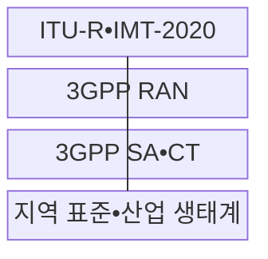
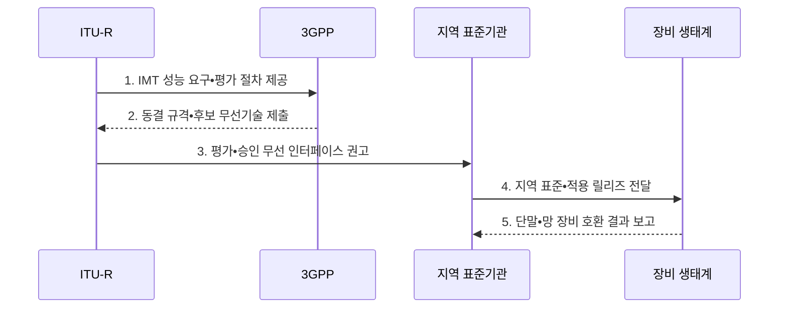

---
sidebar:
  order: 43
  label: "043. 5G 국제 표준 — 3GPP•IMT-2020 (5G International Standards)"
  badge:
    text: "기출 • 50%"
    variant: note
title: "5G 국제 표준 — 3GPP•IMT-2020 (5G International Standards)"
date: "2026-08-03T08:48:47+09:00"
tags:
  - "notes-law-policy"
weight: 43
extra:
  question_no: "043"
  source_status: "기출"
  source_history: "128회, 135회"
  priority: 50
  priority_note: "반복 기출, 3GPP•IMT 표준화 구조"
---

## Ⅰ. 개요

핵심 용어

- **5세대 이동통신(Fifth Generation Mobile Communications, 5G)**: 초고속•초저지연•초연결 서비스를 지원하도록 정의한 이동통신 세대이다.
- **국제전기통신연합 전파통신부문(International Telecommunication Union Radiocommunication Sector, ITU-R)**: 국제이동통신 성능 요구와 무선 인터페이스 승인 및 주파수 이용을 담당하는 국제기구 부문이다.
- **3세대 파트너십 프로젝트(3rd Generation Partnership Project, 3GPP)**: 5G 무선 접속망•코어망•서비스의 상세 구현 규격을 개발하는 국제 표준협력체이다.

- 정의/개념: ITU-R 국제 요구와 3GPP 상세 규격을 연결하는 **5세대 이동통신(Fifth Generation Mobile Communications, 5G) 표준 체계**
- 배경/필요성: 독자 규격만으로는 단말•망의 **상호운용성 확보** 및 국제 로밍 보장 곤란

#### 한줄 요약
- 유엔 산하 기구(ITU)가 5G 무선통신이 갖추어야 할 속도나 지연 시간 목표를 세우면, 민간 협력 기구(3GPP)가 이에 맞는 구체적인 기술 규격서를 작성해 제품을 만들도록 돕는 관계입니다.

## Ⅱ. 특징

핵심 용어

- **국제이동통신-2020(International Mobile Telecommunications-2020, IMT-2020)**: 국제전기통신연합 전파통신부문(International Telecommunication Union Radiocommunication Sector, ITU-R)이 5G 후보 기술의 성능 요구와 평가 방법 및 승인 무선 인터페이스를 정의한 국제 체계이다.
- **3세대 파트너십 프로젝트 릴리즈(3rd Generation Partnership Project Release, 3GPP Release)**: 무선•코어•서비스 규격을 기능 묶음과 일정에 따라 동결하여 배포하는 버전 단위이다.
- **기술 규격(Technical Specification, TS)•기술 보고서(Technical Report, TR)**: 3GPP 구현의 규범 요구사항과 후보 기술 조사 결과를 각각 담는 문서이다.
- **새로운 무선(New Radio, NR)**: 5G 단말과 기지국 사이의 무선 전송 규격이다.

- **IMT-2020** 요구와 무선 인터페이스 승인 기준
- **3GPP 기술 규격(Technical Specification, TS)•기술 보고서(Technical Report, TR)** 기반 NR•코어망 구현 규격
- 릴리즈 동결•채택•호환 검증을 거치는 **단계적 상용화**

#### 한줄 요약
- 3GPP는 한 번에 완성하는 것이 아니라 기술 요구사항 진화에 맞춰 '릴리즈(Release)'라는 단위로 규격을 쪼개어 단계적으로 확정합니다.

## Ⅲ. 구조 및 구성요소

핵심 용어

- **국제전기통신연합 전파통신부문(International Telecommunication Union Radiocommunication Sector, ITU-R)**: 국제 주파수 이용을 조정하고 무선통신 권고와 국제이동통신 요구를 개발하는 부문이다.
- **3세대 파트너십 프로젝트(3rd Generation Partnership Project, 3GPP)**: 이동통신 시스템의 무선•코어망 상세 규격을 개발하는 국제 표준협력체이다.
- **무선 접속망(Radio Access Network, RAN)**: 단말을 기지국을 거쳐 코어망에 연결하는 무선 네트워크 영역이다.
- **서비스 및 시스템(Service and System Aspects, SA)•핵심망 및 단말(Core Network and Terminals, CT)**: 3GPP에서 코어 아키텍처•서비스와 연동 프로토콜을 각각 담당하는 기술 규격 그룹이다.

| 구성요소 | 책임 |
|:---|:---|
| **ITU-R•IMT-2020** | IMT 성능 요구와 승인 권고 관리 |
| **3GPP RAN** | 무선 접속망의 상세 규격 개발 |
| **3GPP SA•CT** | 코어 아키텍처•연동 프로토콜 개발 |
| **지역 표준•산업 생태계** | 지역 표준 전환과 장비 상용화 |

#### 한줄 요약
- 무선국 통신 규격(RAN)과 코어 네트워크 프로토콜(SA•CT) 세부 사양을 3GPP에서 합의해 나가고 각국 표준 기관에 이전시킵니다.

## Ⅳ. 흐름도

핵심 용어

- **기술 규격(Technical Specification, TS)**: 3세대 파트너십 프로젝트(3rd Generation Partnership Project, 3GPP) 구현에 필요한 규범적 요구사항을 담은 문서이다.
- **기술 보고서(Technical Report, TR)**: 후보 기술•요구•영향을 조사하고 규격화 근거를 정리한 문서이다.
- **국제이동통신(International Mobile Telecommunications, IMT)**: 국제전기통신연합이 세대별 이동통신 성능 목표와 평가 절차를 정하는 국제 체계이다.

1. **IMT 성능 요구•평가 절차 제공**: 세대별 성능 목표와 후보 평가 기준 설정
2. **동결 규격•후보 무선기술 제출**: 무선•코어 상세 규격을 확정해 국제 평가 요청
3. **평가•승인 무선 인터페이스 권고**: 요구 충족성과 타당성을 검증해 국제표준 승인
4. **지역 표준•적용 릴리즈 전달**: 승인 규격을 지역 표준과 사업자 기준으로 전환
5. **단말•망 장비 호환 결과 보고**: 단말•기지국•코어망의 연동과 로밍 확인

#### 한줄 요약
- 요구 성능 기준을 수립한 뒤, 3GPP 회의체에서 기고서를 모아 규격을 만든 후 평가단 검증을 받아 공식 표준안으로 채택합니다.

## Ⅴ. 종류 및 비교

핵심 용어

- **비독립모드(Non-Standalone, NSA)**: 기존 장기진화(Long-Term Evolution, LTE) 코어망과 제어 기능을 활용하면서 5세대 새로운 무선(5G New Radio, 5G NR)을 함께 사용하는 구성이다.
- **독립모드(Standalone, SA)**: 5G 전용 코어망과 NR로 슬라이싱•저지연 등 5G 기능을 온전히 제공하는 구성이다.
- **ITU-R IMT-2020**: 국제전기통신연합 전파통신부문(International Telecommunication Union Radiocommunication Sector, ITU-R)의 5G 성능 요구•평가•무선 승인 체계이다.
- **3GPP 5G 규격**: 3세대 파트너십 프로젝트(3rd Generation Partnership Project, 3GPP)가 개발하는 5G 무선•코어망 구현 규격이다.

| 구분 | ITU-R IMT-2020 | 3GPP 5G 규격 |
|:---|:---|:---|
| **적용 기준** | 기술 인증•**주파수 조정** | 구현•**지역 표준 전환** |
| **핵심 특징** | 국제 성능 요구•**무선 승인** | 무선•코어 **구현 규격** 개발 |
| **한계** | 구현 세부 규격의 **부족** | 국제 요구와의 **불일치** |

#### 한줄 요약
- ITU-R은 국가 단위의 규제와 통신 주파수 대역을 조정하고, 3GPP는 실무적으로 장비 간 패킷 규격을 조율합니다.

## Ⅵ. 실무 고려사항 및 대책

핵심 용어

- **릴리즈 호환성**: 단말•기지국•코어가 서로 다른 3세대 파트너십 프로젝트 릴리즈(3rd Generation Partnership Project Release, 3GPP Release) 선택 기능을 지원하여 접속•서비스가 제한되는 문제이다.
- **주파수 적합성**: 국가별 할당 대역•출력•채널 조건에 맞는 3GPP 밴드와 장비를 선택해야 하는 조건이다.
- **상호운용 시험**: 서로 다른 제조사의 단말•무선망•코어망이 같은 프로파일로 접속•이동•서비스를 수행하는지 확인하는 시험이다.

| 문제 | 대책 | 효과 |
|:---|:---|:---|
| ITU 요구와 **구현 규격 혼동** | 성능은 ITU-R, 기능은 **3GPP 규격**으로 추적 | 역할별 **검증 기준 명확화** |
| 장비별 **지원 릴리즈 불일치** | 단말•기지국•코어망의 **지원 버전** 대조 | **연동 장애** 예방 |
| NSA•SA의 **기능 의존성** | 망 조합별 로밍•슬라이싱•**보안 시험** | 단계적 **상용망 전환** 안정화 |
| Release 19•20의 **동결 시점 차이** | 제품은 동결 규격, 선행 개발은 **최신 릴리즈** 추적 | 버전 선택의 **시점 오류** 방지 |

#### 한줄 요약
- 단말기 모뎀과 통신사 기지국•코어망이 서로 다른 릴리즈 사양이면 통신이 끊길 수 있어 지원 버전을 맞춥니다.

## Ⅶ. 결론

핵심 용어

- **국제 요구-상세 규격 관계**: ITU-R은 세대 성능과 국제 무선 체계를 정하고 3GPP는 이를 만족하는 구현 가능한 시스템 규격을 개발하는 관계이다.
- **국제 로밍**: 다른 국가•사업자 망에서도 가입자 인증과 이동통신 서비스를 이어서 사용할 수 있는 기능이다.

- 국제 적합성은 **국제전기통신연합 전파통신부문(International Telecommunication Union Radiocommunication Sector, ITU-R)**, 제품•망 연동은 동일 **3세대 파트너십 프로젝트 릴리즈(3rd Generation Partnership Project Release, 3GPP Release)** 기준 검증

#### 한줄 요약
- 5G를 넘어 6G 이동통신 표준화 주도권을 선점하려면 3GPP의 핵심 릴리즈 동결 시점에 맞추어 기고서를 적시에 제출해야 합니다.
