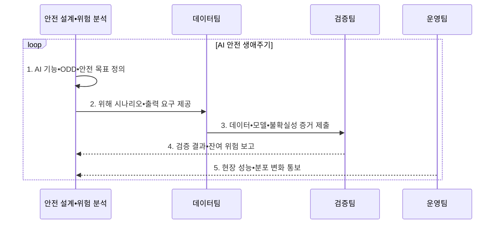

---
sidebar:
  order: 44
  label: "044. ISO/PAS 8800 자율주행 AI 안전 (ISO PAS 8800)"
  badge:
    text: "기출 • 50%"
    variant: note
title: "ISO/PAS 8800 자율주행 AI 안전 (ISO PAS 8800)"
date: "2026-08-05T14:22:44+09:00"
tags:
  - "notes-law-policy"
weight: 44
extra:
  question_no: "044"
  source_status: "기출"
  source_history: "138회"
  priority: 50
  priority_note: "138회 기출, 자율주행 AI 안전 생명주기"
---

## Ⅰ. 개요

<details><summary>핵심 용어</summary>

- **국제표준화기구 공개 가용 규격 8800(International Organization for Standardization Publicly Available Specification 8800, ISO/PAS 8800)**: 도로 차량 인공지능의 출력 불충분•오류가 만드는 안전 위험을 데이터•모델 수명주기 증거로 다루는 규격이다.
- **공개 가용 규격(Publicly Available Specification, PAS)**: 시급한 시장 요구에 대응하여 정식 국제표준보다 빠르게 합의•발행하고 향후 국제표준으로 발전할 수 있는 규격이다.
- **인공지능(Artificial Intelligence, AI)**: 데이터 학습과 추론으로 차량 인지•판단 결과를 생성하며 불확실성의 안전 논증이 필요한 기술이다.

</details>

- 정의/개념: 양산 차량 AI의 출력 위험을 수명주기 증거로 관리하는 **ISO/PAS 8800**
- 배경/필요성: 기능안전•SOTIF만으로는 데이터•모델의 **AI 불확실성** 논증 곤란

#### 한줄 요약
- 자율주행차 AI의 예측 불확실성을 데이터 선정부터 운영 감시까지 관리하는 안전 보증 표준입니다.

## Ⅱ. 특징

<details><summary>핵심 용어</summary>

- **AI 안전 논증**: 차량 AI의 의도된 기능•데이터•모델•검증•운영 통제가 허용 가능한 위험을 달성한다는 주장을 증거로 연결하는 활동이다.
- **운행 설계 영역(Operational Design Domain, ODD)**: 자율주행 기능이 정상 작동하도록 설계된 도로•기상•속도•교통 조건의 범위이다.
- **수명주기 증거**: 데이터 수집부터 학습•검증•배포•운영 감시•변경까지 안전 요구 충족을 입증하는 기록이다.

</details>

- 양산 차량의 AI 요소•경계•ODD를 명시하는 **안전 맥락**
- 불충분한 출력부터 차량 위해까지 잇는 **위해 경로**
- 수명주기 증거를 위험 수준에 연결하는 **안전 논증**

#### 한줄 요약
- AI 알고리즘의 출력 위험을 예방하고 입증하는 증거 수집에 집중합니다.

## Ⅲ. 구조 및 구성요소

<details><summary>핵심 용어</summary>

- **AI 안전 분석**: AI 출력의 불충분성과 오류가 차량 위해로 이어지는 경로를 식별하는 활동이다.
- **분포 변화**: 운영 데이터 특성이나 모델 성능이 학습•검증 당시와 달라지는 현상이다.
- **안전 요구**: 위해를 예방•탐지•완화하기 위해 AI 구성요소와 시스템에 할당한 검증 가능한 조건이다.

</details>

```text
                         [안전 맥락]
                              |
                       [AI 안전 분석]
                         /           \
                  [데이터•모델]     [현장 감시]
                         \           /
                         [검증•보증]
```

선의 의미: 안전 맥락은 AI 안전 분석의 범위를 정하고, 분석 결과는 데이터•모델과 현장 감시에 필요한 안전 증거를 규정하며, 검증•보증은 두 증거 영역을 결합해 안전 논증을 뒷받침한다.

| 구성요소 | 책임 |
|:---|:---|
| **안전 맥락** | 기능•ODD 설정과 AI 역할 정의 |
| **AI 안전 분석** | 출력 불충분성과 차량 위해 분석 |
| **데이터•모델** | 대표성과 모델 불확실성 관리 |
| **검증•보증** | 정량 증거 기반의 안전 논증 |
| **현장 감시** | 배포 후 성능 변화•이상 징후 감시 |

#### 한줄 요약
- 차량이 안전하게 운행할 조건(ODD)과 AI 역할을 정하고, 입출력 한계를 검증해 외부 심사자에게 논리적이고 정량적인 증적을 제시합니다.

## Ⅳ. 흐름도

<details><summary>핵심 용어</summary>

- **데이터 적합성**: 데이터가 ODD의 조건•위험•희귀 사례를 대표하고 품질•계보 기준을 충족하는 성질이다.
- **AI 기능**: 차량 시스템에서 학습 모델이 담당하는 인지•예측•판단 역할과 그 안전 경계이다.
- **운영 감시**: 배포 후 입력 분포•성능•안전 사건을 감시하여 ODD 이탈과 모델 열화를 탐지하는 활동이다.

</details>



1. **AI 기능•ODD•안전 목표 정의**: AI 역할과 정상 운행 조건 및 허용 위험 정의
2. **위해 시나리오•출력 요구 제공**: 불충분한 출력이 차량 위해로 이어지는 경로 분석
3. **데이터•모델•불확실성 증거 제출**: 대표성•편향•강건성•일반화 결과 검증
4. **검증 결과•잔여 위험 보고**: 요구사항과 증거를 연결해 안전 사례 구성
5. **현장 성능•분포 변화 통보**: 배포 후 성능 저하와 새 시나리오를 재평가

#### 한줄 요약
- 기상 상태 등의 ODD에서 차량 위해도를 분석하고, 훈련용 데이터의 양과 편향을 감시하며 출시 후 분포 변화(Drift)를 재조정합니다.

## Ⅴ. 종류 및 비교

<details><summary>핵심 용어</summary>

- **위험 분석 및 위험 평가(Hazard Analysis and Risk Assessment, HARA)**: 시스템 고장으로 발생하는 차량 위해를 분석하는 기능안전 활동이다.
- **자동차 안전 무결성 수준(Automotive Safety Integrity Level, ASIL)**: 차량 위험에 필요한 안전 요구의 엄격도를 나타내는 등급이다.
- **의도된 기능의 안전성(Safety of the Intended Functionality, SOTIF)**: 시스템 고장이 없어도 센서•알고리즘 성능 한계와 합리적으로 예견 가능한 오용에서 생기는 위험을 다루는 접근이다.
- **AI 안전**: 데이터•학습•모델 불확실성과 분포 변화를 포함하여 AI 구성요소의 안전 증거를 관리하는 접근이다.

</details>

| 구분 | ISO/PAS 8800 | ISO 26262 | ISO 21448 |
|:---|:---|:---|:---|
| **적용 기준** | 학습 모델의 **안전 위해** 제어 | 전기•전자의 **고장** 제어 | 의도 기능의 **한계** 제어 |
| **핵심 특징** | AI 안전의 **보증 증거** 연결 | **HARA•ASIL** 관리 | 기능 한계의 **시나리오 분석** |
| **주요 위험** | 데이터•출력의 **불확실성** | 체계•무작위 **고장** | 성능 한계의 **오판** |

#### 한줄 요약
- 부품 고장(26262)과 센서의 날씨 한계(21448)를 통과하더라도, 최종 자율주행 판단을 내리는 딥러닝 모델의 위험(8800)을 최종 방어합니다.

## Ⅵ. 실무 고려사항 및 대책

<details><summary>핵심 용어</summary>

- **ODD 대표성 부족**: 검증 데이터가 날씨•도로•객체•희귀 위험의 실제 운영 분포를 충분히 포함하지 못하는 문제이다.
- **모델 변경 영향**: 재학습•압축•하드웨어 변경 후 기존 안전 증거와 가정이 더는 유효하지 않을 수 있는 문제이다.
- **잔여 위험**: 안전 조치를 적용하고 검증한 뒤에도 남아 있어 수용•운영 제한•감시가 필요한 위험이다.

</details>

| 문제 | 대책 | 효과 |
|:---|:---|:---|
| ODD 밖 입력과 **미지 시나리오** | 경계•위해별 데이터와 **안전 상태 전환** 설계 | 예측 불가 출력의 **차량 영향 제한** |
| 데이터 대표성과 **모델 불확실성** | 계보•편향•강건성 지표를 **안전 요구** 에 연결 | 안전 논증의 **추적성 확보** |
| 배포 후 **분포 변화** | 임계치 이탈 시 기능 제한•**재검증** | 운영 중 **안전 수준 유지** |

#### 한줄 요약
- 카메라가 표지판을 속도로 오판할 때 브레이크 제어기에 주는 영향 범위와 잠재적 사고 리스크를 사전에 파악합니다.

## Ⅶ. 결론

<details><summary>핵심 용어</summary>

- **안전 사례**: 위험•요구•설계•검증•운영 증거를 연결하여 시스템이 허용 가능한 안전을 달성한다는 구조화된 논증이다.

</details>

- 차량 AI에 **ISO/PAS 8800:2024 적용**, **잔여 위험 허용 기준** 충족 후 배포

#### 한줄 요약
- 자율주행 인공지능은 입력 데이터의 미세한 변화로 오류를 일으킬 수 있으므로 실제 주행 시나리오에 기반한 지속적 안전 논증이 필수적입니다.
