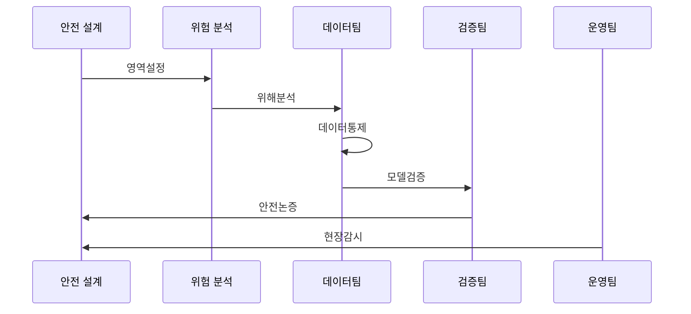

---
sidebar:
  order: 44
  label: "044. ISO/PAS 8800 자율주행 AI 안전 (ISO PAS 8800)"
  badge:
    text: "기출 · 50%"
    variant: note
title: "ISO/PAS 8800 자율주행 AI 안전 (ISO PAS 8800)"
date: "2026-07-27T23:59:59+09:00"
tags:
  - "notes-law-policy"
weight: 44
extra:
  question_no: "044"
  source_status: "기출"
  source_history: "138회"
  priority: 50
  priority_note: "138회 기출, 자율주행 AI 안전 생명주기"
---

## 미리 알고가기

- **국제표준화기구 공개 가용 규격(International Organization for Standardization/Publicly Available Specification, ISO/PAS)**: '아이에스오 슬래시 피에이에스'로 읽고 슬래시로 발행 기구와 신속 규격 유형을 구분
- **공개 가용 규격(Publicly Available Specification, PAS)**: '피에이에스'로 읽고 영문 머리글자로 정식 국제표준 전 단계의 신속 규격을 표시
- **운행 설계 영역(Operational Design Domain, ODD)**: '오디디'로 읽고 영문 머리글자로 자율주행이 작동하도록 정한 노면·기상·속도 조건을 표시
- **의도된 기능의 안전성(Safety Of The Intended Functionality, SOTIF)**: '소티프'로 읽고 영문 머리글자로 고장이 없어도 인지·성능 한계에서 생기는 위험의 안전성을 표시
- **위험 분석 및 위험 평가(Hazard Analysis and Risk Assessment, HARA)**: '하라'로 읽고 영문 머리글자로 차량 기능의 위해와 위험을 분석·평가하는 절차를 표시
- **자동차 안전 무결성 수준(Automotive Safety Integrity Level, ASIL)**: '에이실'로 읽고 영문 머리글자로 차량 위험에 필요한 안전 등급을 표시
- **분포 변화(Drift)**: '드리프트'로 읽고 학습 때와 운영 때의 입력·성능 분포가 달라지는 현상을 표시

## Ⅰ. 개요

- **정의/개념**: 도로 차량 AI 요소의 출력 불충분·오류 위험을 관리하는 안전 규격
- **배경/필요성**: 기존 기능안전·SOTIF만으로 데이터·모델 기반 AI 오류의 안전 논증 곤란

### 쉽게 이해하기 (학습용)
- 자율주행차에 탑재되는 인공지능은 딥러닝 등의 특성으로 인해 100% 예측이 불가능하므로, 학습 데이터 선정부터 테스트, 사후 모니터링까지 전 단계에 걸친 안전 보증 체계를 규정하는 표준입니다.

## Ⅱ. 특징

- 양산 차량의 AI 시스템 요소를 분석한다.
- 출력 불충분·체계·하드웨어 오류를 다룬다.
- 데이터·모델·검증 증거를 위험 수준과 연결해 안전 사례를 논증한다.

### 쉽게 이해하기 (학습용)
- 인공지능 알고리즘 자체의 복잡성에 얽매이지 않고, 출력의 위험성(오판)을 어떻게 예방하고 입증할 수 있는지의 증적 수집에 집중합니다.

## Ⅲ. 아키텍처 및 구성요소

| 설계 요소 | 설명 |
|:---|:---|
| 안전 맥락 | 기능 및 ODD 설정과 AI 역할 영역 정의 |
| AI 안전 분석 | 출력 불충분성과 시스템 내 안전 위협 분석 |
| 데이터·모델 | 데이터 대표성과 인공지능 모델 불확실성 관리 |
| 검증·보증 | 정량적 증적 기반의 자율주행 안전 논증 입증 |
| 현장 감시 | 배포 후 모델 성능 변화 및 이상 징후 감시 |

> 요약: AI 전 수명주기 안전 평가와 신뢰성 검증 체계

### 쉽게 이해하기 (학습용)
- 차량이 안전하게 운행할 조건(ODD)과 AI 역할을 정하고, 입출력 한계를 검증해 외부 심사자에게 논리적이고 정량적인 증적을 제시합니다.

## Ⅳ. 원리 및 절차 흐름도

| 절차 | 설명 |
|:---|:---|
| 영역설정 | AI 기능과 ODD를 정의 |
| 위해분석 | 오동작·출력 부족 위험을 분석 |
| 데이터통제 | 대표성·품질·편향을 검증 |
| 모델검증 | 강건성·일반화 지표를 평가 |
| 안전논증 | 요구 준수 증거를 연결 |
| 현장감시 | 배포 후 성능 변화를 관찰 |

> 요약: 영역·위험·데이터·모델·운영 증거를 연결

### 쉽게 이해하기 (학습용)
- 기상 상태 등의 ODD에서 차량 위해도를 분석하고, 훈련용 데이터의 양과 편향을 감시하며 출시 후 분포 변화(Drift)를 재조정합니다.

## Ⅴ. 차량 안전 표준 비교

| 구분 | ISO/PAS 8800 | ISO 26262 | ISO 21448 |
|:---|:---|:---|:---|
| 적용 기준 | 학습 모델 안전 위해 제어 시 | 전기·전자 고장 제어 시 | 의도 기능 한계 제어 시 |
| 핵심 특징 | AI 안전 보증 증거 연결 | HARA·ASIL 관리 | 기능 한계 시나리오 분석 |
| 한계 | 데이터·출력 불확실성 | 체계·무작위 고장 | 성능 한계 오판 |

> 요약: AI·부품 고장·기능 한계를 표준별 통제

### 쉽게 이해하기 (학습용)
- 부품 고장(26262)과 센서의 날씨 한계(21448)를 통과하더라도, 최종 자율주행 판단을 내리는 딥러닝 모델의 위험(8800)을 최종 방어합니다.

## Ⅵ. 실무 사례

1. 안전 필수 AI 기능과 오작동 영향 범위 분석
2. 운행 영역별 오류 심각도 및 현장 안전 지표 관리

### 쉽게 이해하기 (학습용)
- 카메라가 표지판을 속도로 오판할 때 브레이크 제어기에 주는 영향 범위와 잠재적 사고 리스크를 사전에 파악합니다.
- 폭설이나 안개 상황 등 운행 환경(ODD)별로 AI 추론 오류가 미치는 위험 등급을 나누고 위험을 지속 모니터링합니다.

## Ⅶ. 결론

- 자율주행 안전성 확보를 위한 AI 전 수명주기 보증

### 쉽게 이해하기 (학습용)
- 자율주행 인공지능은 입력 데이터의 미세한 변화로 오류를 일으킬 수 있으므로 실제 주행 시나리오에 기반한 지속적 안전 논증이 필수적입니다.
