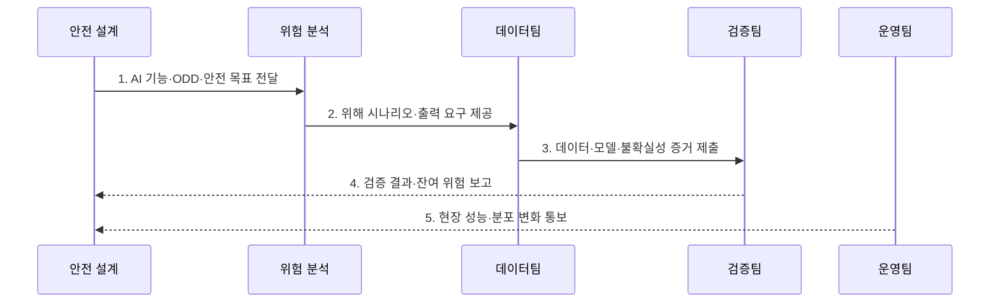

---
sidebar:
  order: 44
  label: "044. ISO/PAS 8800 자율주행 AI 안전 (ISO PAS 8800)"
  badge:
    text: "기출 · 50%"
    variant: note
title: "ISO/PAS 8800 자율주행 AI 안전 (ISO PAS 8800)"
date: "2026-07-31T11:48:11+09:00"
tags:
  - "notes-law-policy"
weight: 44
extra:
  question_no: "044"
  source_status: "기출"
  source_history: "138회"
  priority: 50
  priority_note: "138회 기출, 자율주행 AI 안전 생명주기"
---

## 미리 알고가기

- **국제표준화기구 공개 가용 규격(International Organization for Standardization/Publicly Available Specification, ISO/PAS)**: 시급한 시장 요구에 대응해 정식 국제표준보다 빠르게 발행하는 ISO 규격
- **공개 가용 규격(Publicly Available Specification, PAS)**: 정식 국제표준으로 발전할 수 있도록 신속하게 합의·발행하는 규격
- **운행 설계 영역(Operational Design Domain, ODD)**: 자율주행 기능이 정상 작동하도록 설계된 도로·기상·속도·교통 조건의 범위
- **의도된 기능의 안전성(Safety Of The Intended Functionality, SOTIF)**: 시스템 고장 없이도 센서·알고리즘의 성능 한계로 발생할 수 있는 위험을 다루는 안전 개념
- **위험 분석 및 위험 평가(Hazard Analysis and Risk Assessment, HARA)**: 차량 기능의 위해 요인을 식별하고 심각도·노출도·통제 가능성으로 위험을 평가하는 절차
- **자동차 안전 무결성 수준(Automotive Safety Integrity Level, ASIL)**: 자동차 기능안전 위험에 따라 필요한 안전 요구 수준을 구분한 등급
- **분포 변화(Drift)**: 운영 데이터의 특성이나 모델 성능이 학습 당시와 달라지는 현상
- **ISO/PAS 8800:2024**: 2024년 12월 발행된 도로 차량 AI 안전 공개 가용 규격

> **키워드:** ISO/PAS 8800 자율주행 AI 안전 (ISO PAS 8800)

## Ⅰ. 개요

- 정의/개념: 차량 AI의 출력 불충분·오류 위험을 수명주기 증거로 다루는 **안전 규격**
- 배경/필요성: 기능안전·SOTIF만으로는 데이터·모델의 **AI 불확실성** 논증 곤란

### 쉽게 이해하기 (학습용)
- 자율주행차에 탑재되는 인공지능은 딥러닝 등의 특성으로 인해 100% 예측이 불가능하므로, 학습 데이터 선정부터 테스트, 사후 모니터링까지 전 단계에 걸친 안전 보증 체계를 규정하는 표준입니다.

## Ⅱ. 특징

- 양산 차량의 AI 요소·경계·ODD를 명시하는 **안전 맥락**
- 불충분한 출력부터 차량 위해까지 잇는 **위해 경로**
- 수명주기 증거를 위험 수준에 연결하는 **안전 논증**

### 쉽게 이해하기 (학습용)
- 인공지능 알고리즘 자체의 복잡성에 얽매이지 않고, 출력의 위험성(오판)을 어떻게 예방하고 입증할 수 있는지의 증적 수집에 집중합니다.

## Ⅲ. 구조 및 구성요소

```mermaid
block-beta
    columns 5
    C["안전 맥락"] A["AI 안전 분석"] D["데이터·모델"] V["검증·보증"] O["현장 감시"]
    C -- A
    A -- D
    D -- V
    V -- O
```

| 구성요소 | 책임 |
|:---|:---|
| **안전 맥락** | 기능·ODD 설정과 AI 역할 정의 |
| **AI 안전 분석** | 출력 불충분성과 차량 위해 분석 |
| **데이터·모델** | 대표성과 모델 불확실성 관리 |
| **검증·보증** | 정량 증거 기반의 안전 논증 |
| **현장 감시** | 배포 후 성능 변화·이상 징후 감시 |

### 쉽게 이해하기 (학습용)
- 차량이 안전하게 운행할 조건(ODD)과 AI 역할을 정하고, 입출력 한계를 검증해 외부 심사자에게 논리적이고 정량적인 증적을 제시합니다.

## Ⅳ. 흐름도



1. **AI 기능·ODD·안전 목표 전달**: AI 역할과 정상 운행 조건 및 허용 위험 정의
2. **위해 시나리오·출력 요구 제공**: 불충분한 출력이 차량 위해로 이어지는 경로 분석
3. **데이터·모델·불확실성 증거 제출**: 대표성·편향·강건성·일반화 결과 검증
4. **검증 결과·잔여 위험 보고**: 요구사항과 증거를 연결해 안전 사례 구성
5. **현장 성능·분포 변화 통보**: 배포 후 성능 저하와 새 시나리오를 재평가

### 쉽게 이해하기 (학습용)
- 기상 상태 등의 ODD에서 차량 위해도를 분석하고, 훈련용 데이터의 양과 편향을 감시하며 출시 후 분포 변화(Drift)를 재조정합니다.

## Ⅴ. 종류 및 비교

| 구분 | ISO/PAS 8800 | ISO 26262 | ISO 21448 |
|:---|:---|:---|:---|
| **적용 기준** | 학습 모델의 **안전 위해** 제어 | 전기·전자의 **고장** 제어 | 의도 기능의 **한계** 제어 |
| **핵심 특징** | AI 안전의 **보증 증거** 연결 | **HARA·ASIL** 관리 | 기능 한계의 **시나리오 분석** |
| **주요 위험** | 데이터·출력의 **불확실성** | 체계·무작위 **고장** | 성능 한계의 **오판** |

### 쉽게 이해하기 (학습용)
- 부품 고장(26262)과 센서의 날씨 한계(21448)를 통과하더라도, 최종 자율주행 판단을 내리는 딥러닝 모델의 위험(8800)을 최종 방어합니다.

## Ⅵ. 실무 고려사항 및 대책

| 고려사항 | 대책 | 효과 |
|:---|:---|:---|
| ODD 밖 입력과 **미지 시나리오** | 경계·위해별 데이터와 **안전 상태 전환** 설계 | 예측 불가 출력의 **차량 영향 제한** |
| 데이터 대표성과 **모델 불확실성** | 계보·편향·강건성 지표를 **안전 요구**에 연결 | 안전 논증의 **추적성 확보** |
| 배포 후 **분포 변화** | 임계치 이탈 시 기능 제한·**재검증** | 운영 중 **안전 수준 유지** |

### 쉽게 이해하기 (학습용)
- 카메라가 표지판을 속도로 오판할 때 브레이크 제어기에 주는 영향 범위와 잠재적 사고 리스크를 사전에 파악합니다.

## Ⅶ. 결론

- 차량 안전에 AI가 관여하면 **ISO/PAS 8800:2024**를 적용하고 **잔여 위험** 충족 후 배포

### 쉽게 이해하기 (학습용)
- 자율주행 인공지능은 입력 데이터의 미세한 변화로 오류를 일으킬 수 있으므로 실제 주행 시나리오에 기반한 지속적 안전 논증이 필수적입니다.
