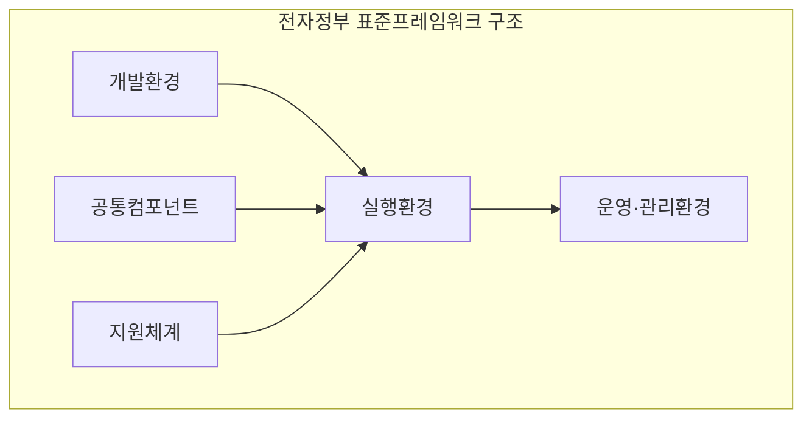
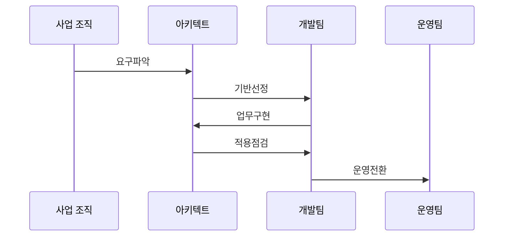

---
sidebar:
  order: 45
  label: "045. 전자 정부 표준 프레임워크 (e-Government Standard Framework)"
  badge:
    text: "미출제 · 30%"
    variant: note
title: "전자 정부 표준 프레임워크 (e-Government Standard Framework)"
date: "2026-07-25T02:10:00+09:00"
tags:
  - "notes-law-policy"
weight: 45
extra:
  question_no: "045"
  source_status: "미출제"
  source_history: ""
  priority: 30
  priority_note: "공공 SW 공통 구조와 확장 지점을 묻는 기반"
---

## 미리 알고가기

- **전자정부 표준 프레임워크(e-Government Standard Framework, eGovFrame)**: '이거브프레임'으로 읽고 e는 전자정부, Gov와 Frame의 대문자는 정부용 개발 틀임을 표시
- **실행환경(Runtime Environment)**: 애플리케이션 실행 시 화면, 업무 로직, 데이터 처리를 지원하는 핵심 공통 라이브러리 및 런타임 서비스
- **개발환경(Development Environment)**: 소스 코드 구현, 빌드, 디버깅 및 형상 관리를 지원하는 개발자 전용 도구 모음
- **소프트웨어(Software, SW)**: '에스더블유'로 읽고 영문 머리글자로 프로그램과 관련 산출물을 표시
- **웹 응용 서버(Web Application Server, WAS)**: '와스'로 읽고 영문 머리글자로 웹 요청의 업무 로직을 실행하는 서버를 표시
- **스프링 프레임워크(Spring Framework)**: 자바 응용의 객체·웹·데이터 처리를 지원하는 기반 프레임워크

## Ⅰ. 개요

- 정의/개념: 공공 시스템용 오픈소스 표준 플랫폼
- **배경/필요성**: 개발 중복·벤더 종속 완화

### 쉽게 이해하기 (학습용)
- 공공 정보화 사업을 할 때 모든 개발사가 처음부터 홈페이지나 데이터베이스 연동 코드를 짜지 않도록, 정부가 무료로 제공하는 검증된 스프링(Spring) 기반의 공통 개발 뼈대입니다.

## Ⅱ. 특징

- 오픈소스가 특정 상용 벤더 종속을 줄인다.
- 개발·운영 전 단계 도구를 제공한다.
- 표준 인터페이스가 코드·인프라를 분리한다.
- 지원 체계가 연동 호환성을 검증한다.

### 쉽게 이해하기 (학습용)
- 특정 대형 IT 기업의 프레임워크를 사용해 발생하는 기술적 독점을 막고, 중소 소프트웨어 기업도 쉽게 사업에 참여할 수 있게 보장합니다.

## Ⅲ. 아키텍처 및 구성요소

| 설계 요소 | 설명 |
|:---|:---|
| 개발환경 | 소스 구현과 빌드 및 형상 관리용 개발 도구 지원 |
| 실행환경 | 화면·연계·데이터 등 핵심 응용 런타임 서비스 제공 |
| 운영·관리 | 애플리케이션 모니터링 및 변경 관리 도구 지원 |
| 공통컴포넌트 | 재사용 가능한 로그인 및 게시판 등 공통 모듈 제공 |
| 지원체계 | 기술 지원 가이드 및 연동 제품 호환성 확인 체계 |

> 요약: 공통 실행 기반과 개발 및 운영 관리를 위한 표준 환경

### 쉽게 이해하기 (학습용)
- 런타임 라이브러리인 실행환경과 Eclipse 기반의 개발도구, 로그인 등의 공통 컴포넌트, 그리고 중소기업 제품 연동을 인증하는 호환성 검증 체계로 구성됩니다.

## Ⅳ. 원리 및 절차 흐름도

| 절차 | 설명 |
|:---|:---|
| 요구파악 | 사업·기술·표준 요구를 식별 |
| 기반선정 | 버전·구조·공통 모듈을 선택 |
| 업무구현 | 표준 확장점에 업무 로직을 개발 |
| 적용점검 | 아키텍처와 호환성을 검증 |
| 운영전환 | 관측 환경과 운영 절차를 구성 |

> 요약: 요구·선정·구현·점검·운영을 표준화

### 쉽게 이해하기 (학습용)
- 구축할 공공 서비스 성격에 맞춰 표준 프레임워크의 특정 버전을 선택하고, 업무 로직을 구현한 뒤 정부 지원단의 아키텍처 가이드라인 준수 여부를 검사받습니다.

## Ⅴ. 종류 및 비교

| 판단 기준 | 표준 프레임워크 | 개별 개발 프레임워크 |
|:---|:---|:---|
| 핵심 특징 | 공개 표준·공통 컴포넌트 | 사업별 독립 기술 구조 |
| 적용 기준 | 공공 표준 준수가 필요할 때 | 독립 구조가 필요할 때 |
| 주요 위험 | 버전·호환성 관리 실패 | 중복 개발·사업자 종속 |

> 요약: 표준 프레임워크 도입을 통한 개발 생산성 및 품질 제고

### 쉽게 이해하기 (학습용)
- 개발사마다 다른 규칙을 쓰던 방식과 달리, 단일한 스프링(Spring) 표준 구조를 사용해 개발 생산성을 높이고 유지보수 비용을 낮춥니다.

## Ⅵ. 실무 사례

1. 공공 시스템은 **패키지·서블릿 컨테이너 호환성** 검증

### 쉽게 이해하기 (학습용)
- 외부 라이브러리를 도입하기 전에 표준프레임워크 공통 패키지와 충돌하는지, WAS 버전에서 실행되는지 확인합니다.

## Ⅶ. 결론

- 공공 정보시스템 품질 및 운영 효율성 제고

### 쉽게 이해하기 (학습용)
- 단순한 코드 재사용을 넘어 이종 시스템 간 상호운용성 확보와 중소 개발사 참여 확대를 위해 표준 릴리즈를 철저히 관리해야 합니다.
