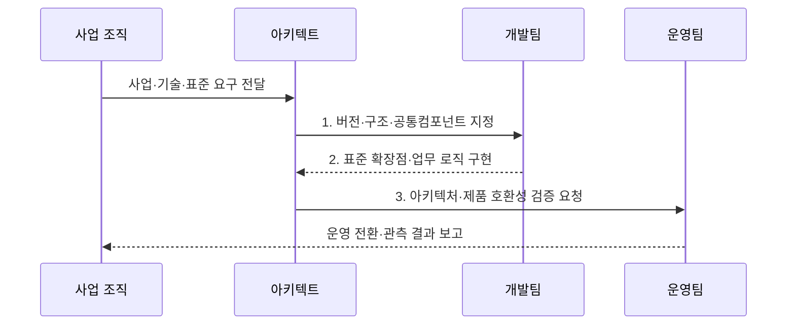

---
sidebar:
  order: 45
  label: "045. 전자 정부 표준 프레임워크 (e-Government Standard Framework)"
  badge:
    text: "미출 · 30%"
    variant: note
title: "전자 정부 표준 프레임워크 (e-Government Standard Framework)"
date: "2026-08-02T13:45:00+09:00"
tags:
  - "notes-law-policy"
weight: 45
extra:
  question_no: "045"
  source_status: "미출"
  source_history: ""
  priority: 30
  priority_note: "공공 SW 공통 구조와 확장 지점을 묻는 기반"
---

## Ⅰ. 개요

<details><summary>핵심 용어</summary>

- **전자정부 표준프레임워크**: 공공 정보시스템 개발에 필요한 실행환경·개발환경·공통 컴포넌트와 표준 구조를 제공하는 오픈소스 개발 기반이다.
- **표준 개발 기반**: 특정 업무 완제품이 아니라 여러 공공 시스템이 공통 구조와 기능을 재사용하도록 제공하는 기술 기반이다.

</details>

- 정의/개념: 공공 시스템에 실행·개발 환경과 공통컴포넌트를 제공하는 **오픈소스 개발 프레임워크**
- 배경/필요성: 기관별 독자 개발은 공통 기능 중복·구조 불일치·**사업자 종속** 유발

### 쉽게 이해하기 (학습용)
- 공공 정보화 사업을 할 때 모든 개발사가 처음부터 홈페이지나 데이터베이스 연동 코드를 짜지 않도록, 정부가 무료로 제공하는 검증된 스프링(Spring) 기반의 공통 개발 뼈대입니다.

## Ⅱ. 특징

<details><summary>핵심 용어</summary>

- **개방형 표준**: 공개된 소스·인터페이스·가이드로 특정 사업자의 독점 구현 의존을 줄이는 방식이다.
- **공통 컴포넌트**: 로그인·권한·게시판·파일 처리 등 반복 업무 기능을 표준 방식으로 재사용하도록 제공하는 모듈이다.

</details>

- **Spring Framework** 기반 공개 구조로 종속을 줄이는 **개방형 표준**
- 개발·실행·운영관리 환경을 잇는 **전주기 지원**
- 공통컴포넌트와 확장점을 활용하는 **재사용·호환성**

### 쉽게 이해하기 (학습용)
- 특정 대형 IT 기업의 프레임워크를 사용해 발생하는 기술적 독점을 막고, 중소 소프트웨어 기업도 쉽게 사업에 참여할 수 있게 보장합니다.

## Ⅲ. 구조 및 구성요소

<details><summary>핵심 용어</summary>

- **실행환경**: 애플리케이션 실행 시 화면·업무 로직·데이터 처리를 지원하는 공통 라이브러리와 런타임 서비스이다.
- **개발환경**: 소스 구현·빌드·디버깅·시험·형상 관리를 지원하는 개발자 도구 모음이다.
- **스프링 프레임워크**: 자바 응용의 객체 관리·웹·데이터 처리를 지원하며 표준프레임워크 실행환경의 기반이 되는 프레임워크이다.

</details>

```mermaid
block-beta
    columns 5
    D["개발환경"] R["실행환경"] O["운영·관리"] C["공통컴포넌트"] S["지원체계"]
    D -- R
    R -- O
    R -- C
    C -- S
```

| 구성요소 | 책임 |
|:---|:---|
| **개발환경** | 소스 구현·빌드·형상 관리 도구 |
| **실행환경** | 화면·연계·데이터의 런타임 서비스 |
| **운영·관리** | 모니터링·변경 관리 도구 |
| **공통컴포넌트** | 로그인·게시판 등 재사용 모듈 |
| **지원체계** | 기술 가이드·제품 호환성 확인 |

### 쉽게 이해하기 (학습용)
- 런타임 라이브러리인 실행환경과 Eclipse 기반의 개발도구, 로그인 등의 공통 컴포넌트, 그리고 중소기업 제품 연동을 인증하는 호환성 검증 체계로 구성됩니다.

## Ⅳ. 흐름도

<details><summary>핵심 용어</summary>

- **공통 구조 적용**: 업무 요구를 계층·인터페이스·예외·보안 등 표준프레임워크 아키텍처에 맞추는 과정이다.
- **컴포넌트 재사용 검토**: 새로 개발하기 전에 요구 기능과 기존 공통 컴포넌트의 적합성·변경 범위를 확인하는 절차이다.

</details>



1. **버전·구조·공통컴포넌트 지정**: 지원 기준·재사용 범위·확장 방식 확정
2. **표준 확장점·업무 로직 구현**: 공통 기능 재사용과 기관 업무 분리 개발
3. **아키텍처·제품 호환성 검증 요청**: 라이브러리·WAS·연계 제품의 충돌 확인

### 쉽게 이해하기 (학습용)
- 구축할 공공 서비스 성격에 맞춰 표준 프레임워크의 특정 버전을 선택하고, 업무 로직을 구현한 뒤 정부 지원단의 아키텍처 가이드라인 준수 여부를 검사받습니다.

## Ⅴ. 종류 및 비교

<details><summary>핵심 용어</summary>

- **실행환경**: 배포된 업무 애플리케이션이 WAS에서 동작하도록 공통 런타임 기능을 제공한다.
- **개발환경**: 개발자가 코드를 생성·빌드·시험·형상관리하도록 도구와 플러그인을 제공한다.
- **공통 컴포넌트**: 여러 공공 업무에서 반복되는 응용 기능의 구현과 화면·데이터 구조를 제공한다.

</details>

| 판단 기준 | 표준 프레임워크 | 개별 개발 프레임워크 |
|:---|:---|:---|
| **적용 기준** | 공공 **표준 준수** 필요 | **독립 구조** 필요 |
| **핵심 특징** | 공개 표준·**공통컴포넌트** | 사업별 **독립 기술 구조** |
| **한계** | 버전·**호환성 관리** 필요 | 중복 개발·**사업자 종속** 가능 |

### 쉽게 이해하기 (학습용)
- 개발사마다 다른 규칙을 쓰던 방식과 달리, 단일한 스프링(Spring) 표준 구조를 사용해 개발 생산성을 높이고 유지보수 비용을 낮춥니다.

## Ⅵ. 실무 고려사항 및 대책

<details><summary>핵심 용어</summary>

- **웹 응용 서버(WAS)**: 웹 요청을 받아 업무 로직을 실행하고 처리 결과를 반환하는 서버이다.
- **자카르타 EE**: 기업용 자바 응용의 웹·데이터·트랜잭션 API를 정의한 표준이다.
- **버전 호환성**: JDK·Spring·Jakarta EE·WAS·라이브러리 버전 조합이 맞지 않아 빌드·실행이 실패하는 문제이다.

</details>

| 문제 | 대책 | 효과 |
|:---|:---|:---|
| 프레임워크·JDK·WAS의 **버전 불일치** | 5.0의 JDK 17·Jakarta EE·**WAS 조합** 검증 | 배포·실행 **오류 예방** |
| 공통컴포넌트의 **무분별한 수정** | 표준 확장점과 변경 영향의 **형상관리** | **업그레이드 가능성** 유지 |
| 업무와 무관한 **일률적 표준 적용** | 업무 특성·재사용 이익·**유지보수 역량** 평가 | 불필요한 **복잡성 억제** |

### 쉽게 이해하기 (학습용)
- 외부 라이브러리를 도입하기 전에 표준프레임워크 공통 패키지와 충돌하는지, WAS 버전에서 실행되는지 확인합니다.

## Ⅶ. 결론

<details><summary>핵심 용어</summary>

- **사업자 종속 완화**: 공개된 공통 구조·소스·가이드로 다른 사업자가 시스템을 인수·유지보수할 수 있게 하는 효과이다.
- **도입과 준수의 구분**: 라이브러리를 사용했다는 사실만으로 표준 구조·보안·품질을 자동 충족하지 않으며 아키텍처와 개발 규칙 준수를 별도 검증해야 한다는 관계이다.

</details>

- 공공 표준·재사용 이익이 크면 **eGovFrame 5.0**을 택하고 **JDK·Jakarta EE·WAS** 검증 후 적용

### 쉽게 이해하기 (학습용)
- 단순한 코드 재사용을 넘어 이종 시스템 간 상호운용성 확보와 중소 개발사 참여 확대를 위해 표준 릴리즈를 철저히 관리해야 합니다.
