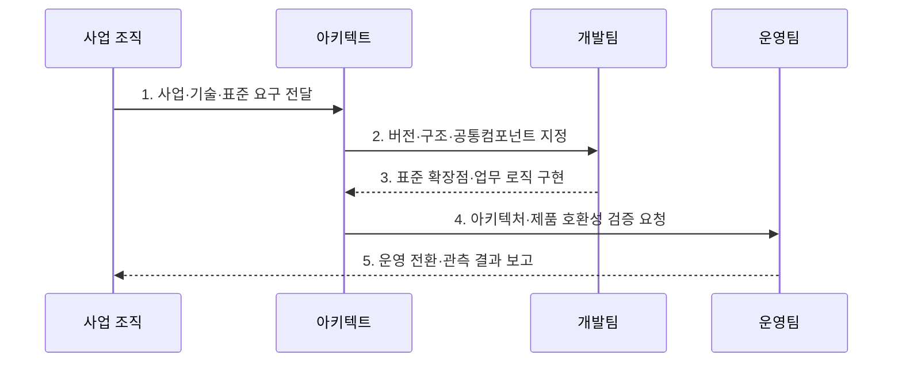

---
sidebar:
  order: 45
  label: "045. 전자 정부 표준 프레임워크 (e-Government Standard Framework)"
  badge:
    text: "미출제 · 30%"
    variant: note
title: "전자 정부 표준 프레임워크 (e-Government Standard Framework)"
date: "2026-07-30T14:46:00+09:00"
tags:
  - "notes-law-policy"
weight: 45
extra:
  question_no: "045"
  source_status: "미출제"
  source_history: ""
  priority: 30
  priority_note: "공공 SW 공통 구조와 확장 지점을 묻는 기반"
---

## 미리 알고가기

- **전자정부 표준 프레임워크(e-Government Standard Framework, eGovFrame)**: 공공 정보시스템 개발에 필요한 실행환경·개발환경·공통 컴포넌트를 제공하는 표준 개발 기반
- **실행환경(Runtime Environment)**: 애플리케이션 실행 시 화면, 업무 로직, 데이터 처리를 지원하는 핵심 공통 라이브러리 및 런타임 서비스
- **개발환경(Development Environment)**: 소스 코드 구현, 빌드, 디버깅 및 형상 관리를 지원하는 개발자 전용 도구 모음
- **소프트웨어(Software, SW)**: 컴퓨터에서 기능을 수행하도록 작성한 프로그램과 관련 데이터·문서
- **웹 응용 서버(Web Application Server, WAS)**: 웹 요청을 받아 업무 로직을 실행하고 처리 결과를 반환하는 서버
- **스프링 프레임워크(Spring Framework)**: 자바 응용의 객체·웹·데이터 처리를 지원하는 기반 프레임워크

## Ⅰ. 개요

- 정의/개념: 공공 정보시스템이 공통 구조와 재사용 기능을 일관되게 구현하도록 실행환경·개발환경·공통컴포넌트를 제공하는 오픈소스 기반 개발 프레임워크
- 배경/필요성: 기관별 독자 개발은 인증·게시판 같은 공통 기능의 중복과 서로 다른 기술 구조 및 특정 사업자 종속을 유발

### 쉽게 이해하기 (학습용)
- 공공 정보화 사업을 할 때 모든 개발사가 처음부터 홈페이지나 데이터베이스 연동 코드를 짜지 않도록, 정부가 무료로 제공하는 검증된 스프링(Spring) 기반의 공통 개발 뼈대입니다.

## Ⅱ. 특징

- 오픈소스 기반의 공개 구조와 표준 인터페이스로 특정 상용 벤더 종속을 완화
- 개발환경·실행환경·운영관리환경을 연계해 구현부터 배포·운영까지 공통 기반을 제공
- 공통컴포넌트를 표준 확장점에 결합해 반복 기능을 재사용하고 업무 로직과 분리
- 지원체계의 적용 가이드와 호환성 확인으로 외부 제품·인프라 연동 위험을 통제

### 쉽게 이해하기 (학습용)
- 특정 대형 IT 기업의 프레임워크를 사용해 발생하는 기술적 독점을 막고, 중소 소프트웨어 기업도 쉽게 사업에 참여할 수 있게 보장합니다.

## Ⅲ. 구조 및 구성요소

| 구성요소 | 책임 |
|:---|:---|
| 개발환경 | 소스 구현과 빌드 및 형상 관리용 개발 도구 지원 |
| 실행환경 | 화면·연계·데이터 등 핵심 응용 런타임 서비스 제공 |
| 운영·관리 | 애플리케이션 모니터링 및 변경 관리 도구 지원 |
| 공통컴포넌트 | 재사용 가능한 로그인 및 게시판 등 공통 모듈 제공 |
| 지원체계 | 기술 지원 가이드 및 연동 제품 호환성 확인 체계 |

### 쉽게 이해하기 (학습용)
- 런타임 라이브러리인 실행환경과 Eclipse 기반의 개발도구, 로그인 등의 공통 컴포넌트, 그리고 중소기업 제품 연동을 인증하는 호환성 검증 체계로 구성됩니다.

## Ⅳ. 흐름도

### 동작 원리

1. **사업·기술·표준 요구 전달**: 공공 사업의 기능과 품질 및 적용 지침 식별
2. **버전·구조·공통컴포넌트 지정**: 지원 기준과 재사용 범위 및 확장 방식 확정
3. **표준 확장점·업무 로직 구현**: 공통 기능을 재사용하고 기관별 업무를 분리 개발
4. **아키텍처·제품 호환성 검증 요청**: 외부 라이브러리·WAS·연계 제품의 충돌 확인
5. **운영 전환·관측 결과 보고**: 배포·모니터링·변경관리 절차를 구성해 서비스 인계

### 쉽게 이해하기 (학습용)
- 구축할 공공 서비스 성격에 맞춰 표준 프레임워크의 특정 버전을 선택하고, 업무 로직을 구현한 뒤 정부 지원단의 아키텍처 가이드라인 준수 여부를 검사받습니다.

## Ⅴ. 종류 및 비교

| 판단 기준 | 표준 프레임워크 | 개별 개발 프레임워크 |
|:---|:---|:---|
| 적용 기준 | 공공 표준 준수가 필요할 때 | 독립 구조가 필요할 때 |
| 핵심 특징 | 공개 표준·공통 컴포넌트 | 사업별 독립 기술 구조 |
| 한계 | 버전·호환성 관리가 필요 | 중복 개발·사업자 종속 가능성 |

### 쉽게 이해하기 (학습용)
- 개발사마다 다른 규칙을 쓰던 방식과 달리, 단일한 스프링(Spring) 표준 구조를 사용해 개발 생산성을 높이고 유지보수 비용을 낮춥니다.

## Ⅵ. 실무 고려사항 및 대책

| 고려사항 | 대책 | 효과 |
|:---|:---|:---|
| 프레임워크·JDK·WAS 버전 불일치 | 지원 조합과 외부 라이브러리 의존성을 시험환경에서 검증 | 배포·실행 오류 예방 |
| 공통컴포넌트의 무분별한 수정 | 표준 확장점을 사용하고 변경 사유와 영향 범위를 형상관리 | 업그레이드 가능성 유지 |
| 표준 적용 자체가 목적화 | 업무 특성과 재사용 이익 및 유지보수 역량을 도입 기준으로 평가 | 불필요한 복잡성 억제 |

### 쉽게 이해하기 (학습용)
- 외부 라이브러리를 도입하기 전에 표준프레임워크 공통 패키지와 충돌하는지, WAS 버전에서 실행되는지 확인합니다.

## Ⅶ. 결론

- 공공 표준 준수와 공통 기능 재사용의 이익이 독립 구조의 유연성보다 크면 전자정부 표준프레임워크를 선택하고, 지원 버전·확장점·WAS 호환성을 검증한 뒤 적용

### 쉽게 이해하기 (학습용)
- 단순한 코드 재사용을 넘어 이종 시스템 간 상호운용성 확보와 중소 개발사 참여 확대를 위해 표준 릴리즈를 철저히 관리해야 합니다.
