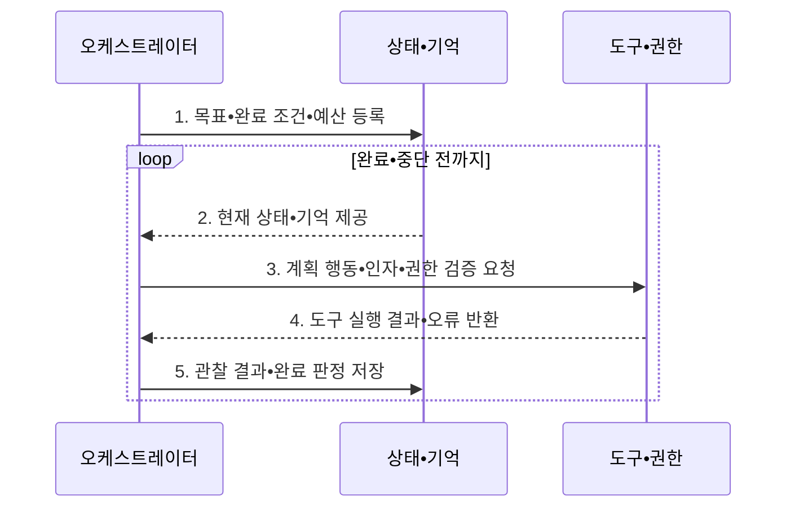

---
sidebar:
  order: 1
  label: "001. AI 에이전트 시스템 (AI Agent System)"
  badge:
    text: "기출 • 80%"
    variant: note
title: "AI 에이전트 시스템 (AI Agent System)"
date: "2026-08-05T02:05:12+09:00"
tags:
  - "notes-latest_tech"
weight: 1
extra:
  question_no: "001"
  source_status: "기출"
  source_history: "138회"
  priority: 80
  priority_note: "에이전트 구조•협업형 문제가 최신 핵심"
---

## Ⅰ. 개요

<details>
<summary>핵심 용어</summary>

- **인공지능 에이전트 시스템(Artificial Intelligence Agent System, AI Agent System)**: 목표를 작업으로 계획하고 도구를 실행하며 관찰 결과에 따라 행동을 조정하는 자율 시스템이다.

</details>

- 정의/개념: 목표 계획•도구 실행•관찰 기반 행동 조정을 수행하는 **AI Agent System**
- 배경/필요성: 단발 생성 모델로는 **장기 상태•외부 실행•오류 복구 관리 불가**

#### 한줄 요약
- 챗봇이 주로 응답을 생성한다면 AI 에이전트는 목표를 작업으로 분해하고 도구를 실행하며 결과에 따라 계획을 조정한다

## Ⅱ. 특징

<details>
<summary>핵심 용어</summary>

- **목표 지향성**: 최종 목표를 의존 관계와 완료 조건이 있는 하위 작업으로 분해하는 특성이다.
- **추론-행동(Reasoning and Acting, ReAct)**: 추론으로 행동을 선택하고 실행 결과를 관찰해 오류 복구와 재계획에 반영하는 반복 방식이다.

</details>

- **계획 축**: 목표 분해와 상태 유지로 장기 작업 단계 실행
- **실행 축**: **ReAct** 반복 기반 오류 복구•재계획
- **통제 축**: 권한•승인•비용•감사 정책으로 자율 행동 제한

#### 한줄 요약
- 실행 결과나 오류를 관찰해 다음 행동을 바꾸고 작업 상태를 기억해 중단된 목표를 계속 수행한다

## Ⅲ. 구조 및 구성요소

<details>
<summary>핵심 용어</summary>

- **대규모 언어 모델(Large Language Model, LLM)**: 자연어 지시와 작업 문맥을 바탕으로 계획•응답•행동 후보를 생성하는 에이전트의 추론 모델이다.
- **오케스트레이터(Orchestrator)**: 목표•정책•상태를 바탕으로 모델, 계획•평가, 도구 호출의 실행 순서와 종료를 조정하는 구성요소이다.
- **계획 모듈**: 목표를 의존 관계가 있는 실행 작업으로 분해하는 구성요소이다.
- **평가 모듈**: 비용•완료 조건에 따라 다음 행동과 종료 여부를 판정하는 구성요소이다.
- **데이터베이스(Database, DB)**: 작업 상태•실행 결과•장기 지식을 지속 저장하여 에이전트가 중단된 목표를 이어가게 하는 저장소이다.
- **응용 프로그래밍 인터페이스(Application Programming Interface, API)**: 에이전트가 외부 도구를 정해진 인자•권한•응답 형식으로 호출하는 인터페이스이다.

</details>

```text
              [모델•오케스트레이터]
                        |
             +----------+----------+
             |                     |
        [상태•기억]            [계획•평가]
             |                     |
             +----------+----------+
                        |
                   [도구•권한]
```

선의 의미: 모델•오케스트레이터가 상태•기억과 계획•평가를 결합하고, 도구•권한 경계가 외부 실행을 통제하는 에이전트 구조를 나타낸다.

| 구성요소 | 책임 |
|:---|:---|
| 모델•오케스트레이터 | **LLM•목표•정책•상태** 기반 다음 행동 선택 |
| 상태•기억 | **DB 작업 상태•결과•장기 지식** 저장 |
| 계획•평가 | **작업 분해•비용•종료 조건** 평가 |
| 도구•권한 | **API 스키마•권한 정책** 기반 실행 |

#### 한줄 요약
- 오케스트레이터가 모델의 계획, 작업 상태, 도구 호출을 연결하고 권한 계층이 외부 행동을 통제한다

## Ⅳ. 흐름도

<details>
<summary>핵심 용어</summary>

</details>



1. **목표•완료 조건•예산 등록**: 작업 범위와 금지 행동 및 종료 기준 설정
2. **현재 상태•기억 제공**: 이전 행동과 결과 및 장기 지식 조회
3. **계획 행동•인자•권한 검증 요청**: 다음 도구와 순서를 선택하고 위험 행동 승인 확인
4. **도구 실행 결과•오류 반환**: 허가된 도구를 격리 환경에서 실행
5. **관찰 결과•완료 판정 저장**: 완료•재계획•한도 중단 결과를 상태에 반영

#### 한줄 요약
- 각 행동 전에 권한과 인자를 검증하고 실행 결과를 상태에 반영해 완료•재계획•중단을 판단한다

## Ⅴ. 종류 및 비교

<details>
<summary>핵심 용어</summary>

- **AI Agent**: 목표 달성을 위해 계획•행동•관찰을 반복하며 외부 도구를 실행하는 시스템이다.
- **검색 증강 생성(Retrieval-Augmented Generation, RAG)**: 외부 자료를 검색해 근거를 대규모 언어 모델의 응답 생성에 결합하는 방식이다.
- **반응형 에이전트**: 장기 계획보다 현재 입력과 규칙에 따라 즉시 행동을 선택하는 에이전트 유형이다.

</details>

| 판단 기준 | AI 에이전트 | 전통적 챗봇 | RAG |
|:---|:---|:---|:---|
| 적용 기준 | **다단계 외부 행동** 필요 | **단발 질의•안내** 필요 | **외부 근거 기반 응답** 필요 |
| 핵심 특징 | **계획•행동•관찰** 반복 | **단발 대화 응답** 중심 | **검색 근거 기반 생성 보강** |
| 한계 | **권한 오용•오류 누적** | **장기 상태•외부 행동 부족** | **검색 밖 행동 실행 불가** |

> 요약: **AI Agent** 중심 외부 행동, **챗봇•RAG** 중심 대화•근거 응답

#### 한줄 요약
- 챗봇은 대화 응답, RAG는 외부 근거를 결합한 응답, 에이전트는 다단계 도구 실행에 적합하다

## Ⅵ. 실무 고려사항 및 대책

<details>
<summary>핵심 용어</summary>

- **인간 참여형 통제(Human-in-the-Loop, HITL)**: 고위험 행동을 실행하기 전에 사람이 맥락과 영향을 검토하고 승인하는 통제다.

</details>

| 문제 | 대책 | 효과 |
|:---|:---|:---|
| 과도한 도구 권한으로 생기는 **외부 피해** | **작업별 최소권한•인자 스키마•격리** 적용 | 오작동의 **영향 범위** 제한 |
| 오류 반복으로 발생하는 **비용 폭증** | **재시도•시간•토큰•비용 한도** 설정 | 무한 실행과 **자원 낭비** 방지 |
| 금액•권리 변경의 **책임 불명확** | 변경•지급 전 **HITL 승인** | 책임 있는 **자율화 경계** 확보 |

#### 한줄 요약
- 고객지원 에이전트는 주문•환불 정보를 조회하되 금액 변경과 지급 실행은 담당자의 승인을 받은 뒤 수행한다

## Ⅶ. 결론

<details>
<summary>핵심 용어</summary>

- **최소 권한**: 에이전트가 각 작업에 필요한 도구와 데이터만 제한된 범위에서 사용하게 하는 보안 원칙이다.
</details>

- 다단계 외부 행동은 **AI Agent**, 고위험 변경은 **HITL 승인** 후 실행

#### 한줄 요약
- 도구 권한과 승인 경계를 명확히 하고 실행 로그와 비용 한도를 지속적으로 검증해야 한다
