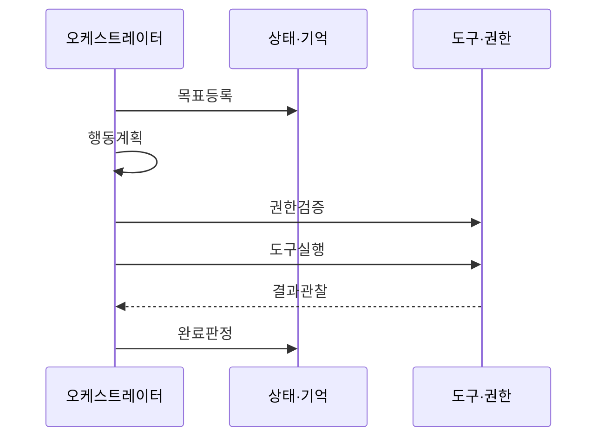

---
sidebar:
  order: 1
  label: "001. AI 에이전트 시스템 (AI Agent System)"
  badge:
    text: "기출 · 80%"
    variant: note
title: "AI 에이전트 시스템 (AI Agent System)"
date: "2026-07-25T01:25:00+09:00"
tags:
  - "notes-latest_tech"
weight: 1
extra:
  question_no: "001"
  source_status: "기출"
  source_history: "138회"
  priority: 80
  priority_note: "에이전트 구조·협업형 문제가 최신 핵심"
---

## 미리 알고가기

- **인공지능 (Artificial Intelligence, AI)**: 목표 기반 자동 판단·실행
- **대규모 언어 모델 (Large Language Model, LLM)**: 계획·행동 선택 생성
- **추론·행동 (Reasoning and Acting, ReAct)**: 추론·도구 실행·관찰 반복
- **검색 증강 생성 (Retrieval-Augmented Generation, RAG)**: 외부 근거 검색·생성 보강
- **인간 개입 (Human-in-the-Loop, HITL)**: 고위험 행동·사람 승인
- **데이터베이스 (Database, DB)**: 작업 상태·장기 기억 저장
- **응용 프로그래밍 인터페이스 (Application Programming Interface, API)**: 외부 기능 호출 계약 제공

## Ⅰ. 개요

- **정의/개념**: 목표를 계획·실행·조정하는 AI 체계
- **배경/필요성**: 다단계 실행의 권한·오류 통제

### 쉽게 이해하기 (학습용)
- 챗봇이 단순히 질문에 대답만 하는 똑똑한 학자라면, AI 에이전트는 노트북과 신용카드를 들고 실제로 일을 해결하는 실무 비서

## Ⅱ. 특징

- 목표를 하위 작업·실행 순서로 분해한다
- 도구 결과·오류로 다음 행동과 종료를 조정한다
- 허가된 API·DB·샌드박스만 사용한다
- 기억의 출처·유효기간·접근권한을 관리한다

### 쉽게 이해하기 (학습용)
- 길을 가다 장애물을 만나면 멈추는 것이 아니라, 스스로 돌아가는 우회 경로를 만들고 경험을 기억해 두는 스마트한 문제 해결 능력

## Ⅲ. 구성요소 및 구조

| 설계 요소 | 설명 |
|:---|:---|
| 모델·오케스트레이터 | 목표·정책·상태로 다음 행동 선택 |
| 상태·기억 | 작업 상태·결과·장기 지식 저장 |
| 계획·평가 | 작업 분해·비용·종료 조건 평가 |
| 도구·권한 | 스키마 기반 도구·권한 정책 실행 |

> 요약: 계획·기억·도구로 목표를 자율 실행함

### 쉽게 이해하기 (학습용)
- 계획·기억·도구가 목표를 실행하고 권한 계층이 행동을 통제함

## Ⅳ. 원리 및 절차 흐름도

| 절차 | 설명 |
|:---|:---|
| 목표등록 | 완료 조건·예산·금지 행동 등록 |
| 행동계획 | 작업·도구·순서 계획 수립 |
| 권한검증 | 인자·권한·위험 승인 검증 |
| 도구실행 | 허가 도구 격리 환경 실행 |
| 결과관찰 | 결과·오류 상태 반영 |
| 완료판정 | 완료·재계획·한도 중단 판정 |

> 요약: 권한 검증·실행·관찰로 목표를 완료함

### 쉽게 이해하기 (학습용)
- 계획한 도구를 실행하고 결과를 관찰해 완료 여부를 다시 판단함

## Ⅴ. 종류 및 비교

| 판단 기준 | AI 에이전트 | 전통적 챗봇 | RAG |
|:---|:---|:---|:---|
| 핵심 목적 | 목표 달성을 위한 다단계 실행 | 사전 정의 대화 처리 | 외부 근거를 검색해 생성 보강 |
| 처리 흐름 | 계획·행동·관찰 반복 | 규칙·단발 응답 중심 | 검색 후 응답 생성 중심 |
| 적용 기준 | 다단계 외부 행동이 필요할 때 | 단발 질의·안내가 필요할 때 | 외부 근거 기반 응답이 필요할 때 |

> 요약: 에이전트·챗봇·RAG는 실행·응답·검색을 맡는다.

### 쉽게 이해하기 (학습용)
- 챗봇은 응답, RAG는 검색 근거, 에이전트는 실제 행동까지 수행함

## Ⅵ. 실무 사례

- 환불 조회는 자동화하고 금액 변경은 승인한다

### 쉽게 이해하기 (학습용)
- 은행원이 대출 서류를 자동 처리하다가도, 마지막 승인 도장은 반드시 지점장의 결재를 받아야 사고가 나지 않는 구조

## Ⅶ. 결론

- 위험 행동은 최소 권한·승인·감사로 통제한다

### 쉽게 이해하기 (학습용)
- 자율주행차가 운전자의 손을 덜어주더라도 최악의 사고를 피하기 위해 언제든 수동으로 제어할 수 있는 브레이크가 필수적
