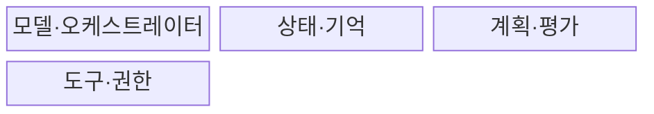
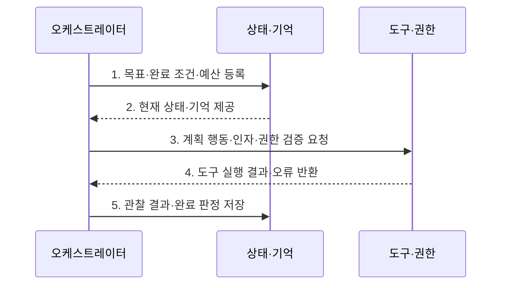

---
sidebar:
  order: 1
  label: "001. AI 에이전트 시스템 (AI Agent System)"
  badge:
    text: "기출 · 80%"
    variant: note
title: "AI 에이전트 시스템 (AI Agent System)"
date: "2026-07-30T11:04:43+09:00"
tags:
  - "notes-latest_tech"
weight: 1
extra:
  question_no: "001"
  source_status: "기출"
  source_history: "138회"
  priority: 80
  priority_note: "에이전트 구조·협업형 문제가 최신 핵심"
---

## 미리 알고가기

- **인공지능(Artificial Intelligence, AI)**: 에이전트가 상황을 분석하고 목표 달성에 필요한 판단을 수행하는 기술이다
- **대규모 언어 모델(Large Language Model, LLM)**: 자연어 지시와 문맥을 바탕으로 계획·응답·행동 후보를 생성하는 모델이다
- **추론·행동(Reasoning and Acting, ReAct)**: 추론으로 행동을 선택하고 실행 결과를 관찰해 다음 판단에 반영하는 방식이다
- **검색 증강 생성(Retrieval-Augmented Generation, RAG)**: 외부에서 검색한 근거를 모델 입력에 결합해 답변을 생성하는 기법이다
- **인간 개입(Human-in-the-Loop, HITL)**: 고위험 행동의 실행 여부를 사람이 검토하고 승인하는 통제다
- **데이터베이스(Database, DB)**: 에이전트의 작업 상태와 장기 기억을 저장하는 시스템이다
- **응용 프로그래밍 인터페이스(Application Programming Interface, API)**: 에이전트가 외부 시스템의 기능을 호출하는 규격이다

## Ⅰ. 개요

- 정의/개념: 주어진 목표를 작업으로 계획하고 도구를 실행한 뒤 결과를 관찰해 다음 행동을 조정하는 자율 AI 시스템
- 배경/필요성: 단발 생성 모델만으로는 장기 작업의 상태와 외부 도구 실행 및 오류 이후의 복구 과정을 지속적으로 관리하기 곤란

### 쉽게 이해하기 (학습용)
- 챗봇이 주로 응답을 생성한다면 AI 에이전트는 목표를 작업으로 분해하고 도구를 실행하며 결과에 따라 계획을 조정한다

## Ⅱ. 특징

- **목표 분해·상태 유지**로 장기 작업을 단계적으로 실행
- **행동·관찰 반복**으로 오류 복구와 재계획 수행
- **권한·승인·비용·감사 정책**으로 자율 행동 통제

### 쉽게 이해하기 (학습용)
- 실행 결과나 오류를 관찰해 다음 행동을 바꾸고 작업 상태를 기억해 중단된 목표를 계속 수행한다

## Ⅲ. 구조 및 구성요소

| 구성요소 | 책임 |
|:---|:---|
| 모델·오케스트레이터 | 목표·정책·상태로 다음 행동 선택 |
| 상태·기억 | 작업 상태·결과·장기 지식 저장 |
| 계획·평가 | 작업 분해·비용·종료 조건 평가 |
| 도구·권한 | 스키마 기반 도구·권한 정책 실행 |

### 쉽게 이해하기 (학습용)
- 오케스트레이터가 모델의 계획, 작업 상태, 도구 호출을 연결하고 권한 계층이 외부 행동을 통제한다

## Ⅳ. 흐름도

### 동작 원리

1. **목표·완료 조건·예산 등록**: 작업 범위와 금지 행동 및 종료 기준 설정
2. **현재 상태·기억 제공**: 이전 행동과 결과 및 장기 지식 조회
3. **계획 행동·인자·권한 검증 요청**: 다음 도구와 순서를 선택하고 위험 행동 승인 확인
4. **도구 실행 결과·오류 반환**: 허가된 도구를 격리 환경에서 실행
5. **관찰 결과·완료 판정 저장**: 완료·재계획·한도 중단 결과를 상태에 반영

### 쉽게 이해하기 (학습용)
- 각 행동 전에 권한과 인자를 검증하고 실행 결과를 상태에 반영해 완료·재계획·중단을 판단한다

## Ⅴ. 종류 및 비교

| 판단 기준 | AI 에이전트 | 전통적 챗봇 | RAG |
|:---|:---|:---|:---|
| 적용 기준 | 다단계 외부 행동이 필요할 때 | 단발 질의·안내가 필요할 때 | 외부 근거 기반 응답이 필요할 때 |
| 핵심 특징 | 계획·행동·관찰 반복 | 단발·대화 응답 중심 | 검색 근거로 생성 보강 |
| 한계 | 권한 오용·오류 누적 | 장기 상태·외부 행동 부족 | 검색 밖 행동 실행 불가 |

### 쉽게 이해하기 (학습용)
- 챗봇은 대화 응답, RAG는 외부 근거를 결합한 응답, 에이전트는 다단계 도구 실행에 적합하다

## Ⅵ. 실무 고려사항 및 대책

| 고려사항 | 대책 | 효과 |
|:---|:---|:---|
| 도구 권한의 과도한 부여 | 작업별 최소권한과 인자 스키마 및 실행 격리 적용 | 오작동의 외부 영향 제한 |
| 오류 반복과 비용 폭증 | 재시도·시간·토큰·비용 한도와 명시적 종료 조건 설정 | 무한 실행과 자원 낭비 방지 |
| 금액 변경 등 고위험 행동 | 조회는 자동화하고 변경·지급은 HITL 승인 후 실행 | 책임 있는 자율화 경계 확보 |

### 쉽게 이해하기 (학습용)
- 고객지원 에이전트는 주문·환불 정보를 조회하되 금액 변경과 지급 실행은 담당자의 승인을 받은 뒤 수행한다

## Ⅶ. 결론

- 다단계 외부 행동이 필요하면 AI 에이전트를 선택하되, 최소권한과 실행 한도를 적용하고 금전·권리 변경 행동은 사람 승인을 통과한 경우에만 허용

### 쉽게 이해하기 (학습용)
- 도구 권한과 승인 경계를 명확히 하고 실행 로그와 비용 한도를 지속적으로 검증해야 한다
