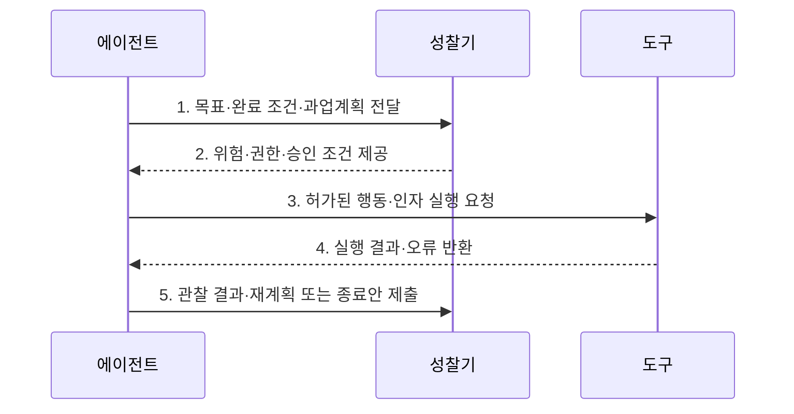

---
sidebar:
  order: 2
  label: "002. 에이전틱 AI (Agentic AI)"
  badge:
    text: "기출 · 70%"
    variant: note
title: "에이전틱 AI (Agentic AI)"
date: "2026-07-30T14:53:00+09:00"
tags:
  - "notes-latest_tech"
weight: 2
extra:
  question_no: "002"
  source_status: "기출"
  source_history: "138회"
  priority: 70
  priority_note: "자율 목표 수행과 통제 설계가 주요 쟁점"
---

## 미리 알고가기

- **인공지능(Artificial Intelligence, AI)**: 학습·추론·판단 등 인간의 지능적 능력을 컴퓨터로 구현하는 기술이다.
- **대규모 언어 모델(Large Language Model, LLM)**: 대규모 텍스트를 학습하여 언어를 이해하고 생성하는 모델로, 에이전트의 계획·판단을 지원한다.
- **에이전틱 워크플로(Agentic Workflow)**: 목표 달성을 위해 계획·행동·관찰·성찰을 반복하는 작업 방식이다.
- **목표 지향성(Goal Orientation)**: 최종 목표를 완료 조건이 있는 하위 과업으로 분해하는 특성이다.
- **자기 성찰(Self-Reflection)**: 수행 결과와 오류를 평가하여 계획을 수정하는 과정이다.
- **비동기 자율성(Asynchronous Autonomy)**: 장기 작업의 상태를 저장하고 필요한 시점에 작업을 재개하는 능력이다.
- **체화 인공지능(Embodied AI)**: 로봇과 센서를 통해 물리 환경을 인식하고 행동하는 인공지능이다.
- **사물 인터넷(Internet of Things, IoT)**: 센서와 장치를 네트워크로 연결하여 데이터를 수집·교환하는 기술이다.
- **응용 프로그래밍 인터페이스(Application Programming Interface, API)**: 에이전트가 외부 시스템의 기능을 호출하는 규격이다.
- **데이터베이스(Database, DB)**: 작업 상태와 복구 지점을 저장하는 데이터 관리 체계다.

## Ⅰ. 개요

- 정의/개념: 주어진 목표를 하위 작업으로 계획하고 도구를 실행하며 관찰 결과에 따라 행동을 재계획하는 자율 인공지능
- 배경/필요성: 생성형 AI의 단발성 응답만으로는 장기 업무의 진행 상태와 완료 조건 및 예외 복구를 지속적으로 관리하기 곤란

### 쉽게 이해하기 (학습용)
- 에이전틱 AI는 사용자가 목표를 제시하면 필요한 작업을 스스로 나누고 도구를 사용하여 완료 조건까지 수행한다.

## Ⅱ. 특징

- 목표 분해로 고수준 목표를 의존관계가 있는 하위 작업과 검증 가능한 완료 조건으로 변환
- 동적 재계획으로 관찰 결과와 오류 및 환경 변화에 따라 다음 행동과 대체 경로를 수정
- 상태·권한·승인 정책으로 장기 자율 실행의 영향 범위와 중단·복구 조건을 통제

### 쉽게 이해하기 (학습용)
- 실행 중 문제가 발생해도 관찰 결과를 반영하여 대체 경로를 찾고 목표 달성을 계속 시도한다.

## Ⅲ. 구조 및 구성요소

| 설계 요소 | 설명 |
|:---|:---|
| 목표·정책 | 목표·조건·위험도·자율 수준 정의 |
| 계획·평가 | 작업 생성·관찰 결과 평가 |
| 도구·권한 | 도구 인증·인자·실행 중개 |
| 상태·감사 | 진행 상태·비용·복구지점 기록 |

### 쉽게 이해하기 (학습용)
- 목표·계획·도구·상태·승인을 통합 관리해야 자율 실행의 정확성과 통제 가능성을 확보할 수 있다.

## Ⅳ. 흐름도

| 절차 | 설명 |
|:---|:---|
| 목표·완료 조건·과업계획 전달 | 작업·의존성·예외 경로와 자율 수준 설정 |
| 위험·권한·승인 조건 제공 | 행동 영향과 허용 권한 및 HITL 지점 판정 |
| 허가된 행동·인자 실행 요청 | 검증된 도구 호출과 진행 상태 기록 |
| 실행 결과·오류 반환 | 외부 환경의 관찰값과 실패 원인 제공 |
| 관찰 결과·재계획 또는 종료안 제출 | 완료·재개·중단·인적 이관 중 다음 상태 결정 |

### 쉽게 이해하기 (학습용)
- 계획한 행동을 실행한 뒤 결과를 평가하고, 필요하면 계획을 수정하거나 작업을 종료한다.

## Ⅴ. 종류 및 비교

| 판단 기준 | 에이전틱 AI | 생성형 AI |
|:---|:---|:---|
| 적용 기준 | 장기·다단계 목표 수행이 필요할 때 | 단발 콘텐츠 생성이 필요할 때 |
| 핵심 특징 | 목표·계획·행동·관찰 루프 | 입력에 따른 콘텐츠 생성 |
| 한계 | 오류 누적·권한 오용 위험 | 목표 상태·외부 실행 부족 |

### 쉽게 이해하기 (학습용)
- 생성형 AI가 주로 단발성 결과를 생성한다면, 에이전틱 AI는 목표가 충족될 때까지 계획과 행동을 반복한다.

## Ⅵ. 실무 고려사항 및 대책

| 고려사항 | 대책 | 효과 |
|:---|:---|:---|
| 완료 조건이 모호한 장기 작업 | 목표마다 객관적 완료 기준과 최대 반복·비용 한도 설정 | 무한 실행 방지 |
| 오류가 다음 행동으로 누적 | 관찰값의 신뢰도를 평가하고 실패 시 복구지점에서 재계획 | 잘못된 상태 확산 억제 |
| 서비스 차단 등 고영향 행동 | 최소권한을 적용하고 실행 전 담당자 승인과 사후 감사 기록 요구 | 자율성과 책임성의 균형 |

### 쉽게 이해하기 (학습용)
- 업무 위험도에 따라 에이전트의 권한 범위를 제한하고, 중요한 작업에는 사람의 승인을 적용한다.

## Ⅶ. 결론

- 장기·다단계 목표와 외부 행동이 필요할 때 에이전틱 AI를 선택하고, 객관적 완료 조건과 최소권한 및 승인·중단·복구 정책을 갖춘 범위에서만 자율성을 부여

### 쉽게 이해하기 (학습용)
- 자율성을 높이되 오류가 확산되지 않도록 승인 지점과 중단·복구 절차를 함께 설계해야 한다.
