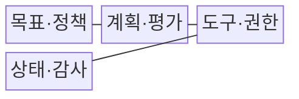
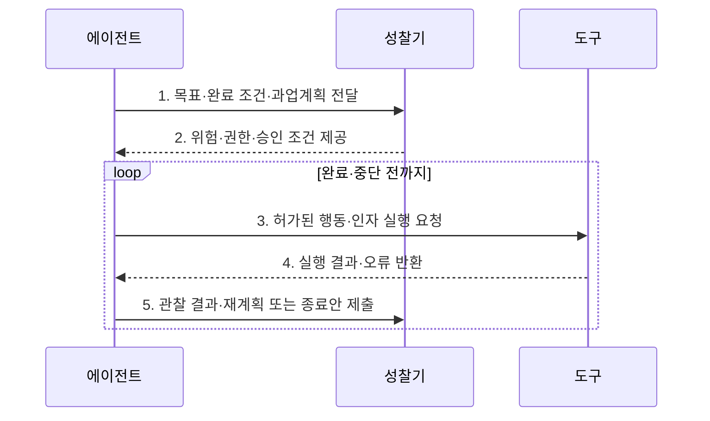

---
sidebar:
  order: 2
  label: "002. 에이전틱 AI (Agentic AI)"
  badge:
    text: "기출 · 70%"
    variant: note
title: "에이전틱 AI (Agentic AI)"
date: "2026-07-31T11:51:42+09:00"
tags:
  - "notes-latest_tech"
weight: 2
extra:
  question_no: "002"
  source_status: "기출"
  source_history: "138회"
  priority: 70
  priority_note: "자율 목표 수행과 통제 설계가 주요 쟁점"
---

## Ⅰ. 개요

핵심 용어

- **에이전틱 인공지능(Agentic Artificial Intelligence, Agentic AI)**: 목표를 하위 작업으로 분해하고 도구 실행·관찰·재계획을 반복하여 완료 조건까지 수행하는 자율 인공지능이다.

- 정의/개념: 목표 분해·도구 실행·관찰·재계획을 반복하는 **에이전틱 인공지능(Agentic Artificial Intelligence, Agentic AI)**
- 배경/필요성: 생성형 AI의 단발 응답으로는 **장기 상태·완료 조건·예외 복구 관리 불가**

#### 한줄 요약
- 에이전틱 AI는 사용자가 목표를 제시하면 필요한 작업을 스스로 나누고 도구를 사용하여 완료 조건까지 수행한다.

## Ⅱ. 특징

핵심 용어

- **목표 지향성**: 목표를 의존 작업과 검증 가능한 완료 조건으로 바꾸는 특성이다.
- **자기 성찰**: 관찰 결과와 오류를 평가하여 행동 경로를 수정하는 특성이다.
- **비동기 자율성**: 장기 작업의 상태와 복구 지점을 저장하고 필요한 시점에 실행을 재개하는 능력이다.

- **목표 지향성**: 목표를 의존 작업과 검증 가능한 완료 조건으로 변환
- **자기 성찰**: 관찰·오류에 따라 행동 경로 수정
- **비동기 자율성**: 상태·권한·승인으로 중단·복구 조건 관리

#### 한줄 요약
- 실행 중 문제가 발생해도 관찰 결과를 반영하여 대체 경로를 찾고 목표 달성을 계속 시도한다.

## Ⅲ. 구조 및 구성요소

핵심 용어

- **작업 메모리**: 현재 목표·계획·관찰·도구 결과를 보존하여 후속 판단에 제공하는 상태 저장소다.
- **대규모 언어 모델(Large Language Model, LLM)**: 자연어 목표와 작업 문맥을 바탕으로 계획과 행동 후보를 생성하는 모델이다.
- **계획·평가 모듈**: 목표를 의존 작업으로 분해하고 관찰 결과·완료 조건에 따라 재계획이나 종료를 결정하는 구성요소이다.
- **권한 정책**: 에이전트가 호출할 수 있는 도구·데이터·행동 범위와 사람의 승인 지점을 정하는 통제 규칙이다.
- **응용 프로그래밍 인터페이스(Application Programming Interface, API)**: 에이전트가 외부 도구를 인증·인자·권한 규칙에 따라 호출하는 인터페이스이다.
- **데이터베이스(Database, DB)**: 진행 상태·비용·복구 지점과 감사 기록을 지속 저장하는 저장소이다.

| 구성요소 | 책임 |
|:---|:---|
| 목표·정책 | **대규모 언어 모델(Large Language Model, LLM) 목표·조건·위험도·자율 수준** 정의 |
| 계획·평가 | **에이전틱 워크플로·관찰 결과** 평가 |
| 도구·권한 | **응용 프로그래밍 인터페이스(Application Programming Interface, API) 인증·인자·실행 권한** 중개 |
| 상태·감사 | **데이터베이스(Database, DB) 진행 상태·비용·복구지점** 기록 |

#### 한줄 요약
- 목표·계획·도구·상태·승인을 통합 관리해야 자율 실행의 정확성과 통제 가능성을 확보할 수 있다.

## Ⅳ. 흐름도

핵심 용어

- **자기 성찰**: 수행 결과와 오류를 완료 조건에 비추어 평가하고 계획을 수정하는 과정이다.
- **인간 참여형 통제(Human-in-the-Loop, HITL)**: 위험한 행동을 실행하기 전에 사람이 맥락과 영향을 검토하고 승인하는 통제이다.

1. **목표·완료 조건·과업계획 전달**: 작업·의존성·예외 경로와 자율 수준 설정
2. **위험·권한·승인 조건 제공**: 행동 영향과 허용 권한 및 HITL 지점 판정
3. **허가된 행동·인자 실행 요청**: 검증된 도구 호출과 진행 상태 기록
4. **실행 결과·오류 반환**: 외부 환경의 관찰값과 실패 원인 제공
5. **관찰 결과·재계획 또는 종료안 제출**: 완료·재개·중단·인적 이관 중 다음 상태 결정

#### 한줄 요약
- 계획한 행동을 실행한 뒤 결과를 평가하고, 필요하면 계획을 수정하거나 작업을 종료한다.

## Ⅴ. 종류 및 비교

핵심 용어

- **에이전틱 인공지능(Agentic Artificial Intelligence, Agentic AI)**: 목표 달성까지 계획·행동·관찰·성찰과 외부 실행을 반복하는 자율 인공지능이다.
- **생성형 인공지능(Generative Artificial Intelligence, Generative AI)**: 입력에 따라 텍스트·이미지·코드 등의 콘텐츠를 생성하는 인공지능이다.
- **에이전틱 워크플로**: 목표 달성을 위해 계획·행동·관찰·성찰 단계를 반복하는 작업 방식이다.

| 판단 기준 | 에이전틱 AI | 생성형 AI |
|:---|:---|:---|
| 적용 기준 | **장기·다단계 목표** 수행 | **단발 콘텐츠** 생성 |
| 핵심 특징 | **목표·계획·행동·관찰 루프** | 입력에 따른 **콘텐츠 생성** |
| 한계 | **오류 누적·권한 오용 위험** | **목표 상태·외부 실행 부족** |

> 요약: **에이전틱 인공지능(Agentic Artificial Intelligence, Agentic AI)** 중심 목표 실행, **생성형 인공지능(Generative Artificial Intelligence, Generative AI)** 중심 콘텐츠 생성

#### 한줄 요약
- 생성형 AI가 주로 단발성 결과를 생성한다면, 에이전틱 AI는 목표가 충족될 때까지 계획과 행동을 반복한다.

## Ⅵ. 실무 고려사항 및 대책

핵심 용어

- **완료 조건**: 에이전트가 목표 달성 여부를 검증하고 실행을 종료할 수 있도록 정한 측정 가능한 기준이다.
- **인간 참여형 통제(Human-in-the-Loop, HITL)**: 서비스 차단·권리 변경 등 고영향 행동을 사람이 승인한 뒤 실행하게 하는 통제이다.

| 문제 | 대책 | 효과 |
|:---|:---|:---|
| 완료 조건이 모호해 생기는 **무한 실행** | **객관적 완료 기준·반복·비용 한도** 설정 | 작업의 **종료 가능성** 확보 |
| 오류가 후속 행동에 번지는 **상태 오염** | **관찰 신뢰도·복구지점 재계획** 적용 | 잘못된 **상태 확산** 억제 |
| 서비스 차단의 **고영향·책임 위험** | **최소권한·인간 참여형 통제(Human-in-the-Loop, HITL) 승인·감사 기록** 적용 | 자율성과 **책임성** 균형 |

#### 한줄 요약
- 업무 위험도에 따라 에이전트의 권한 범위를 제한하고, 중요한 작업에는 사람의 승인을 적용한다.

## Ⅶ. 결론

핵심 용어

- **자율성 통제**: 권한·비용·시간·승인 경계를 적용하여 에이전트의 독립 행동 범위를 제한하는 운영 원칙이다.
- **인간 참여형 통제(Human-in-the-Loop, HITL)**: 고영향 행동을 사람이 승인하도록 하여 자율성과 책임의 경계를 정하는 통제이다.

- 장기·다단계 목표는 **에이전틱 인공지능(Agentic Artificial Intelligence, Agentic AI)**, 고영향 행동은 **인간 참여형 통제(Human-in-the-Loop, HITL) 승인** 적용

#### 한줄 요약
- 자율성을 높이되 오류가 확산되지 않도록 승인 지점과 중단·복구 절차를 함께 설계해야 한다.
