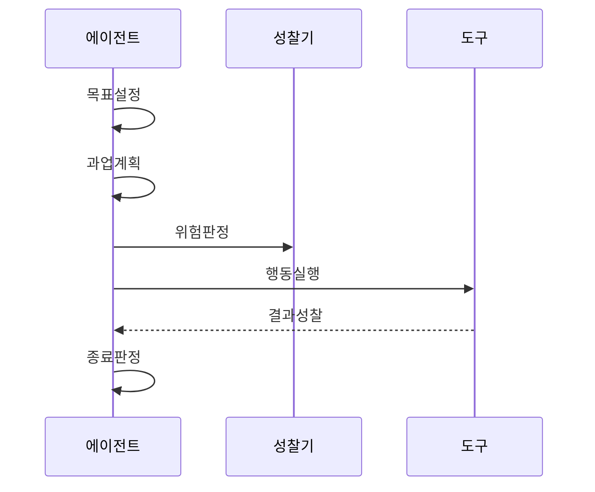

---
sidebar:
  order: 2
  label: "002. 에이전틱 AI (Agentic AI)"
  badge:
    text: "기출 · 70%"
    variant: note
title: "에이전틱 AI (Agentic AI)"
date: "2026-07-27T23:59:59+09:00"
tags:
  - "notes-latest_tech"
weight: 2
extra:
  question_no: "002"
  source_status: "기출"
  source_history: "138회"
  priority: 70
  priority_note: "자율 목표 수행과 통제 설계가 주요 쟁점"
---

## 미리 알고가기

- **인공지능(Artificial Intelligence, AI, 에이아이)**: 영문 머리글자를 딴 기술명으로, 목표 기반 판단 자동화에 활용
- **대규모 언어 모델(Large Language Model, LLM, 엘엘엠)**: 영문 머리글자를 딴 언어 모델로, 계획·성찰·행동 후보를 생성
- **에이전틱 워크플로 (Agentic Workflow)**: 계획·행동·성찰 반복
- **목표 지향성 (Goal Orientation)**: 최종 목표에서 하위 과업 정의
- **자기 성찰 (Self-Reflection)**: 결과·오류 평가·계획 수정
- **비동기 자율성 (Asynchronous Autonomy)**: 장기 작업 상태 기반 재개
- **체화 인공지능 (Embodied AI)**: 로봇·센서 실세계 상호작용
- **사물 인터넷 (Internet of Things, IoT)**: 체화 에이전트 장치 연결
- **응용 프로그래밍 인터페이스 (Application Programming Interface, API)**: 외부 기능 호출 계약 제공
- **데이터베이스 (Database, DB)**: 작업 상태·복구 지점 저장

## Ⅰ. 개요

- 정의/개념: 목표·계획·행동·피드백 결합 AI
- 기존 한계: 생성형 AI 단독 응답은 목표 완료 상태를 지속 관리 불가
- **배경/필요성**: 장기 업무의 자율 실행과 위험 통제

### 쉽게 이해하기 (학습용)
- 사용자가 시키는 대로만 기계적으로 글을 받아 적는 비서에서, "이번 달 매출 분석해 줘"라고 목표만 던지면 알아서 일처리를 끝내는 유능한 직원으로 진화하는 과정

## Ⅱ. 특징

- 고수준 목표를 하위 작업과 완료 조건으로 분해한다
- 관찰·오류·환경 변화에 따라 계획과 행동을 수정한다
- 상태·권한·승인 정책으로 장기 자율 실행을 통제한다

### 쉽게 이해하기 (학습용)
- 슈퍼마켓 문이 닫혀 있을 때 그냥 돌아오는 것이 아니라, 근처 편의점을 찾거나 배달 앱을 켜서 끝내 심부름을 완수하는 능동적인 행동 방식입니다.

## Ⅲ. 구성요소 및 구조

| 설계 요소 | 설명 |
|:---|:---|
| 목표·정책 | 목표·조건·위험도·자율 수준 정의 |
| 계획·평가 | 작업 생성·관찰 결과 평가 |
| 도구·권한 | 도구 인증·인자·실행 중개 |
| 상태·감사 | 진행 상태·비용·복구지점 기록 |

> 요약: 성찰 제어기가 계획·도구·상태·승인을 조정함

### 쉽게 이해하기 (학습용)
- 성찰 제어기가 계획·상태·도구·승인을 목표에 맞게 조정함

## Ⅳ. 원리 및 절차 흐름도

| 절차 | 설명 |
|:---|:---|
| 목표설정 | 목표·완료 조건·수준 설정 |
| 과업계획 | 작업·의존성·예외 경로 계획 |
| 위험판정 | 권한·영향·승인 판정 |
| 행동실행 | 도구 실행·상태 기록 |
| 결과성찰 | 평가·대안 계획 생성 |
| 종료판정 | 완료·재개·이관 판정 |

> 요약: 행동 결과를 성찰해 재계획·완료를 판정함

### 쉽게 이해하기 (학습용)
- 목표를 계획하고 행동 결과를 성찰해 우회·종료 여부를 정함

## Ⅴ. 종류 및 비교

| 판단 기준 | 에이전틱 AI | 생성형 AI |
|:---|:---|:---|
| 적용 기준 | 장기·다단계 목표 수행이 필요할 때 | 단발 콘텐츠 생성이 필요할 때 |
| 핵심 특징 | 목표·계획·행동·관찰 루프 | 입력에 따른 콘텐츠 생성 |
| 한계 | 오류 누적·권한 오용 위험 | 목표 상태·외부 실행 부족 |

> 요약: 에이전틱 AI는 목표를 수행하고 생성형 AI는 생성한다.

### 쉽게 이해하기 (학습용)
- 생성형 AI는 단발 응답, 에이전틱 AI는 목표 달성까지 반복함

## Ⅵ. 실무 사례

- 로그 분석은 자동화하고 차단은 승인·복구한다

### 쉽게 이해하기 (학습용)
- 은행에서 신입 사원에게 송금 권한을 조금씩 열어주다가 신뢰가 쌓이면 완전 전결권을 넘기듯이, AI에게 시스템 제어권을 차츰 늘려주는 조치입니다.

## Ⅶ. 결론

- 위험도·검증 근거로 자율·중단 수준을 정한다

### 쉽게 이해하기 (학습용)
- 스마트홈에 완전 자동 온도 조절 장치를 도입하되, 방이 얼어버리거나 화재가 나는 비상 상황을 막기 위한 안전장치를 2중으로 잠가두는 구조
