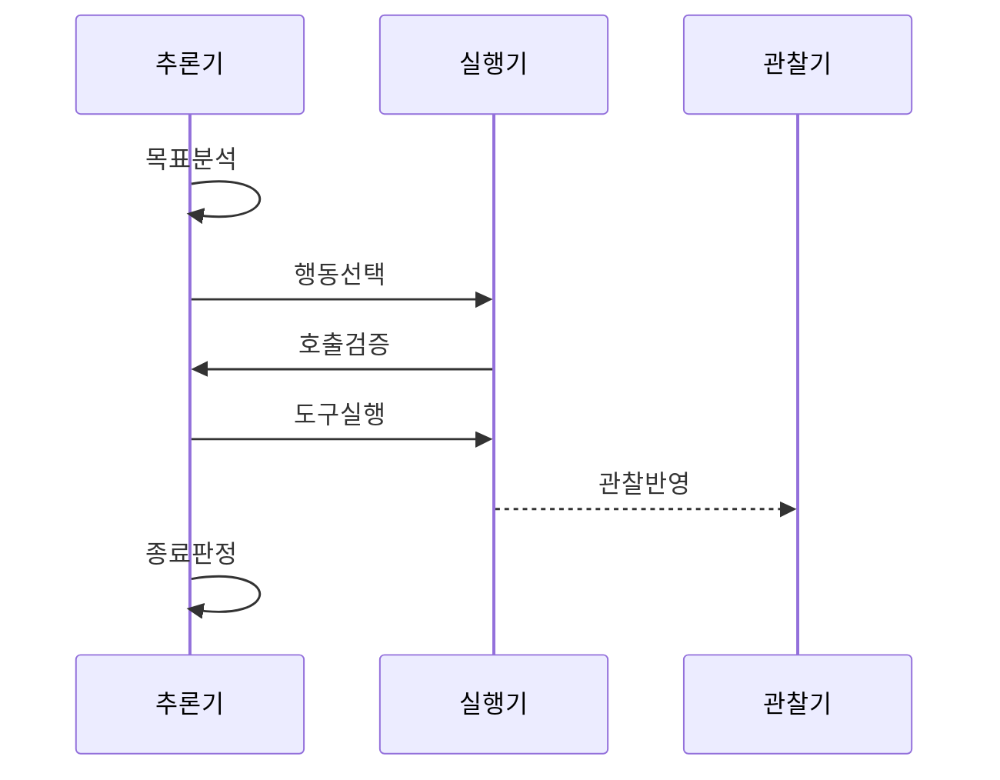

---
sidebar:
  order: 3
  label: "003. ReAct 패턴 (Reasoning and Acting)"
  badge:
    text: "기출 · 60%"
    variant: note
title: "ReAct 패턴 (Reasoning and Acting)"
date: "2026-07-25T01:25:00+09:00"
tags:
  - "notes-latest_tech"
weight: 3
extra:
  question_no: "003"
  source_status: "기출"
  source_history: "138회"
  priority: 60
  priority_note: "추론·행동 반복이 에이전트 설계의 기본"
---

## 미리 알고가기

- **사고 연쇄 (Chain-of-Thought, CoT)**: 중간 추론 단계 이어 답 생성
- **추론·행동 (Reasoning and Acting, ReAct)**: 추론·행동·관찰 반복
- **대규모 언어 모델 (Large Language Model, LLM)**: 다음 추론·행동 생성
- **응용 프로그래밍 인터페이스 (Application Programming Interface, API)**: 외부 도구 호출 계약 제공
- **데이터베이스 (Database, DB)**: 외부 근거·상태 저장
- **환각 (Hallucination)**: 근거 없는 내용 사실처럼 생성
- **랭체인 (LangChain)**: 모델·도구·상태 흐름 연결
- **최대 반복 횟수 (Max Iterations)**: 무한 호출·비용 폭증 제한

## Ⅰ. 개요

- **정의/개념**: 추론·행동·관찰을 반복하는 패턴
- **배경/필요성**: 외부 검색·계산·실행 결과 반영

### 쉽게 이해하기 (학습용)
- 요리책의 글자만 읽으며 요리를 상상하는 것에서 벗어나, 직접 간을 보고(관찰) 불을 조절(행동)하며 완성도 높은 음식을 만들어내는 피드백 과정

## Ⅱ. 특징

- 정보 공백을 판단해 필요한 행동을 선택한다
- 관찰 결과로 가설·계획·다음 도구를 수정한다
- 도구·관찰·상태 전이를 감사 기록으로 남긴다
- 반복 증가는 지연·비용·오류 누적을 키운다

### 쉽게 이해하기 (학습용)
- 혼자 짐작해서 답을 적는 대신, 모르는 부분을 사전에서 찾아보고 확인된 내용을 바탕으로 다음 답안을 차근차근 완성해 나가는 특성입니다.

## Ⅲ. 구성요소 및 구조

| 설계 요소 | 설명 |
|:---|:---|
| 추론·정책 | 정보 공백·다음 행동 결정 |
| 행동 실행기 | 도구 스키마·인자·권한 검증 |
| 관찰 처리기 | 결과 출처·오류·상태 반영 |
| 루프 제어기 | 완료·비용·시간·반복 한도 제어 |

> 요약: ReAct 제어기가 추론·행동·관찰·반복 한도를 조정함

### 쉽게 이해하기 (학습용)
- 추론·실행·관찰·루프 제어가 외부 근거 기반 판단을 구성함

## Ⅳ. 원리 및 절차 흐름도

| 절차 | 설명 |
|:---|:---|
| 목표분석 | 완료 조건·정보 공백 분석 |
| 행동선택 | 도구·인자 선택 수립 |
| 호출검증 | 도구·인자·위험 검증 |
| 도구실행 | 제한 환경 도구 실행 |
| 관찰반영 | 출처·오류 확인·반영 |
| 종료판정 | 근거 충분성·한도 종료 판정 |

> 요약: 도구 관찰을 추론에 반영하고 반복 한도로 종료함

### 쉽게 이해하기 (학습용)
- 정보 공백을 도구로 확인하고 근거·한도에 따라 반복을 끝냄

## Ⅴ. 종류 및 비교

| 판단 기준 | ReAct | 표준 프롬프팅 | Chain of Thought |
|:---|:---|:---|:---|
| 정보원 | 모델 지식·도구 관찰 | 입력·모델 지식 | 입력·모델 지식과 추론 |
| 처리 흐름 | 추론·행동·관찰 반복 | 입력 후 응답 | 추론 후 응답 |
| 적용 기준 | 외부 도구 근거·행동이 필요할 때 | 단순 질의·응답이 필요할 때 | 내부 추론 분해가 필요할 때 |

> 요약: ReAct는 행동, CoT는 추론, 표준은 응답에 쓴다.

### 쉽게 이해하기 (학습용)
- 표준은 즉답, CoT는 내부 추론, ReAct는 도구 관찰까지 사용함

## Ⅵ. 실무 사례

- 계정 조회는 자동화하고 초기화는 승인한다

### 쉽게 이해하기 (학습용)
- 문이 잠겨 열쇠를 찾을 때, 온 집안을 5번만 수색해보고 안 나오면 포기하고 집주인에게 연락하는 것과 같은 안전 가이드 조치입니다.

## Ⅶ. 결론

- 출처·반복·비용·종료 조건으로 ReAct를 통제한다

### 쉽게 이해하기 (학습용)
- 외부 사전을 참고해가며 검증을 치르면 만점에 가까워지지만, 제한된 검증 시간이 지나기 전에 검증지를 제출할 수 있게 조율하는 구조
