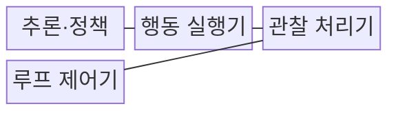
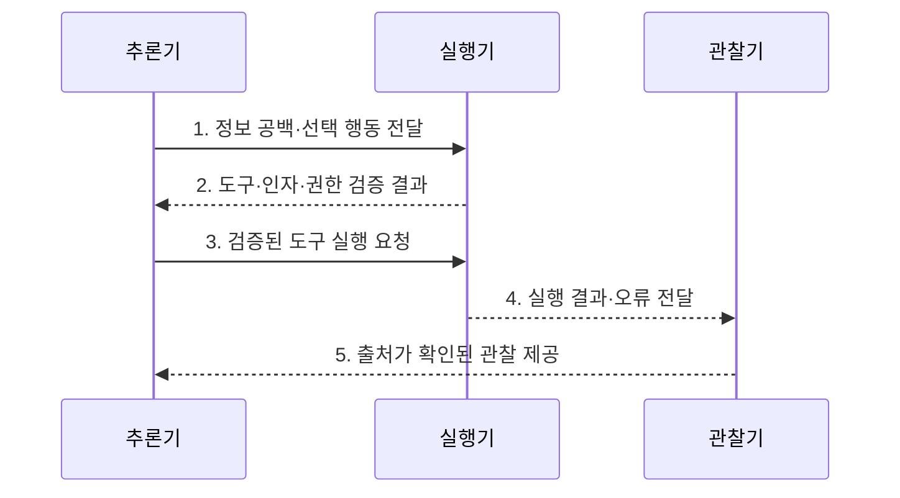

---
sidebar:
  order: 3
  label: "003. ReAct 패턴 (Reasoning and Acting)"
  badge:
    text: "기출 · 60%"
    variant: note
title: "ReAct 패턴 (Reasoning and Acting)"
date: "2026-07-30T11:04:43+09:00"
tags:
  - "notes-latest_tech"
weight: 3
extra:
  question_no: "003"
  source_status: "기출"
  source_history: "138회"
  priority: 60
  priority_note: "추론·행동 반복이 에이전트 설계의 기본"
---

## 미리 알고가기

- **사고 연쇄(Chain-of-Thought, CoT)**: 복잡한 문제를 중간 추론 단계로 나누어 답을 도출하는 기법이다.
- **추론·행동(Reasoning and Acting, ReAct)**: 추론으로 행동을 선택하고 그 관찰 결과를 다음 추론에 반영하는 에이전트 패턴이다.
- **대규모 언어 모델(Large Language Model, LLM)**: 입력과 관찰 결과를 바탕으로 다음 추론과 행동을 생성하는 모델이다.
- **응용 프로그래밍 인터페이스(Application Programming Interface, API)**: 에이전트가 외부 도구의 기능을 호출하는 규격이다.
- **데이터베이스(Database, DB)**: 외부 근거와 에이전트의 작업 상태를 저장하는 데이터 관리 체계다.
- **환각(Hallucination)**: 모델이 근거가 없거나 사실과 다른 내용을 생성하는 현상이다.
- **랭체인(LangChain)**: 언어 모델·도구·상태 관리 흐름을 구성하는 프레임워크다.
- **최대 반복 횟수(Max Iterations)**: 실행 루프의 무한 반복과 비용 증가를 방지하는 종료 조건이다.

## Ⅰ. 개요

- 정의/개념: 모델이 정보 공백을 추론해 외부 도구 행동을 선택하고 그 관찰 결과로 다음 추론을 갱신하는 에이전트 실행 패턴
- 배경/필요성: 모델 내부의 지식과 추론만으로는 최신 정보와 정확한 계산 및 외부 시스템의 현재 상태를 검증하기 곤란

### 쉽게 이해하기 (학습용)
- ReAct는 필요한 정보를 도구로 확인하고, 그 결과를 근거로 다음 행동을 결정한다.

## Ⅱ. 특징

- **추론 기반 도구 선택**으로 정보 공백에 맞는 검색·계산·실행 도구와 인자를 결정
- **행동 결과 관찰**로 도구의 근거·오류를 반영해 기존 가설과 다음 행동을 수정
- **종료 조건·실행 한도**로 근거 충분성·비용·시간·반복 횟수를 함께 통제

### 쉽게 이해하기 (학습용)
- 추론만으로 답을 확정하지 않고 도구로 확인한 외부 근거를 다음 판단에 반영한다.

## Ⅲ. 구조 및 구성요소

| 구성요소 | 책임 |
|:---|:---|
| 추론·정책 | 정보 공백·다음 행동 결정 |
| 행동 실행기 | 도구 스키마·인자·권한 검증 |
| 관찰 처리기 | 결과 출처·오류·상태 반영 |
| 루프 제어기 | 완료·비용·시간·반복 한도 제어 |

### 쉽게 이해하기 (학습용)
- 추론·실행·관찰·루프 제어를 결합하여 외부 근거에 기반한 판단을 수행한다.

## Ⅳ. 흐름도

1. **정보 공백·선택 행동 전달**: 완료 조건과 부족한 근거를 분석해 도구·인자 선택
2. **도구·인자·권한 검증 결과**: 호출 형식과 행동 위험 및 실행 권한 확인
3. **검증된 도구 실행 요청**: 제한된 환경에서 허가된 외부 행동 수행
4. **실행 결과·오류 전달**: 도구 출력과 실패 원인을 관찰 처리기로 전송
5. **출처가 확인된 관찰 제공**: 근거를 다음 추론에 반영해 완료·재시도·중단 판정

### 쉽게 이해하기 (학습용)
- 정보 공백을 도구로 확인하고, 근거의 충분성과 실행 한도에 따라 반복을 종료한다.

## Ⅴ. 종류 및 비교

| 판단 기준 | ReAct | 표준 프롬프팅 | Chain of Thought |
|:---|:---|:---|:---|
| 적용 기준 | 외부 도구 근거·행동이 필요할 때 | 단순 질의·응답이 필요할 때 | 내부 추론 분해가 필요할 때 |
| 핵심 특징 | 추론·행동·관찰 반복 | 입력 후 단발 응답 | 내부 추론 후 응답 |
| 한계 | 반복 비용·도구 오류 누적 | 외부 상태 확인 불가 | 외부 행동·관찰 부족 |

### 쉽게 이해하기 (학습용)
- 표준 프롬프팅은 단발 응답, CoT는 내부 추론, ReAct는 도구 실행과 관찰까지 활용한다.

## Ⅵ. 실무 고려사항 및 대책

| 고려사항 | 대책 | 효과 |
|:---|:---|:---|
| 신뢰할 수 없는 도구 결과 | 출처·시점·오류 상태를 관찰값과 함께 검증 | 잘못된 근거의 추론 반영 방지 |
| 반복 루프의 비용 누적 | 최대 반복·시간·비용과 근거 충분성 종료 조건 설정 | 무한 실행 억제 |
| 계정 초기화 등 상태 변경 | 조회·진단과 변경 도구의 권한을 분리하고 본인확인·승인 요구 | 고위험 행동 통제 |

### 쉽게 이해하기 (학습용)
- 조회와 진단은 자동화하되, 계정 상태를 변경하는 작업은 승인 절차로 통제한다.

## Ⅶ. 결론

- 외부 상태 확인과 행동이 필요하면 ReAct를 선택하되, 출처가 검증된 관찰만 다음 추론에 반영하고 반복 한도 또는 완료 조건에 도달하면 실행을 종료

### 쉽게 이해하기 (학습용)
- 도구 결과를 다음 추론에 반영하되, 오류와 비용이 누적되지 않도록 실행 횟수와 종료 조건을 함께 설계해야 한다.
