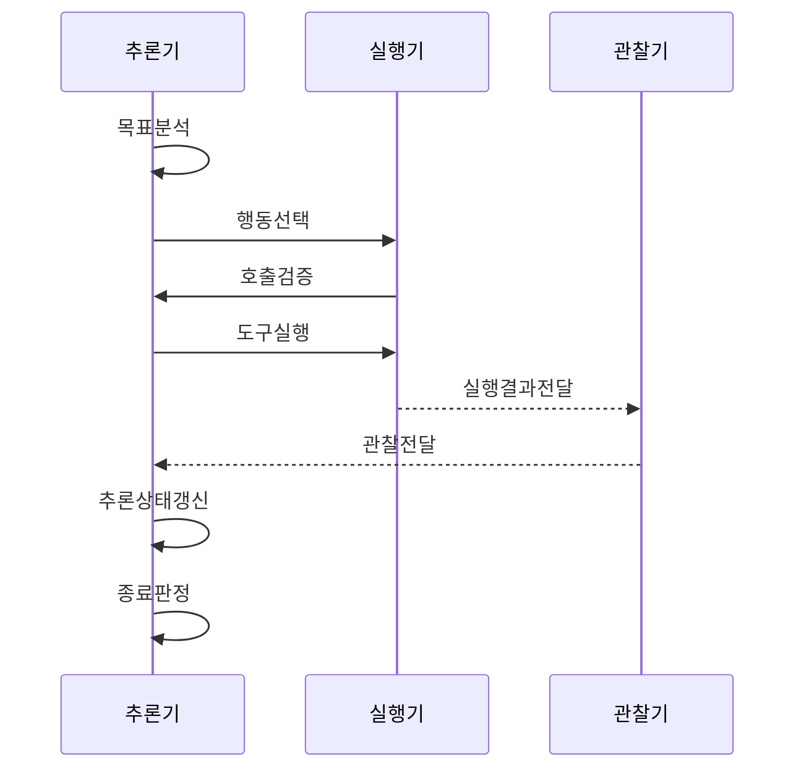

---
sidebar:
  order: 3
  label: "003. ReAct 패턴 (Reasoning and Acting)"
  badge:
    text: "기출 · 60%"
    variant: note
title: "ReAct 패턴 (Reasoning and Acting)"
date: "2026-07-27T23:59:59+09:00"
tags:
  - "notes-latest_tech"
weight: 3
extra:
  question_no: "003"
  source_status: "기출"
  source_history: "138회"
  priority: 60
  priority_note: "추론·행동 반복이 에이전트 설계의 기본"
---

## 미리 알고가기

- **사고 연쇄(Chain-of-Thought, CoT)**: 복잡한 문제를 중간 추론 단계로 나누어 답을 도출하는 기법이다.
- **추론·행동(Reasoning and Acting, ReAct)**: 추론으로 행동을 선택하고 그 관찰 결과를 다음 추론에 반영하는 에이전트 패턴이다.
- **대규모 언어 모델(Large Language Model, LLM)**: 입력과 관찰 결과를 바탕으로 다음 추론과 행동을 생성하는 모델이다.
- **응용 프로그래밍 인터페이스(Application Programming Interface, API)**: 에이전트가 외부 도구의 기능을 호출하는 규격이다.
- **데이터베이스(Database, DB)**: 외부 근거와 에이전트의 작업 상태를 저장하는 데이터 관리 체계다.
- **환각(Hallucination)**: 모델이 근거가 없거나 사실과 다른 내용을 생성하는 현상이다.
- **랭체인(LangChain)**: 언어 모델·도구·상태 관리 흐름을 구성하는 프레임워크다.
- **최대 반복 횟수(Max Iterations)**: 실행 루프의 무한 반복과 비용 증가를 방지하는 종료 조건이다.

## Ⅰ. 개요

- 정의/개념: **ReAct**는 추론(Reasoning)으로 행동(Acting)을 선택하고, 도구의 관찰 결과를 다음 추론에 반영하는 반복 실행 패턴이다.
- 기존 한계: 모델 내부의 지식과 추론만으로는 최신 정보·정확한 계산·외부 시스템의 현재 상태를 확인하기 어렵다.

### 쉽게 이해하기 (학습용)
- ReAct는 필요한 정보를 도구로 확인하고, 그 결과를 근거로 다음 행동을 결정한다.

## Ⅱ. 특징

- **도구 선택**: 정보 공백에 맞는 검색·계산·실행 도구를 선택한다.
- **관찰 기반 수정**: 도구의 관찰 결과에 따라 가설과 다음 행동을 수정한다.
- **루프 통제**: 완료·비용·시간·반복 횟수를 기준으로 실행을 종료한다.

### 쉽게 이해하기 (학습용)
- 추론만으로 답을 확정하지 않고 도구로 확인한 외부 근거를 다음 판단에 반영한다.

## Ⅲ. 구성요소 및 구조

| 설계 요소 | 설명 |
|:---|:---|
| 추론·정책 | 정보 공백·다음 행동 결정 |
| 행동 실행기 | 도구 스키마·인자·권한 검증 |
| 관찰 처리기 | 결과 출처·오류·상태 반영 |
| 루프 제어기 | 완료·비용·시간·반복 한도 제어 |

> 요약: ReAct 제어기는 추론·행동·관찰을 연결하고 반복 한도를 통제한다.

### 쉽게 이해하기 (학습용)
- 추론·실행·관찰·루프 제어를 결합하여 외부 근거에 기반한 판단을 수행한다.

## Ⅳ. 원리 및 절차 흐름도

| 절차 | 설명 |
|:---|:---|
| 목표분석 | 완료 조건·정보 공백 분석 |
| 행동선택 | 도구·인자 선택 수립 |
| 호출검증 | 도구·인자·위험 검증 |
| 도구실행 | 제한 환경 도구 실행 |
| 실행결과전달 | 도구 출력·오류를 관찰기에 전달 |
| 관찰전달 | 출처·오류를 확인한 관찰 전달 |
| 추론상태갱신 | 관찰을 다음 추론 상태에 반영 |
| 종료판정 | 근거 충분성·한도 종료 판정 |

> 요약: 도구의 관찰 결과를 추론에 반영하고 완료 조건이나 반복 한도에 따라 종료한다.

### 쉽게 이해하기 (학습용)
- 정보 공백을 도구로 확인하고, 근거의 충분성과 실행 한도에 따라 반복을 종료한다.

## Ⅴ. 종류 및 비교

| 판단 기준 | ReAct | 표준 프롬프팅 | Chain of Thought |
|:---|:---|:---|:---|
| 적용 기준 | 외부 도구 근거·행동이 필요할 때 | 단순 질의·응답이 필요할 때 | 내부 추론 분해가 필요할 때 |
| 핵심 특징 | 추론·행동·관찰 반복 | 입력 후 단발 응답 | 내부 추론 후 응답 |
| 한계 | 반복 비용·도구 오류 누적 | 외부 상태 확인 불가 | 외부 행동·관찰 부족 |

> 요약: ReAct는 외부 행동과 관찰, CoT는 내부 추론, 표준 프롬프팅은 단발 응답에 중점을 둔다.

### 쉽게 이해하기 (학습용)
- 표준 프롬프팅은 단발 응답, CoT는 내부 추론, ReAct는 도구 실행과 관찰까지 활용한다.

## Ⅵ. 실무 사례

1. 고객 지원 에이전트가 계정 상태를 조회하고 해결 방법을 탐색하되, 계정 초기화는 본인 확인과 담당자 승인을 거쳐 실행한다.

### 쉽게 이해하기 (학습용)
- 조회와 진단은 자동화하되, 계정 상태를 변경하는 작업은 승인 절차로 통제한다.

## Ⅶ. 결론

- 외부 근거에 기반한 판단과 실행이 필요한 업무에는 도구의 신뢰성·출처와 반복·종료 조건을 검토하여 **ReAct**를 활용해야 한다.

### 쉽게 이해하기 (학습용)
- 도구 결과를 다음 추론에 반영하되, 오류와 비용이 누적되지 않도록 실행 횟수와 종료 조건을 함께 설계해야 한다.
