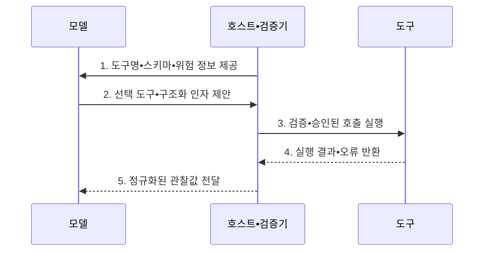

---
sidebar:
  order: 4
  label: "004. 도구 호출 (Tool Use)"
  badge:
    text: "기출 • 70%"
    variant: note
title: "도구 호출 (Tool Use)"
date: "2026-08-05T02:05:12+09:00"
tags:
  - "notes-latest_tech"
weight: 4
extra:
  question_no: "004"
  source_status: "기출"
  source_history: "138회"
  priority: 70
  priority_note: "외부 도구 연계와 권한 통제가 핵심"
---

## Ⅰ. 개요

<details>
<summary>핵심 용어</summary>

- **도구 호출(Tool Use)**: 대규모 언어 모델이 외부 기능과 인자를 제안하고 호스트가 이를 검증•승인•실행하여 결과를 모델에 돌려주는 연계 방식이다.
- **대규모 언어 모델(Large Language Model, LLM)**: 사용자 목표를 해석하여 호출할 외부 기능과 구조화된 인자를 제안하는 모델이다.

</details>

- 정의/개념: LLM 제안과 호스트 검증•실행을 분리하는 **도구 호출 연계 방식**
- 배경/필요성: 텍스트 생성만으로는 **외부 상태 조회•DB 업무 변경 불가**

#### 한줄 요약
- 모델은 실행할 도구와 인자를 제안하고, 호스트는 권한과 입력값을 검증한 뒤 외부 기능을 실행한다.

## Ⅱ. 특징

<details>
<summary>핵심 용어</summary>

- **실행 책임 분리**: 모델이 도구 호출을 제안하되 실제 권한 확인과 실행은 신뢰 경계 안의 호스트가 담당하는 원칙이다.
- **자바스크립트 객체 표기법(JavaScript Object Notation, JSON) 스키마**: 도구 인자의 자료형•필수 필드•허용 범위를 구조적으로 검증하는 명세이다.

</details>

- **책임 축**: **LLM** 중심 도구•인자 제안, 호스트 중심 실행 결정
- **검증 축**: **JSON 스키마**•최소권한•업무 규칙 중첩 확인
- **결과 축**: 출력•오류를 다음 판단의 비신뢰 관찰값으로 정규화

#### 한줄 요약
- 모델이 외부 기능을 직접 실행하지 않고, 검증된 실행 중개기를 통해 필요한 계산•검색•업무 처리를 수행한다.

## Ⅲ. 구조 및 구성요소

<details>
<summary>핵심 용어</summary>

- **모델 컨텍스트 프로토콜(Model Context Protocol, MCP)**: 인공지능 애플리케이션과 외부 데이터•도구의 연결 및 메시지 교환을 표준화한 프로토콜이다.
- **응용 프로그래밍 인터페이스(Application Programming Interface, API)**: 실행 중개기가 외부 기능을 정해진 요청•응답 규격으로 호출하는 인터페이스이다.
- **인간 참여형 통제(Human-in-the-Loop, HITL)**: 고위험 도구 실행 전에 사람이 맥락과 영향을 검토하고 승인하는 통제이다.

</details>

```text
                [도구 레지스트리]
                         |
                   [모델•라우터]
                         |
                   [실행 중개기]
                         |
                   [결과 처리기]
```

선의 의미: 도구 레지스트리의 명세를 모델•라우터가 참조하고, 실행 중개기의 신뢰 경계를 거쳐 결과 처리기에 연결되는 도구 호출 구조를 나타낸다.

| 구성요소 | 책임 |
|:---|:---|
| 도구 레지스트리 | **MCP•API 스키마•위험•권한** 제공 |
| 모델•라우터 | **LLM 도구•JSON 인자•병렬 호출** 제안 |
| 실행 중개기 | **인증•검증•HITL 승인•샌드박스** 실행 |
| 결과 처리기 | **결과•오류•신뢰 경계** 정규화 |

#### 한줄 요약
- 도구 레지스트리•실행 중개기•정책•결과 처리기가 호출의 전 과정을 분담한다.

## Ⅳ. 흐름도

<details>
<summary>핵심 용어</summary>

- **도구 결과**: 외부 실행이 반환한 데이터나 오류를 다음 판단에 사용하도록 구조화한 비신뢰 관찰값이다.

</details>



1. **도구명•스키마•위험 정보 제공**: 모델이 선택할 수 있는 기능과 인자 제약 및 부작용 명시
2. **선택 도구•구조화 인자 제안**: 사용자 목표에 맞는 호출 후보 생성
3. **검증•승인된 호출 실행**: 값•대상•권한•업무 규칙을 확인해 제한 환경에서 실행
4. **실행 결과•오류 반환**: 도구 출력과 실패 원인을 호스트에 전달
5. **정규화된 관찰값 전달**: 신뢰 경계를 표시한 결과를 다음 추론에 반영

#### 한줄 요약
- 모델이 제안한 도구와 인자를 검증하고 승인한 뒤 실행 결과를 모델에 반환한다.

## Ⅴ. 종류 및 비교

<details>
<summary>핵심 용어</summary>

- **코드 샌드박스**: 생성된 코드를 운영 시스템과 격리하고 시간•메모리•입출력 권한을 제한해 실행하는 환경이다.

</details>

| 판단 기준 | 도구 호출 | 플러그인 | 함수 호출 |
|:---|:---|:---|:---|
| 적용 기준 | **다양한 외부 기능** 활용 | **플랫폼 확장 묶음** 필요 | **구조화 함수 인자** 필요 |
| 핵심 특징 | **외부 기능 활용** 의 상위 개념 | **설치형 기능•UI 확장** 묶음 | **함수명•인자** 구조화 반환 |
| 한계 | **권한 오용•결과 주입 위험** | **플랫폼 종속** | **실행•값 검증은 호스트 책임** |

> 요약: **도구 호출 기반 상위 실행**, **플러그인•함수 호출 기반 구현**

#### 한줄 요약
- 플러그인이 설치 가능한 기능 묶음이라면, 도구 호출은 모델이 외부 기능을 활용하는 실행 방식이다.

## Ⅵ. 실무 고려사항 및 대책

<details>
<summary>핵심 용어</summary>

- **부작용 통제**: 데이터 변경•결제•전송 같은 비가역 행동에 승인•멱등성•감사 기록을 적용하는 운영 방식이다.
</details>

| 문제 | 대책 | 효과 |
|:---|:---|:---|
| 잘못된 도구•인자로 생기는 **오호출** | **허용 목록•JSON 스키마•업무 규칙** 검증 | 부적절한 **도구 실행** 차단 |
| 도구 결과에 섞이는 **지시문 주입** | 결과를 **비신뢰 데이터•관찰값** 으로 분리 | 다음 추론의 **정책 우회** 방지 |
| 환불•배송지 변경의 **업무 부작용** | **조회•변경 권한 분리•HITL•감사** 적용 | 실제 **업무 영향** 통제 |

#### 한줄 요약
- 조회와 변경 권한을 분리하고, 영향이 큰 작업에는 사람의 승인과 감사 기록을 적용한다.

## Ⅶ. 결론

<details>
<summary>핵심 용어</summary>

</details>

- 외부 상태•업무 실행은 **도구 호출**, 변경 작업은 **HITL 승인** 후 실행

#### 한줄 요약
- 도구 연계의 편의성뿐 아니라 잘못된 호출이 실제 업무에 미치는 영향을 통제할 수 있도록 실행 경계를 설계해야 한다.
