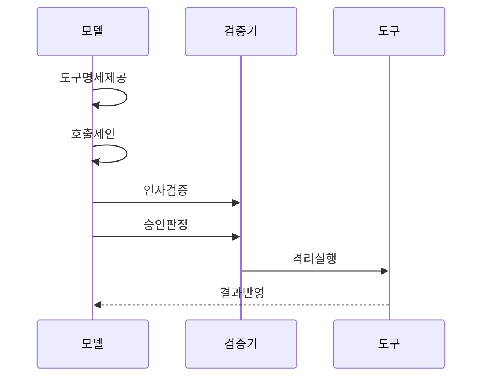

---
sidebar:
  order: 4
  label: "004. 도구 호출 (Tool Use)"
  badge:
    text: "기출 · 70%"
    variant: note
title: "도구 호출 (Tool Use)"
date: "2026-07-25T01:25:00+09:00"
tags:
  - "notes-latest_tech"
weight: 4
extra:
  question_no: "004"
  source_status: "기출"
  source_history: "138회"
  priority: 70
  priority_note: "외부 도구 연계와 권한 통제가 핵심"
---

## 미리 알고가기

- **대규모 언어 모델 (Large Language Model, LLM)**: 도구·인자 사용 제안
- **응용 프로그래밍 인터페이스 (Application Programming Interface, API)**: 외부 기능 호출 계약 제공
- **제이에스온 (JavaScript Object Notation, JSON)**: 구조화 인자 표현
- **JSON 스키마 (JSON Schema)**: 인자 구조·필수 필드 검증
- **모델 컨텍스트 프로토콜 (Model Context Protocol, MCP)**: 모델·도구 연결 표준화
- **인간 개입 (Human-in-the-Loop, HITL)**: 고위험 호출 사람 승인
- **데이터베이스 (Database, DB)**: 조회·변경 대상 데이터 저장
- **중단 문자열 (Stop Sequence)**: 지정 문자열 생성 중단
- **코드 샌드박스 (Code Sandbox)**: 임의 코드 격리 실행

## Ⅰ. 개요

- **정의/개념**: 모델 요청을 호스트가 실행하는 구조
- **배경/필요성**: 외부 계산·검색·업무 기능 활용

### 쉽게 이해하기 (학습용)
- 인공지능에게 단순히 글만 쓸 수 있는 종이와 펜을 주던 수준에서 벗어나, 직접 마우스와 키보드를 쥐여주고 컴퓨터 프로그램을 다루게 하는 기술

## Ⅱ. 특징

- 모델은 요청하고 호스트가 실행·권한을 검사한다
- 추출한 인자는 서버가 스키마·업무 규칙으로 검증한다
- 도구 설명·맥락·정책이 호출 선택을 제한한다
- 외부 결과는 주입·오염·반복 호출 위험을 만든다
- 레지스트리가 도구 명세·버전·폐기를 관리한다

### 쉽게 이해하기 (학습용)
- 똑똑한 아이가 복잡한 곱셈을 할 때 직접 암산하지 않고, 옆에 있는 친구에게 계산기를 써달라고 값을 불러주는 것과 같은 협동 능력입니다.

## Ⅲ. 구성요소 및 구조

| 설계 요소 | 설명 |
|:---|:---|
| 도구 레지스트리 | 스키마·위험·권한 정보 제공 |
| 모델·라우터 | 도구·인자·병렬 호출 제안 |
| 실행 중개기 | 인증·검증·승인·실행 중개 |
| 결과 처리기 | 결과·오류 정규화·전달 |

> 요약: 호스트가 도구 명세·권한·실행·결과를 통제함

### 쉽게 이해하기 (학습용)
- 레지스트리·중개기·정책·결과 처리기가 도구 실행을 분담함

## Ⅳ. 원리 및 절차 흐름도

| 절차 | 설명 |
|:---|:---|
| 도구명세제공 | 도구·스키마·위험 제공 |
| 호출제안 | 모델 도구·인자 제안 |
| 인자검증 | 스키마·값·대상 검증 |
| 승인판정 | 부작용·승인 필요 판정 |
| 격리실행 | 제한 환경 도구 실행 |
| 결과반영 | 결과 정규화·모델 반영 |

> 요약: 도구 제안을 검증·승인·격리 실행해 반영함

### 쉽게 이해하기 (학습용)
- 도구 제안을 검증·승인해 실행하고 결과를 모델에 돌려줌

## Ⅴ. 종류 및 비교

| 판단 기준 | 도구 호출 | 플러그인 | 함수 호출 |
|:---|:---|:---|:---|
| 개념 범위 | 모델의 외부 기능 활용 전반 | 플랫폼에 설치되는 확장 묶음 | 구조화된 함수·인자 반환 방식 |
| 실행 주체 | 호스트·런타임이 실행함 | 플랫폼·호스트 정책에 따름 | 클라이언트가 함수를 실행함 |
| 적용 기준 | 다양한 외부 기능 활용이 필요할 때 | 플랫폼 확장 묶음이 필요할 때 | 구조화 함수 인자 반환이 필요할 때 |

> 요약: 도구·플러그인·함수 호출은 활용·확장·구조화한다.

### 쉽게 이해하기 (학습용)
- 플러그인은 설치 묶음, 도구 호출은 외부 기능 활용 방식임

## Ⅵ. 실무 사례

- 검색은 읽기 전용, 변경은 승인·감사를 적용한다

### 쉽게 이해하기 (학습용)
- 신입 사원이 중요한 회사 문서를 삭제하거나 송금하지 못하도록, 읽기만 가능하게 하거나 부장의 결재를 거치게 설정하는 권한 관리입니다.

## Ⅶ. 결론

- 최소 권한·검증·승인·복구로 도구를 통제한다

### 쉽게 이해하기 (학습용)
- 여러 전자제품이 스마트홈 허브에 통일된 규격으로 연결되어야 오류 없이 완벽하게 자율 제어되는 이치
