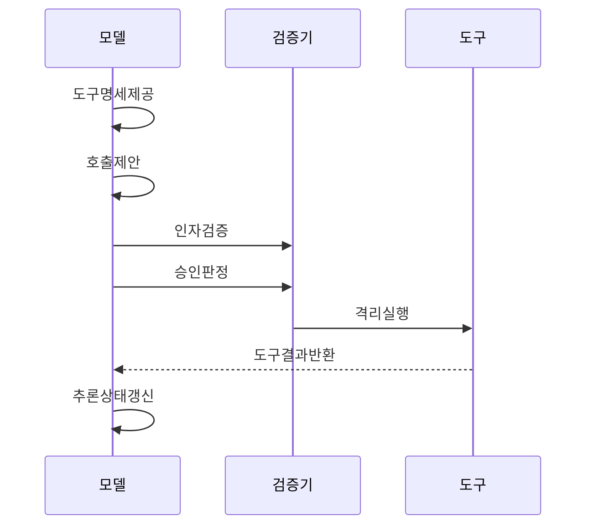

---
sidebar:
  order: 4
  label: "004. 도구 호출 (Tool Use)"
  badge:
    text: "기출 · 70%"
    variant: note
title: "도구 호출 (Tool Use)"
date: "2026-07-27T23:59:59+09:00"
tags:
  - "notes-latest_tech"
weight: 4
extra:
  question_no: "004"
  source_status: "기출"
  source_history: "138회"
  priority: 70
  priority_note: "외부 도구 연계와 권한 통제가 핵심"
---

## 미리 알고가기

- **대규모 언어 모델(Large Language Model, LLM)**: 사용자 요청을 해석하여 사용할 도구와 인자를 제안하는 모델이다.
- **응용 프로그래밍 인터페이스(Application Programming Interface, API)**: 외부 시스템의 기능을 호출하기 위한 규격이다.
- **JSON(JavaScript Object Notation)**: 도구명과 인자를 구조화하여 전달하는 데이터 형식이다.
- **JSON 스키마(JSON Schema)**: 호출 인자의 자료형·필수 필드·허용 범위를 검증하는 명세다.
- **모델 컨텍스트 프로토콜(Model Context Protocol, MCP)**: 인공지능 애플리케이션과 외부 데이터·도구를 표준 방식으로 연결하는 프로토콜이다.
- **인간 개입(Human-in-the-Loop, HITL)**: 고위험 도구 호출을 사람이 검토하고 승인하는 통제 방식이다.
- **데이터베이스(Database, DB)**: 도구가 조회하거나 변경하는 업무 데이터를 저장하는 체계다.
- **중단 문자열(Stop Sequence)**: 모델의 출력에서 생성을 중단할 문자열을 지정하는 제어값이다.
- **코드 샌드박스(Code Sandbox)**: 생성된 코드를 시스템과 격리된 환경에서 실행하는 보안 장치다.

## Ⅰ. 개요

- 정의/개념: **도구 호출**은 모델이 외부 기능과 인자를 제안하면 호스트가 이를 검증·실행하고 결과를 모델에 반환하는 구조다.
- 기존 한계: 모델 자체의 텍스트 생성만으로는 외부 시스템의 현재 상태를 조회하거나 업무 데이터를 변경할 수 없다.

### 쉽게 이해하기 (학습용)
- 모델은 실행할 도구와 인자를 제안하고, 호스트는 권한과 입력값을 검증한 뒤 외부 기능을 실행한다.

## Ⅱ. 특징

- **역할 분리**: 모델은 도구와 인자를 제안하고 호스트가 실제 실행 여부를 결정한다.
- **호출 검증**: 호스트와 서버가 스키마·권한·업무 규칙을 검증한다.
- **결과 피드백**: 도구의 실행 결과를 모델 문맥에 반환하여 다음 판단에 반영한다.

### 쉽게 이해하기 (학습용)
- 모델이 외부 기능을 직접 실행하지 않고, 검증된 실행 중개기를 통해 필요한 계산·검색·업무 처리를 수행한다.

## Ⅲ. 구성요소 및 구조

| 설계 요소 | 설명 |
|:---|:---|
| 도구 레지스트리 | 스키마·위험·권한 정보 제공 |
| 모델·라우터 | 도구·인자·병렬 호출 제안 |
| 실행 중개기 | 인증·검증·승인·실행 중개 |
| 결과 처리기 | 결과·오류 정규화·전달 |

> 요약: 호스트가 도구 명세와 권한을 검증하고 실행과 결과 반환을 통제한다.

### 쉽게 이해하기 (학습용)
- 도구 레지스트리·실행 중개기·정책·결과 처리기가 호출의 전 과정을 분담한다.

## Ⅳ. 원리 및 절차 흐름도

| 절차 | 설명 |
|:---|:---|
| 도구명세제공 | 도구·스키마·위험 제공 |
| 호출제안 | 모델 도구·인자 제안 |
| 인자검증 | 스키마·값·대상 검증 |
| 승인판정 | 부작용·승인 필요 판정 |
| 격리실행 | 제한 환경 도구 실행 |
| 도구결과반환 | 실행 출력·오류를 모델에 반환 |
| 추론상태갱신 | 정규화한 결과를 다음 추론에 반영 |

> 요약: 모델의 도구 제안을 검증·승인한 뒤 격리 실행하고 그 결과를 다음 추론에 반영한다.

### 쉽게 이해하기 (학습용)
- 모델이 제안한 도구와 인자를 검증하고 승인한 뒤 실행 결과를 모델에 반환한다.

## Ⅴ. 종류 및 비교

| 판단 기준 | 도구 호출 | 플러그인 | 함수 호출 |
|:---|:---|:---|:---|
| 적용 기준 | 다양한 외부 기능 활용이 필요할 때 | 플랫폼 확장 묶음이 필요할 때 | 구조화 함수 인자 반환이 필요할 때 |
| 핵심 특징 | 외부 기능 활용의 상위 개념 | 설치형 기능·UI 확장 묶음 | 함수명·인자 구조화 반환 |
| 한계 | 권한 오용·결과 주입 위험 | 플랫폼 종속 | 실행·값 검증은 호스트 책임 |

> 요약: 도구 호출은 외부 기능 활용, 플러그인은 플랫폼 기능 확장, 함수 호출은 구조화된 호출 생성에 중점을 둔다.

### 쉽게 이해하기 (학습용)
- 플러그인이 설치 가능한 기능 묶음이라면, 도구 호출은 모델이 외부 기능을 활용하는 실행 방식이다.

## Ⅵ. 실무 사례

1. 고객 지원 에이전트는 주문 정보를 읽기 전용으로 조회하고, 환불이나 배송지 변경은 권한 검증과 담당자 승인을 거쳐 실행하며 감사 로그를 남긴다.

### 쉽게 이해하기 (학습용)
- 조회와 변경 권한을 분리하고, 영향이 큰 작업에는 사람의 승인과 감사 기록을 적용한다.

## Ⅶ. 결론

- 모델이 외부 기능을 안전하게 실행하도록 도구의 입력 스키마와 최소 권한, 승인·감사·복구 절차를 검토하여 **도구 호출**을 활용해야 한다.

### 쉽게 이해하기 (학습용)
- 도구 연계의 편의성뿐 아니라 잘못된 호출이 실제 업무에 미치는 영향을 통제할 수 있도록 실행 경계를 설계해야 한다.
