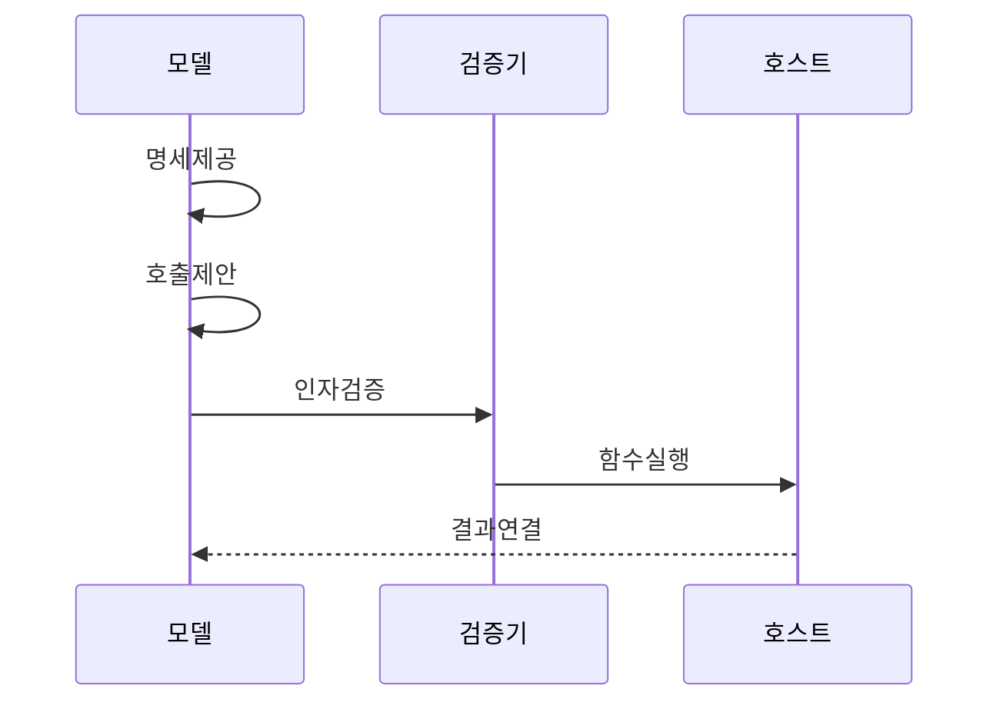

---
sidebar:
  order: 5
  label: "005. 함수 호출 (Function Calling)"
  badge:
    text: "기출 · 60%"
    variant: note
title: "함수 호출 (Function Calling)"
date: "2026-07-27T23:59:59+09:00"
tags:
  - "notes-latest_tech"
weight: 5
extra:
  question_no: "005"
  source_status: "기출"
  source_history: "138회"
  priority: 60
  priority_note: "함수 스키마 연계가 도구 실행의 기반"
---

## 미리 알고가기

- **함수 호출(Function Calling)**: 모델이 사용자의 의도를 실행 가능한 함수명과 구조화된 인자로 변환하여 호스트에 요청하는 방식
- **JSON(JavaScript Object Notation)**: 키와 값으로 함수 인자와 실행 결과를 구조화하는 데이터 형식
- **구조화 출력 (Structured Outputs)**: 출력을 지정 스키마에 맞춤
- **도구 선택 (tool_choice)**: 자동·필수·금지 호출 정책 설정
- **병렬 함수 호출 (Parallel Function Calling)**: 복수 함수 호출 함께 제안
- **호출 식별자 (Identifier, ID)**: 함수 요청·결과 연결
- **응용 프로그래밍 인터페이스 (Application Programming Interface, API)**: 함수 호출 옵션·결과 계약 제공
- **비정형 데이터 (Unstructured Data)**: 고정 스키마 없는 자연어 데이터

## Ⅰ. 개요

- 정의/개념: 모델의 구조화 요청을 호스트가 실행
- 기존 한계: 자연어 호출 지시는 함수·인자 형식의 검증 곤란
- **배경/필요성**: 함수 선택과 인자를 구조화해 실행 경계 제공

### 쉽게 이해하기 (학습용)
- 모델은 자연어 요청에서 실행할 함수와 인자를 구조화하고, 실제 실행 여부와 권한은 호스트가 검증·통제한다.

## Ⅱ. 특징

- 함수 설명·스키마가 모델의 함수·인자 제안을 제한한다
- 호스트가 인자·권한·부작용을 검증한 뒤 실행한다
- 호출 ID가 모델 요청과 함수 실행 결과를 연결한다

### 쉽게 이해하기 (학습용)
- 함수 설명과 인자 스키마는 모델의 출력을 제한하지만 값의 업무 타당성과 실행 부작용까지 보장하지는 않는다.

## Ⅲ. 구성요소 및 구조

| 설계 요소 | 설명 |
|:---|:---|
| 함수 명세 | 이름·설명·스키마 제공 |
| 모델 라우터 | 요청에 따른 함수·인자 제안 |
| 검증·정책 | 형식·값·권한·부작용 검사 |
| 호스트 실행기 | 함수 호출·결과·ID 반환 |

> 요약: 함수 명세·ID가 제안과 결과를 연결함

### 쉽게 이해하기 (학습용)
- 함수 명세·모델 제안·호스트 검증·실행 결과가 계약으로 연결됨

## Ⅳ. 원리 및 절차 흐름도

| 절차 | 설명 |
|:---|:---|
| 명세제공 | 함수명·스키마 조건 제공 |
| 호출제안 | 함수명·인자·ID 제안 |
| 인자검증 | JSON 구조·값·권한 검증 |
| 함수실행 | 승인 함수 호스트 실행 |
| 결과연결 | 결과·ID 연결 반영 |

> 요약: 구조화 호출을 검증·실행하고 ID로 결과를 연결함

### 쉽게 이해하기 (학습용)
- 함수와 인자를 검증해 실행하고 호출 ID로 결과를 연결함

## Ⅴ. 종류 및 비교

| 판단 기준 | 함수 호출 | 프롬프트 기반 JSON | 제약형 구조 출력 |
|:---|:---|:---|:---|
| 적용 기준 | 외부 함수 실행 의도가 필요할 때 | 형식 유도만 필요할 때 | 실행 없는 스키마 일치가 필요할 때 |
| 핵심 특징 | 함수명·인자·호출 ID 반환 | 프롬프트로 JSON 형식 유도 | 출력의 스키마 일치 보장 |
| 한계 | 값·권한·실행은 별도 검증 | 형식 위반 가능 | 외부 함수 실행 의미 없음 |

> 요약: 함수 호출은 의도를, 구조화 출력은 형식을 맞춘다.

### 쉽게 이해하기 (학습용)
- 프롬프트는 형식 유도, 함수 호출은 실행 의도를 구조화함

## Ⅵ. 실무 사례

1. 고객 요청에서 주문 정보를 추출하여 주문 API 호출

### 쉽게 이해하기 (학습용)
- 모델이 생성한 상품·수량·배송지 인자를 스키마와 원문에 대조하고, 권한과 중복 실행 여부를 확인한 뒤 주문 API를 호출한다.

## Ⅶ. 결론

- 자연어 요청을 안전하게 시스템 기능과 연결하기 위해 인자 스키마·권한·멱등성·실행 부작용을 검토하여 함수 호출을 활용해야 한다.

### 쉽게 이해하기 (학습용)
- 구조화된 인자는 실행 계약일 뿐 결과의 타당성을 보장하지 않으므로 호스트에서 검증·승인·오류 처리를 수행해야 한다.
