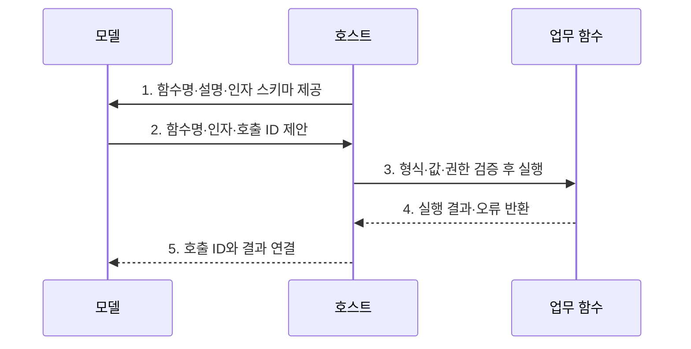

---
sidebar:
  order: 5
  label: "005. 함수 호출 (Function Calling)"
  badge:
    text: "기출 · 60%"
    variant: note
title: "함수 호출 (Function Calling)"
date: "2026-07-31T11:53:44+09:00"
tags:
  - "notes-latest_tech"
weight: 5
extra:
  question_no: "005"
  source_status: "기출"
  source_history: "138회"
  priority: 60
  priority_note: "함수 스키마 연계가 도구 실행의 기반"
---

## 미리 알고가기

- **함수 호출(Function Calling)**: 모델이 사용자의 의도를 실행 가능한 함수명과 구조화된 인자로 변환하여 호스트에 요청하는 방식
- **JSON(JavaScript Object Notation)**: 키와 값으로 함수 인자와 실행 결과를 구조화하는 데이터 형식
- **구조화 출력(Structured Outputs)**: 모델의 출력을 지정된 데이터 스키마에 맞추는 기능
- **도구 선택(tool_choice)**: 함수 호출을 자동·필수·금지로 제어하는 정책
- **병렬 함수 호출(Parallel Function Calling)**: 서로 독립적인 복수 함수 호출을 함께 제안하는 방식
- **호출 식별자(Identifier, ID)**: 함수 요청과 실행 결과를 연결하는 고유 식별값
- **응용 프로그래밍 인터페이스 (Application Programming Interface, API)**: 함수 호출 옵션·결과 계약 제공

> **키워드:** 함수 호출 (Function Calling)

## Ⅰ. 개요

- 정의/개념: 자연어 의도를 함수명·인자로 구조화하는 **함수 호출 연계 방식**
- 배경/필요성: 자연어만으로는 **함수·인자·권한·부작용 경계 검증 불가**

### 쉽게 이해하기 (학습용)
- 모델은 자연어 요청에서 실행할 함수와 인자를 구조화하고, 실제 실행 여부와 권한은 호스트가 검증·통제한다.

## Ⅱ. 특징

- **형식 축**: 함수 설명·JSON 스키마로 함수·인자 구조 제한
- **tool_choice**로 자동·필수·금지 호출 정책 제어
- **실행 축**: 호출 ID로 병렬·재시도 결과를 연결해 호스트 검증

### 쉽게 이해하기 (학습용)
- 함수 설명과 인자 스키마는 모델의 출력을 제한하지만 값의 업무 타당성과 실행 부작용까지 보장하지는 않는다.

## Ⅲ. 구조 및 구성요소

| 구성요소 | 책임 |
|:---|:---|
| 함수 명세 | **이름·설명·JSON 스키마** 제공 |
| 모델 라우터 | **함수·인자·병렬 호출** 제안 |
| 검증·정책 | **형식·값·권한·부작용** 검사 |
| 호스트 실행기 | **API 함수·결과·호출 ID** 연결 |

### 쉽게 이해하기 (학습용)
- 함수 명세·모델 제안·호스트 검증·실행 결과가 계약으로 연결됨

## Ⅳ. 흐름도

1. **함수명·설명·인자 스키마 제공**: 선택 가능한 함수와 필수 필드·자료형·허용 범위 제시
2. **함수명·인자·호출 ID 제안**: 자연어 요청을 구조화된 실행 의도로 변환
3. **형식·값·권한 검증 후 실행**: 원문·업무 규칙·권한과 대조해 승인된 함수 호출
4. **실행 결과·오류 반환**: 함수 출력과 실패 원인을 호스트에 전달
5. **호출 ID와 결과 연결**: 병렬 호출과 재시도 결과를 올바른 요청에 결합

### 쉽게 이해하기 (학습용)
- 함수와 인자를 검증해 실행하고 호출 ID로 결과를 연결함

## Ⅴ. 종류 및 비교

| 판단 기준 | 함수 호출 | 프롬프트 기반 JSON | 제약형 구조 출력 |
|:---|:---|:---|:---|
| 적용 기준 | **외부 함수 실행 의도** 필요 | **형식 유도**만 필요 | **실행 없는 스키마 일치** 필요 |
| 핵심 특징 | **함수명·인자·호출 ID** 반환 | 프롬프트로 **JSON 형식** 유도 | **구조화 출력**의 스키마 일치 |
| 한계 | **값·권한·실행 별도 검증** | **형식 위반 가능성** | **외부 함수 실행 의미 없음** |

> 요약: **함수 호출**은 실행 의도, **JSON·구조 출력**은 형식 제어

### 쉽게 이해하기 (학습용)
- 프롬프트는 형식 유도, 함수 호출은 실행 의도를 구조화함

## Ⅵ. 실무 고려사항 및 대책

| 고려사항 | 대책 | 효과 |
|:---|:---|:---|
| 스키마만 맞고 값은 틀린 **의미상 오류** | **사용자 원문·업무 데이터·허용 범위** 대조 | 잘못된 **인자 실행** 차단 |
| 재시도로 발생하는 **주문 중복 실행** | **호출 ID·멱등성 키**로 기존 결과 재사용 | 중복 **업무 부작용** 방지 |
| 상태 변경 함수의 **권한 우회** | **읽기·쓰기 분리·인증·승인** 적용 | 실제 **업무 권한** 보호 |

### 쉽게 이해하기 (학습용)
- 모델이 생성한 상품·수량·배송지 인자를 스키마와 원문에 대조하고, 권한과 중복 실행 여부를 확인한 뒤 주문 API를 호출한다.

## Ⅶ. 결론

- 외부 실행 의도는 **함수 호출**, 값·권한·멱등성 검증은 **호스트**가 수행

### 쉽게 이해하기 (학습용)
- 구조화된 인자는 실행 계약일 뿐 결과의 타당성을 보장하지 않으므로 호스트에서 검증·승인·오류 처리를 수행해야 한다.
