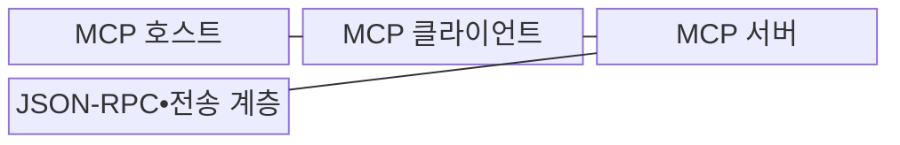
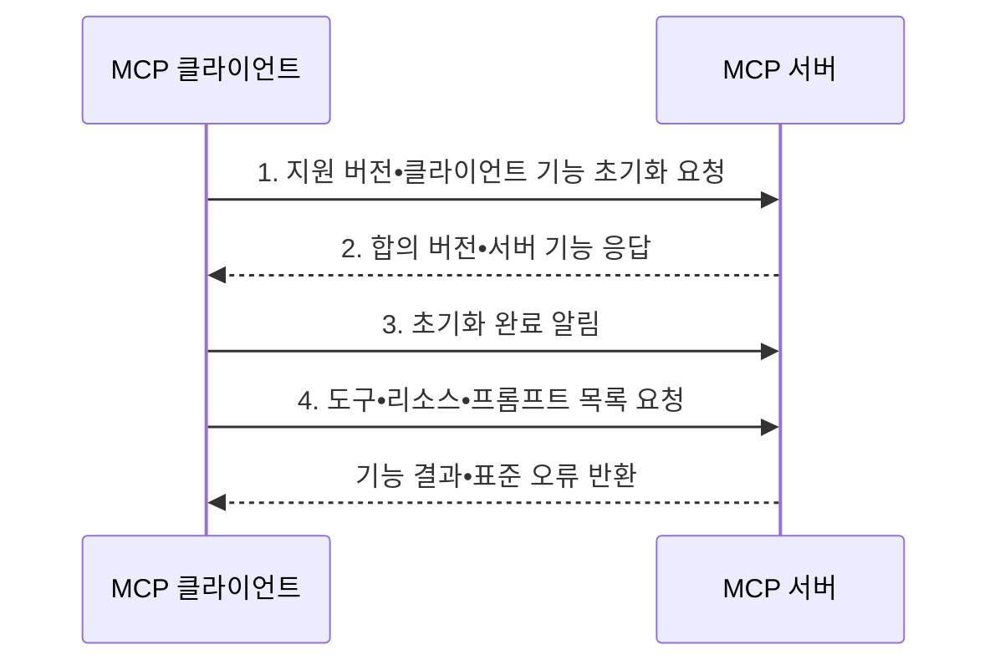

---
sidebar:
  order: 6
  label: "006. 모델 컨텍스트 프로토콜 (Model Context Protocol, MCP)"
  badge:
    text: "기출 • 70%"
    variant: note
title: "모델 컨텍스트 프로토콜 (Model Context Protocol, MCP)"
date: "2026-08-04T11:59:28+09:00"
tags:
  - "notes-latest_tech"
weight: 6
extra:
  question_no: "006"
  source_status: "기출"
  source_history: "138회"
  priority: 70
  priority_note: "표준형 AI 도구 연계가 최신 출제축"
---

## Ⅰ. 개요

핵심 용어

- **모델 컨텍스트 프로토콜(Model Context Protocol, MCP)**: 인공지능 호스트와 외부 서버가 기능을 발견하고 컨텍스트•도구•프롬프트를 교환하는 수명주기와 메시지를 표준화한 연결 프로토콜이다.

- 정의/개념: 호스트•서버의 기능 발견과 메시지 교환을 표준화한 **MCP**
- 배경/필요성: 맞춤 연동으로 **기능 발견•메시지 처리 중복과 호환성 저하** 발생

#### 한줄 요약
- 서버별 연동 방식을 공통 메시지와 기능 발견 절차로 표준화하여 호스트의 중복 구현을 줄인다.

## Ⅱ. 특징

핵심 용어

- **기능 협상**: 초기화 단계에서 클라이언트와 서버가 프로토콜 리비전과 사용할 선택 기능을 합의하는 과정이다.
- **자바스크립트 객체 표기법 원격 절차 호출(JavaScript Object Notation Remote Procedure Call, JSON-RPC)**: 요청•응답•알림•오류를 JSON 객체로 표현하는 메시지 형식이다.

- **협상 축**: 초기화에서 리비전과 선택 기능 합의
- **메시지 축**: **JSON-RPC** 기반 도구•리소스•프롬프트 교환 통일
- **책임 축**: 호스트•클라이언트•서버의 정책•세션•기능 분리

#### 한줄 요약
- 서버마다 다른 연결법을 외우지 않고 공통 규칙으로 기능을 찾아 사용함

## Ⅲ. 구조 및 구성요소

핵심 용어

- **모델 컨텍스트 프로토콜 호스트(Model Context Protocol Host, MCP Host)**: 사용자 동의•보안 정책과 여러 MCP 클라이언트 연결을 관리하는 인공지능 애플리케이션이다.
- **MCP 클라이언트(MCP Client)**: 서버별 세션과 프로토콜 메시지 교환을 관리하는 호스트 내부 구성요소이다.
- **MCP 서버(MCP Server)**: 도구•리소스•프롬프트 기능을 표준 메시지로 제공하는 외부 구성요소이다.
- **표준 입출력(Standard Input/Output, stdio)**: 로컬 MCP 프로세스가 표준 입력•출력 스트림으로 메시지를 교환하는 전송 방식이다.
- **스트리밍 가능 HTTP(Streamable Hypertext Transfer Protocol, Streamable HTTP)**: HTTP POST와 선택적 이벤트 스트림으로 원격 MCP 메시지를 교환하는 방식이다.

| 구성요소 | 책임 |
|:---|:---|
| MCP 호스트 | **사용자 동의•정책•복수 서버 연결** 관리 |
| MCP 클라이언트 | 서버별 **세션•메시지 교환** 관리 |
| MCP 서버 | **도구•리소스•프롬프트** 제공 |
| JSON-RPC•전송 계층 | **stdio•Streamable HTTP** 메시지 전달 |

#### 한줄 요약
- 호스트가 서버마다 전담 연결을 두고 필요한 기능만 가져옴

## Ⅳ. 흐름도

핵심 용어

1. **지원 버전•클라이언트 기능 초기화 요청**: 호환 버전과 roots•sampling 등 지원 범위 제안
2. **합의 버전•서버 기능 응답**: 사용할 버전과 tools•resources•prompts 등 기능 확정
3. **초기화 완료 알림**: 협상된 기능으로 정상 메시지 교환이 가능함을 통지
4. **도구•리소스•프롬프트 목록 요청**: 필요한 서버 기능을 발견하고 선택

#### 한줄 요약
- 먼저 서로 말이 통하는지 확인한 뒤 필요한 기능을 요청하고 결과를 받음

## Ⅴ. 종류 및 비교

핵심 용어

- **개방형 응용 프로그래밍 인터페이스 명세(OpenAPI Specification, OpenAPI)**: 고정된 하이퍼텍스트 전송 프로토콜(Hypertext Transfer Protocol, HTTP) API 계약을 기술하는 명세이다.

| 판단 기준 | MCP | OpenAPI | 맞춤형 API |
|:---|:---|:---|:---|
| 적용 기준 | 모델의 **도구•컨텍스트 선택** | **고정 HTTP 계약** 필요 | **단일 시스템 연동** |
| 핵심 특징 | **기능 발견•호출•컨텍스트 교환** | **HTTP API 계약** 기술 | **구현별 직접 연동** |
| 한계 | **호스트•서버 보안 구현** 필요 | **세션•기능 협상 없음** | **재사용•상호운용성 부족** |

> 요약: **MCP 기반 기능 협상**, **OpenAPI•맞춤 API 기반 HTTP•직접 연동**

#### 한줄 요약
- AI가 여러 기능을 찾아 쓰면 MCP, 정해진 웹 API만 부르면 OpenAPI를 사용함

## Ⅵ. 실무 고려사항 및 대책

핵심 용어

- **신뢰 경계**: 호스트•클라이언트•서버 사이에서 인증•권한•입력 검증 책임이 달라지는 보안 경계다.
- **전송 계층 보안(Transport Layer Security, TLS)**: 원격 전송 메시지의 기밀성•무결성과 서버 인증을 제공하는 보안 프로토콜이다.

| 문제 | 대책 | 효과 |
|:---|:---|:---|
| 과도한 기능 공개로 생기는 **권한 확산** | **서버별 클라이언트•허용 목록•최소권한** 적용 | 서버 간 **보안 경계** 유지 |
| 원격 전송에서 발생하는 **세션 탈취** | **표준 인증•TLS•세션 검증** 적용 | 메시지 **위변조•오용** 방지 |
| 도구 호출의 **실제 업무 부작용** | 호스트가 **동의•인자•대상•승인** 검증 | 연결과 **실행 권한** 분리 |

#### 한줄 요약
- 금융 서버는 읽기 권한만 주고 필요한 조건의 자료만 돌려줌

## Ⅶ. 결론

핵심 용어

- 기능 발견•세션 협상은 **MCP**, 고정 HTTP 계약은 **OpenAPI** 선택

#### 한줄 요약
- 공통 연결 규칙을 쓰되 서버별 허용 범위는 따로 정함
