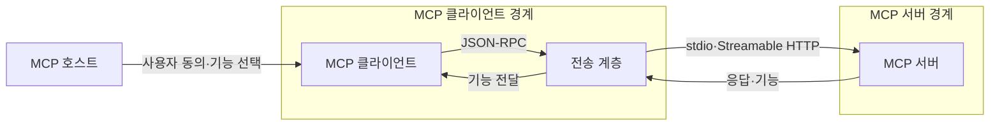
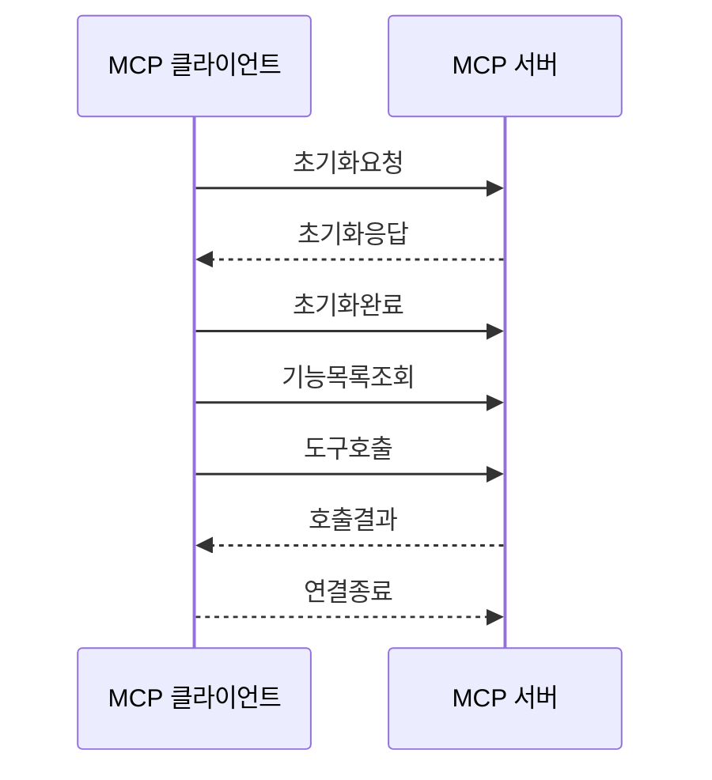

---
sidebar:
  order: 6
  label: "006. 모델 컨텍스트 프로토콜 (Model Context Protocol, MCP)"
  badge:
    text: "기출 · 70%"
    variant: note
title: "모델 컨텍스트 프로토콜 (Model Context Protocol, MCP)"
date: "2026-07-25T01:25:00+09:00"
tags:
  - "notes-latest_tech"
weight: 6
extra:
  question_no: "006"
  source_status: "기출"
  source_history: "138회"
  priority: 70
  priority_note: "표준형 AI 도구 연계가 최신 출제축"
---

## 미리 알고가기

- **인공지능 (Artificial Intelligence, AI)**: 외부 데이터와 기능을 모델 입력·행동에 연결하는 애플리케이션
- **모델 컨텍스트 프로토콜 (Model Context Protocol, MCP)**: 호스트와 서버의 컨텍스트·기능 교환 규격
- **MCP 호스트 (MCP Host)**: 사용자 동의와 여러 MCP 연결을 관리하는 AI 애플리케이션
- **MCP 클라이언트 (MCP Client)**: 호스트 안에서 서버별 세션과 메시지를 관리하는 연결기
- **MCP 서버 (MCP Server)**: 도구·리소스·프롬프트를 제공하는 프로그램
- **제이에스온 원격 프로시저 호출 (JSON Remote Procedure Call, JSON-RPC)**: MCP 메시지의 요청·응답 형식
- **표준 입출력 (Standard Input/Output, stdio)**: 호스트가 로컬 서버와 주고받는 전송 방식
- **스트리밍 가능 HTTP (Streamable HTTP)**: 원격 서버와 POST·GET으로 통신하는 전송 방식
- **개방형 API 명세 (OpenAPI Specification, OpenAPI)**: HTTP API의 자원·메서드 계약을 기술하는 명세

## Ⅰ. 개요
- **정의/개념**: AI 호스트와 외부 기능의 교환 규격
- **배경/필요성**: 서버별 연동 코드와 기능 호출 방식의 중복

### 쉽게 이해하기 (학습용)
- USB처럼 도구 연결 규격을 통일해 서버를 바꿔도 같은 방식으로 사용함

## Ⅱ. 특징
- 호스트가 서버별 연결·오류 범위를 격리한다
- 도구·리소스·프롬프트 발견·호출을 표준화한다
- 초기화가 프로토콜 버전·기능을 협상한다
- 호스트·서버가 사용자 동의·권한을 집행한다

### 쉽게 이해하기 (학습용)
- 서버마다 다른 연결법을 외우지 않고 공통 규칙으로 기능을 찾아 사용함

## Ⅲ. 아키텍처 및 구성요소

| 설계 요소 | 설명 |
|:---|:---|
| MCP 호스트 | 사용자 동의와 여러 서버 연결을 관리 |
| MCP 클라이언트 | 서버별 세션과 메시지 교환을 관리 |
| MCP 서버 | 도구·리소스·프롬프트를 제공 |
| 전송 계층 | stdio·Streamable HTTP로 JSON-RPC 전달 |

> 요약: 호스트가 클라이언트로 서버 기능을 중개

### 쉽게 이해하기 (학습용)
- 호스트가 서버마다 전담 연결을 두고 필요한 기능만 가져옴

## Ⅳ. 원리 및 절차 흐름도

| 절차 | 설명 |
|:---|:---|
| 초기화요청 | 버전·클라이언트 기능을 전송 |
| 초기화응답 | 서버 버전·기능을 반환 |
| 초기화완료 | 정상 작업 시작을 통지 |
| 기능목록조회 | 사용 가능한 기능을 조회 |
| 도구호출 | 선택한 도구와 인자를 전송 |
| 호출결과 | 실행 결과나 오류를 반환 |
| 연결종료 | 전송 연결을 닫음 |

> 요약: 초기화 협상 후 기능을 호출

### 쉽게 이해하기 (학습용)
- 먼저 서로 말이 통하는지 확인한 뒤 필요한 기능을 요청하고 결과를 받음

## Ⅴ. 종류 및 비교

| 판단 기준 | MCP | OpenAPI | 맞춤형 API |
|:---|:---|:---|:---|
| 기능 발견 | 목록 조회·기능 협상 | 문서·코드 생성 | 구현별 방식 |
| 연결 대상 | AI 호스트·서버 | HTTP API 소비자 | 특정 애플리케이션 |
| 적용 기준 | 모델이 도구·컨텍스트를 선택할 때 | 고정 HTTP 계약이 필요할 때 | 단일 시스템 연동일 때 |

> 요약: MCP는 기능 협상으로 기능을 발견·호출

### 쉽게 이해하기 (학습용)
- AI가 여러 기능을 찾아 쓰면 MCP, 정해진 웹 API만 부르면 OpenAPI를 사용함

## Ⅵ. 실무 사례
- 금융 조회는 읽기 계정·쿼리 필터로 범위 제한

### 쉽게 이해하기 (학습용)
- 금융 서버는 읽기 권한만 주고 필요한 조건의 자료만 돌려줌

## Ⅶ. 결론
- 기능 협상·동의 경계에 따라 MCP 연결과 권한을 설계

### 쉽게 이해하기 (학습용)
- 공통 연결 규칙을 쓰되 서버별 허용 범위는 따로 정함
