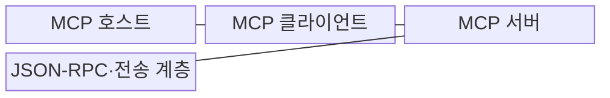

---
sidebar:
  order: 6
  label: "006. 모델 컨텍스트 프로토콜 (Model Context Protocol, MCP)"
  badge:
    text: "기출 · 70%"
    variant: note
title: "모델 컨텍스트 프로토콜 (Model Context Protocol, MCP)"
date: "2026-07-30T11:04:43+09:00"
tags:
  - "notes-latest_tech"
weight: 6
extra:
  question_no: "006"
  source_status: "기출"
  source_history: "138회"
  priority: 70
  priority_note: "표준형 AI 도구 연계가 최신 출제축"
---

## 미리 알고가기

- **인공지능(Artificial Intelligence, AI)**: 학습·추론·판단 같은 지능적 기능을 컴퓨터로 구현하는 기술
- **모델 컨텍스트 프로토콜(Model Context Protocol, MCP)**: AI 애플리케이션과 외부 데이터·도구·프롬프트를 표준 방식으로 연결하는 프로토콜
- **MCP 호스트(MCP Host, 엠씨피 호스트)**: 사용자 동의·보안 정책과 여러 클라이언트 연결을 관리하는 AI 애플리케이션
- **MCP 클라이언트(MCP Client, 엠씨피 클라이언트)**: 호스트 안에서 서버 하나와 세션·메시지를 관리하는 연결기
- **MCP 서버(MCP Server, 엠씨피 서버)**: 도구·리소스·프롬프트 기능을 제공하는 프로그램
- **JSON-RPC(JSON Remote Procedure Call)**: MCP의 요청·응답·알림 메시지를 표현하는 JSON 기반 원격 절차 호출 형식
- **표준 입출력(Standard Input/Output, stdio)**: 로컬 클라이언트와 서버가 프로세스 입출력 스트림으로 메시지를 교환하는 전송 방식
- **스트리밍 가능 HTTP(Streamable HTTP)**: HTTP POST와 선택적 SSE 스트림으로 원격 메시지를 교환하는 전송 방식
- **개방형 API 명세(OpenAPI Specification, OpenAPI)**: HTTP API의 자원·메서드 계약을 기술하는 명세

## Ⅰ. 개요

- 정의/개념: AI 호스트가 외부 서버의 도구·리소스·프롬프트를 발견하고 사용하도록 수명주기와 JSON-RPC 메시지 및 전송 방식을 표준화한 연결 프로토콜
- 배경/필요성: 서버·도구별 맞춤 연동은 기능 발견과 메시지 처리를 중복 구현하게 하고 재사용·권한 통제·호환성 확보를 어렵게 함

### 쉽게 이해하기 (학습용)
- 서버별 연동 방식을 공통 메시지와 기능 발견 절차로 표준화하여 호스트의 중복 구현을 줄인다.

## Ⅱ. 특징

- **초기화·기능 협상**으로 클라이언트와 서버가 프로토콜 버전과 선택 기능을 합의
- **JSON-RPC 표준화**로 도구·리소스·프롬프트의 발견과 사용 메시지를 통일
- **호스트·클라이언트·서버 책임 분리**로 정책·세션·전문 기능을 구분

### 쉽게 이해하기 (학습용)
- 서버마다 다른 연결법을 외우지 않고 공통 규칙으로 기능을 찾아 사용함

## Ⅲ. 구조 및 구성요소

| 구성요소 | 책임 |
|:---|:---|
| MCP 호스트 | 사용자 동의와 여러 서버 연결을 관리 |
| MCP 클라이언트 | 서버별 세션과 메시지 교환을 관리 |
| MCP 서버 | 도구·리소스·프롬프트를 제공 |
| JSON-RPC·전송 계층 | stdio·Streamable HTTP로 요청·응답·알림 전달 |

### 쉽게 이해하기 (학습용)
- 호스트가 서버마다 전담 연결을 두고 필요한 기능만 가져옴

## Ⅳ. 흐름도

1. **지원 버전·클라이언트 기능 초기화 요청**: 호환 버전과 roots·sampling 등 지원 범위 제안
2. **합의 버전·서버 기능 응답**: 사용할 버전과 tools·resources·prompts 등 기능 확정
3. **초기화 완료 알림**: 협상된 기능으로 정상 메시지 교환이 가능함을 통지
4. **도구·리소스·프롬프트 목록 요청**: 필요한 서버 기능을 발견하고 선택
5. **기능 결과·표준 오류 반환**: 협상된 기능만 실행해 결과 또는 JSON-RPC 오류 제공

### 쉽게 이해하기 (학습용)
- 먼저 서로 말이 통하는지 확인한 뒤 필요한 기능을 요청하고 결과를 받음

## Ⅴ. 종류 및 비교

| 판단 기준 | MCP | OpenAPI | 맞춤형 API |
|:---|:---|:---|:---|
| 적용 기준 | 모델이 도구·컨텍스트를 선택할 때 | 고정 HTTP 계약이 필요할 때 | 단일 시스템 연동일 때 |
| 핵심 특징 | 기능 발견·호출·컨텍스트 교환 | HTTP API 계약 기술 | 구현별 직접 연동 |
| 한계 | 호스트·서버 보안 구현 필요 | 모델용 세션·기능 협상 없음 | 재사용·상호운용성 부족 |

### 쉽게 이해하기 (학습용)
- AI가 여러 기능을 찾아 쓰면 MCP, 정해진 웹 API만 부르면 OpenAPI를 사용함

## Ⅵ. 실무 고려사항 및 대책

| 고려사항 | 대책 | 효과 |
|:---|:---|:---|
| 서버가 과도한 기능·데이터를 공개 | 서버별 전담 클라이언트와 허용 기능·리소스 목록 및 최소권한 적용 | 서버 간 보안 경계 유지 |
| 원격 전송의 인증·세션 탈취 | Streamable HTTP에 표준 인증과 TLS 및 세션 검증 적용 | 원격 메시지 위변조·오용 방지 |
| 도구 호출의 실제 부작용 | 호스트가 사용자 동의와 인자·대상·승인을 검증한 뒤 실행 | 프로토콜 연결과 실행 권한 분리 |

### 쉽게 이해하기 (학습용)
- 금융 서버는 읽기 권한만 주고 필요한 조건의 자료만 돌려줌

## Ⅶ. 결론

- 여러 AI 외부 기능을 공통 방식으로 발견·호출해야 하면 MCP를 선택하고, 버전·기능 협상 후 서버별 최소권한과 사용자 동의를 통과한 기능만 호스트가 노출

### 쉽게 이해하기 (학습용)
- 공통 연결 규칙을 쓰되 서버별 허용 범위는 따로 정함
