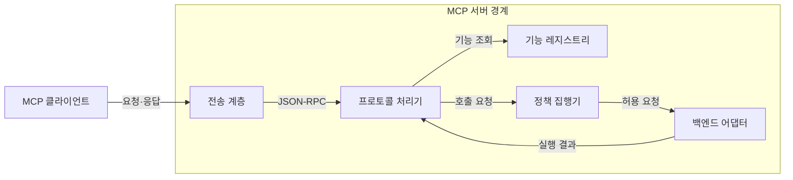
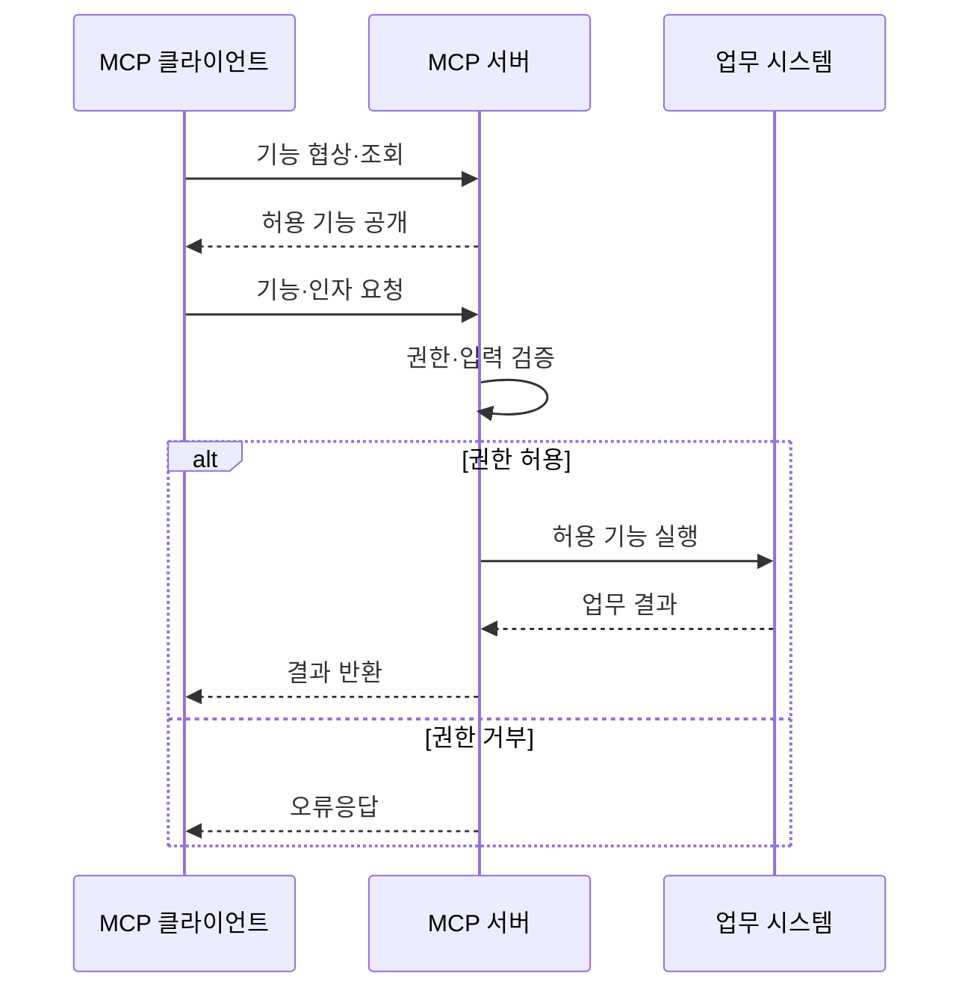

---
sidebar:
  order: 7
  label: "007. MCP Server (모델 컨텍스트 프로토콜 서버)"
  badge:
    text: "기출 · 30%"
    variant: note
title: "MCP Server (모델 컨텍스트 프로토콜 서버)"
date: "2026-07-27T23:59:59+09:00"
tags:
  - "notes-latest_tech"
weight: 7
extra:
  question_no: "007"
  source_status: "기출"
  source_history: "138회"
  priority: 30
  priority_note: "서버 기능·책임은 MCP 하위 구조"
---

## 미리 알고가기

- **모델 컨텍스트 프로토콜(Model Context Protocol, MCP)**: 인공지능 애플리케이션과 외부 데이터·도구·프롬프트를 표준 방식으로 연결하는 프로토콜이다.
- **인공지능(Artificial Intelligence, AI)**: MCP 서버가 제공하는 리소스와 도구를 활용하여 과업을 수행하는 애플리케이션의 핵심 모델이다.
- **MCP 서버(MCP Server)**: 도구·리소스·프롬프트를 MCP 기능으로 제공하고 접근 권한과 실행을 통제하는 프로그램이다.
- **JSON-RPC(JSON Remote Procedure Call)**: JSON 형식으로 원격 호출의 요청·응답·알림·오류를 교환하는 프로토콜이다.
- **표준 입출력 (Standard Input/Output, stdio)**: 로컬 클라이언트가 서버 프로세스와 통신하는 방식
- **스트리밍 가능 HTTP (Streamable HTTP)**: 원격 클라이언트가 HTTP로 서버와 통신하는 방식
- **기능 협상 (Capability Negotiation)**: 세션에서 사용할 선택 기능을 합의하는 과정
- **표현 상태 전송 API (Representational State Transfer API, REST API)**: 자원과 HTTP 메서드 중심의 범용 호출 계약

## Ⅰ. 개요
- 정의/개념: **MCP 서버**는 클라이언트와 협상한 도구·리소스·프롬프트를 제공하고, 요청의 권한과 입력값을 검증하여 백엔드 기능을 실행하는 프로그램이다.
- 기존 한계: 백엔드별 맞춤 API는 모델 기능 발견·호출이 불일치
- 기존 한계: 업무 데이터·기능의 개별 연동은 **표준 노출·서버측 권한 통제**가 어려움

### 쉽게 이해하기 (학습용)
- 필요한 자료와 기능만 꺼내 주는 안전한 창구임

## Ⅱ. 특징
- 도구·리소스·프롬프트 목록과 명세를 제공한다
- 요청 인자·백엔드 권한·접근 범위를 서버에서 검증한다
- 실행 결과와 프로토콜·도구 오류를 클라이언트에 반환한다

### 쉽게 이해하기 (학습용)
- 서버는 내부 권한을 확인한 뒤 필요한 결과만 정해진 형식으로 돌려줌

## Ⅲ. 아키텍처 및 구성요소

| 설계 요소 | 설명 |
|:---|:---|
| 전송 계층 | stdio·Streamable HTTP 연결을 수신 |
| 프로토콜 처리기 | JSON-RPC 요청·오류를 처리 |
| 기능 레지스트리 | 제공 기능과 선언 정보를 관리 |
| 정책 집행기 | 인증·인가·입력 검증을 적용 |
| 백엔드 어댑터 | 업무 시스템 호출과 결과 변환 |

> 요약: 서버 경계에서 기능·정책·백엔드를 연결

### 쉽게 이해하기 (학습용)
- 문을 지키는 처리기가 권한을 확인하고 내부 업무 시스템을 호출함

## Ⅳ. 원리 및 절차 흐름도

| 절차 | 설명 |
|:---|:---|
| 기능 협상·조회 | 호환 버전과 제공 기능 범위를 확인 |
| 허용 기능 공개 | 기능 목록과 메타데이터를 반환 |
| 기능·인자 요청 | 실행할 기능과 구조화 인자를 수신 |
| 권한·입력 검증 | 주체·범위·스키마에 따라 실행 허용 |
| 허용 기능 실행 | 검증된 업무 기능만 백엔드에서 실행 |
| 결과 반환 | 업무 결과를 프로토콜 응답으로 반환 |
| 오류응답 | 권한 거부 사유를 반환 |

> 요약: 기능 협상 후 권한을 검사해 백엔드를 호출

### 쉽게 이해하기 (학습용)
- 서버는 먼저 허용된 일인지 확인한 뒤 내부 시스템을 움직이고 결과를 돌려줌

## Ⅴ. 종류 및 비교

| 판단 기준 | MCP Server | REST API 서버 |
|:---|:---|:---|
| 적용 기준 | AI가 기능을 선택할 때 | 고정 API 계약이 필요할 때 |
| 핵심 특징 | 기능 목록·명세를 동적 제공 | 자원·HTTP 메서드 계약 |
| 한계 | 기능 권한·입력 검증 책임 | 모델용 기능 협상 없음 |

> 요약: AI 기능 선택은 MCP, 고정 자원은 REST

### 쉽게 이해하기 (학습용)
- AI가 기능 목록을 보고 선택해야 하면 MCP, 정해진 웹 자원이면 REST를 사용함

## Ⅵ. 실무 사례
1. 전사 자원 관리 MCP 서버가 사용자와 테넌트별 접근 권한을 검사한 뒤 허용된 문서 조회·업무 도구만 제공한다.

### 쉽게 이해하기 (학습용)
- 사내 업무 서버는 사용자마다 볼 수 있는 회사와 자료를 가려서 보여줌

## Ⅶ. 결론
- 인공지능에 업무 데이터와 도구를 표준 방식으로 제공하기 위해 기능 범위·테넌트 격리·최소 권한·입력 검증을 검토하여 **MCP 서버**를 활용해야 한다.

### 쉽게 이해하기 (학습용)
- 서버가 제공할 기능과 볼 수 있는 자료의 경계를 먼저 정함
