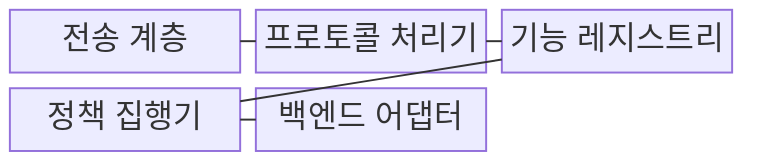
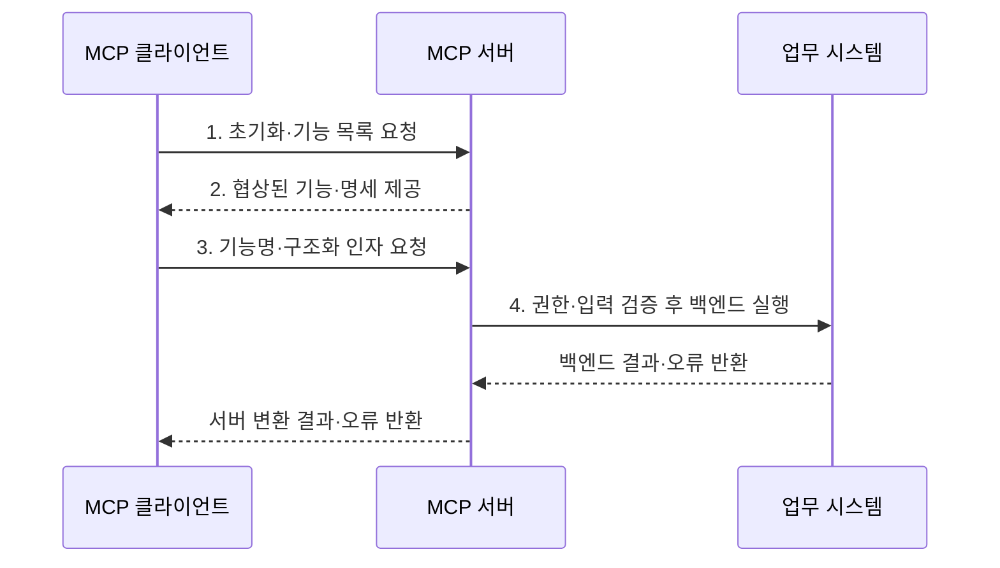

---
sidebar:
  order: 7
  label: "007. MCP Server (모델 컨텍스트 프로토콜 서버)"
  badge:
    text: "기출 · 30%"
    variant: note
title: "MCP Server (모델 컨텍스트 프로토콜 서버)"
date: "2026-07-31T08:39:58+09:00"
tags:
  - "notes-latest_tech"
weight: 7
extra:
  question_no: "007"
  source_status: "기출"
  source_history: "138회"
  priority: 30
  priority_note: "서버 기능·책임은 MCP 하위 구조"
---

## 미리 알고가기

- **모델 컨텍스트 프로토콜(Model Context Protocol, MCP)**: 인공지능 애플리케이션과 외부 데이터·도구·프롬프트를 표준 방식으로 연결하는 프로토콜이다.
- **인공지능(Artificial Intelligence, AI)**: MCP 서버가 제공하는 리소스와 도구를 활용하여 과업을 수행하는 애플리케이션의 핵심 모델이다.
- **MCP 서버(MCP Server)**: 도구·리소스·프롬프트를 MCP 기능으로 제공하고 접근 권한과 실행을 통제하는 프로그램이다.
- **JSON-RPC(JSON Remote Procedure Call)**: JSON 형식으로 원격 호출의 요청·응답·알림·오류를 교환하는 프로토콜이다.
- **표준 입출력(Standard Input/Output, stdio)**: 로컬 클라이언트가 서버 프로세스와 입출력 스트림으로 통신하는 방식
- **스트리밍 가능 HTTP(Streamable HTTP)**: 원격 클라이언트가 HTTP POST와 선택적 SSE로 서버와 통신하는 방식
- **기능 협상(Capability Negotiation)**: 세션에서 사용할 선택 기능을 초기화 단계에서 합의하는 과정
- **표현 상태 전송 API(Representational State Transfer API, REST API)**: 자원과 HTTP 메서드 중심의 범용 호출 계약

## Ⅰ. 개요

- 정의/개념: 도구·리소스·프롬프트를 노출하고 백엔드를 중개하는 **MCP 서버 프로그램**
- 배경/필요성: 맞춤 API마다 기능 발견·권한 방식이 달라 **재사용·일관 통제 불가**

### 쉽게 이해하기 (학습용)
- 필요한 자료와 기능만 꺼내 주는 안전한 창구임

## Ⅱ. 특징

- **공개 축**: 도구·리소스·프롬프트 명세 기반 기능 탐색
- **검증 축**: 인증·인가·입력 검증 기반 실행 경계 통제
- **결과 축**: 구조화 결과·오류 기반 후속 추론 지원

### 쉽게 이해하기 (학습용)
- 서버는 내부 권한을 확인한 뒤 필요한 결과만 정해진 형식으로 돌려줌

## Ⅲ. 구조 및 구성요소

| 구성요소 | 책임 |
|:---|:---|
| 전송 계층 | **stdio·Streamable HTTP 연결** 수신 |
| 프로토콜 처리기 | **JSON-RPC 요청·응답·오류** 처리 |
| 기능 레지스트리 | **도구·리소스·프롬프트 명세** 관리 |
| 정책 집행기 | **인증·인가·입력·테넌트** 검증 |
| 백엔드 어댑터 | **REST API·업무 시스템 결과** 변환 |

### 쉽게 이해하기 (학습용)
- 문을 지키는 처리기가 권한을 확인하고 내부 업무 시스템을 호출함

## Ⅳ. 흐름도

1. **초기화·기능 목록 요청**: 버전·지원 기능 협상과 목록 조회
2. **협상된 기능·명세 제공**: 설명·입력 스키마 제공
3. **기능명·구조화 인자 요청**: 선택 기능과 검증 인자 전달
4. **권한·입력 검증 후 백엔드 실행**: 허용 작업만 수행

### 쉽게 이해하기 (학습용)
- 서버는 먼저 허용된 일인지 확인한 뒤 내부 시스템을 움직이고 결과를 돌려줌

## Ⅴ. 종류 및 비교

| 판단 기준 | MCP Server | REST API 서버 |
|:---|:---|:---|
| 적용 기준 | AI의 **동적 기능 선택** | **고정 API 계약** 기반 기능 제공 |
| 핵심 특징 | **기능 목록·명세** 동적 제공 | **HTTP 메서드·URI** 계약 |
| 한계 | **권한·입력 검증** 책임 | 모델용 **기능 협상 부재** |

> 요약: **MCP 서버**는 모델 기능 발견, **REST API**는 고정 HTTP 계약

### 쉽게 이해하기 (학습용)
- AI가 기능 목록을 보고 선택해야 하면 MCP, 정해진 웹 자원이면 REST를 사용함

## Ⅵ. 실무 고려사항 및 대책

| 고려사항 | 대책 | 효과 |
|:---|:---|:---|
| 과도한 공개로 **공격 표면 확대** | **허용 목록·최소 스키마** 적용 | 고권한 기능 오용 차단 |
| 테넌트 식별 누락으로 **교차 접근** | **세션·백엔드 쿼리**에 테넌트 강제 | 데이터 경계 보장 |
| 불명확한 오류로 **복구 판단 혼선** | **오류 코드·재시도 가능성** 구조화 | 안전한 복구 경로 선택 |

### 쉽게 이해하기 (학습용)
- 사내 업무 서버는 사용자마다 볼 수 있는 회사와 자료를 가려서 보여줌

## Ⅶ. 결론

- AI의 동적 기능 발견은 **MCP 서버**, 고정 HTTP 계약은 **REST API** 선택

### 쉽게 이해하기 (학습용)
- 서버가 제공할 기능과 볼 수 있는 자료의 경계를 먼저 정함
