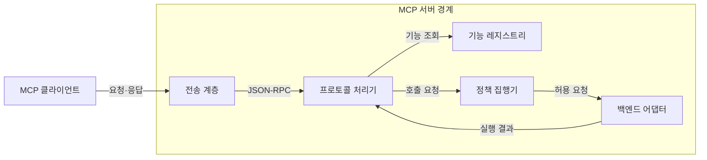
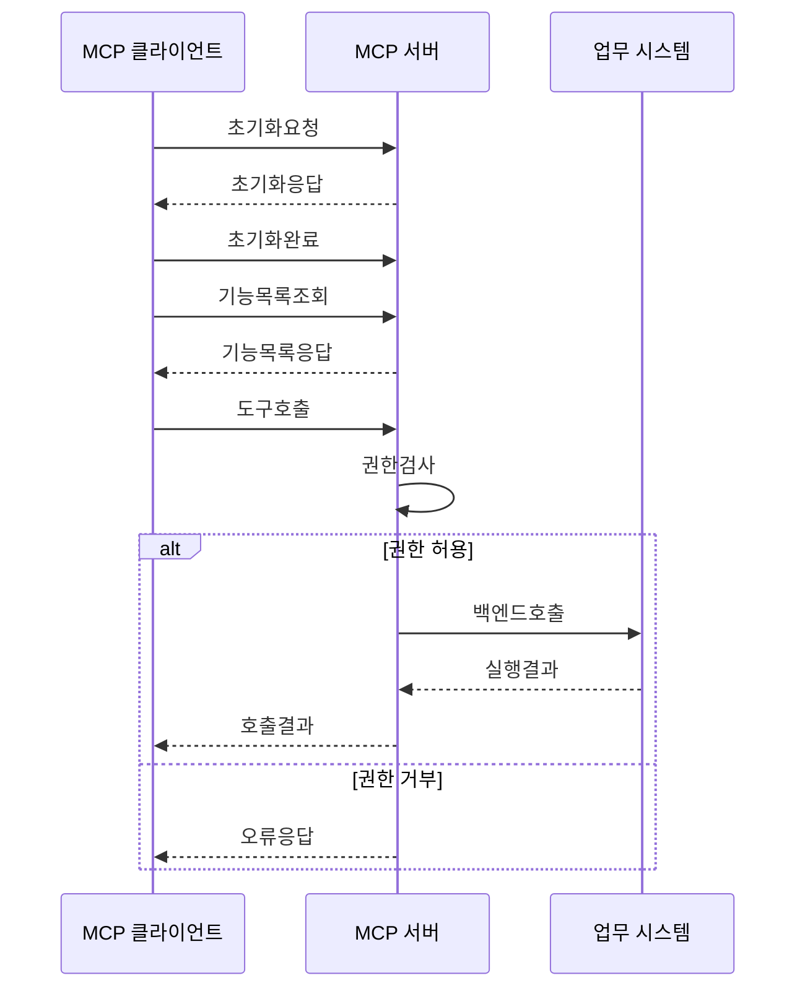

---
sidebar:
  order: 7
  label: "007. MCP Server (모델 컨텍스트 프로토콜 서버)"
  badge:
    text: "기출 · 30%"
    variant: note
title: "MCP Server (모델 컨텍스트 프로토콜 서버)"
date: "2026-07-27T23:59:59+09:00"
tags:
  - "notes-latest_tech"
weight: 7
extra:
  question_no: "007"
  source_status: "기출"
  source_history: "138회"
  priority: 30
  priority_note: "서버 기능·책임은 MCP 하위 구조"
---

## 미리 알고가기

- **모델 컨텍스트 프로토콜(Model Context Protocol, MCP, 엠씨피)**: 영문 머리글자를 딴 호스트·서버 간 기능·컨텍스트 교환 규격
- **인공지능 (Artificial Intelligence, AI)**: MCP 서버의 리소스와 도구를 활용하는 애플리케이션
- **MCP 서버(MCP Server, 엠씨피 서버)**: 도구·리소스·프롬프트를 프로토콜 기능으로 제공하는 프로그램
- **JSON-RPC(JSON Remote Procedure Call, 제이슨 알피시)**: JSON 기반 요청·응답·알림·오류 메시지 형식
- **표준 입출력 (Standard Input/Output, stdio)**: 로컬 클라이언트가 서버 프로세스와 통신하는 방식
- **스트리밍 가능 HTTP (Streamable HTTP)**: 원격 클라이언트가 HTTP로 서버와 통신하는 방식
- **기능 협상 (Capability Negotiation)**: 세션에서 사용할 선택 기능을 합의하는 과정
- **표현 상태 전송 API (Representational State Transfer API, REST API)**: 자원과 HTTP 메서드 중심의 범용 호출 계약

## Ⅰ. 개요
- **정의/개념**: 협상한 기능을 제공하는 MCP 프로그램
- **기존 한계**: 백엔드별 맞춤 API는 모델 기능 발견·호출이 불일치
- **배경/필요성**: 업무 데이터·기능의 표준 노출과 서버측 통제

### 쉽게 이해하기 (학습용)
- 필요한 자료와 기능만 꺼내 주는 안전한 창구임

## Ⅱ. 특징
- 도구·리소스·프롬프트 목록과 명세를 제공한다
- 요청 인자·백엔드 권한·접근 범위를 서버에서 검증한다
- 실행 결과와 프로토콜·도구 오류를 클라이언트에 반환한다

### 쉽게 이해하기 (학습용)
- 서버는 내부 권한을 확인한 뒤 필요한 결과만 정해진 형식으로 돌려줌

## Ⅲ. 아키텍처 및 구성요소

| 설계 요소 | 설명 |
|:---|:---|
| 전송 계층 | stdio·Streamable HTTP 연결을 수신 |
| 프로토콜 처리기 | JSON-RPC 요청·오류를 처리 |
| 기능 레지스트리 | 제공 기능과 선언 정보를 관리 |
| 정책 집행기 | 인증·인가·입력 검증을 적용 |
| 백엔드 어댑터 | 업무 시스템 호출과 결과 변환 |

> 요약: 서버 경계에서 기능·정책·백엔드를 연결

### 쉽게 이해하기 (학습용)
- 문을 지키는 처리기가 권한을 확인하고 내부 업무 시스템을 호출함

## Ⅳ. 원리 및 절차 흐름도

| 절차 | 설명 |
|:---|:---|
| 초기화요청 | 버전·클라이언트 기능을 수신 |
| 초기화응답 | 서버 버전·기능을 반환 |
| 초기화완료 | 정상 작업 시작을 통지 |
| 기능목록조회 | 제공 기능 목록을 요청 |
| 기능목록응답 | 기능 목록과 메타데이터를 반환 |
| 도구호출 | 도구명과 인자를 수신 |
| 권한검사 | 주체·범위에 따라 호출 허용 |
| 백엔드호출 | 허용된 업무 기능을 호출 |
| 실행결과 | 업무 시스템 결과를 수신 |
| 호출결과 | 결과 또는 오류를 반환 |
| 오류응답 | 권한 거부 사유를 반환 |

> 요약: 기능 협상 후 권한을 검사해 백엔드를 호출

### 쉽게 이해하기 (학습용)
- 서버는 먼저 허용된 일인지 확인한 뒤 내부 시스템을 움직이고 결과를 돌려줌

## Ⅴ. 종류 및 비교

| 판단 기준 | MCP Server | REST API 서버 |
|:---|:---|:---|
| 적용 기준 | AI가 기능을 선택할 때 | 고정 API 계약이 필요할 때 |
| 핵심 특징 | 기능 목록·명세를 동적 제공 | 자원·HTTP 메서드 계약 |
| 한계 | 기능 권한·입력 검증 책임 | 모델용 기능 협상 없음 |

> 요약: AI 기능 선택은 MCP, 고정 자원은 REST

### 쉽게 이해하기 (학습용)
- AI가 기능 목록을 보고 선택해야 하면 MCP, 정해진 웹 자원이면 REST를 사용함

## Ⅵ. 실무 사례
- 전사 자원 관리 서버는 권한·테넌트 범위를 검사

### 쉽게 이해하기 (학습용)
- 사내 업무 서버는 사용자마다 볼 수 있는 회사와 자료를 가려서 보여줌

## Ⅶ. 결론
- 테넌트 경계별 MCP 서버 권한 정책 설정

### 쉽게 이해하기 (학습용)
- 서버가 제공할 기능과 볼 수 있는 자료의 경계를 먼저 정함
