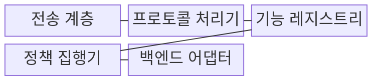
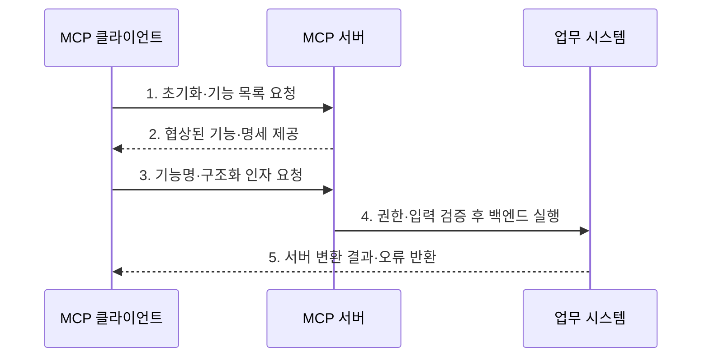

---
sidebar:
  order: 7
  label: "007. MCP Server (모델 컨텍스트 프로토콜 서버)"
  badge:
    text: "기출 · 30%"
    variant: note
title: "MCP Server (모델 컨텍스트 프로토콜 서버)"
date: "2026-07-30T11:04:43+09:00"
tags:
  - "notes-latest_tech"
weight: 7
extra:
  question_no: "007"
  source_status: "기출"
  source_history: "138회"
  priority: 30
  priority_note: "서버 기능·책임은 MCP 하위 구조"
---

## 미리 알고가기

- **모델 컨텍스트 프로토콜(Model Context Protocol, MCP)**: 인공지능 애플리케이션과 외부 데이터·도구·프롬프트를 표준 방식으로 연결하는 프로토콜이다.
- **인공지능(Artificial Intelligence, AI)**: MCP 서버가 제공하는 리소스와 도구를 활용하여 과업을 수행하는 애플리케이션의 핵심 모델이다.
- **MCP 서버(MCP Server)**: 도구·리소스·프롬프트를 MCP 기능으로 제공하고 접근 권한과 실행을 통제하는 프로그램이다.
- **JSON-RPC(JSON Remote Procedure Call)**: JSON 형식으로 원격 호출의 요청·응답·알림·오류를 교환하는 프로토콜이다.
- **표준 입출력(Standard Input/Output, stdio)**: 로컬 클라이언트가 서버 프로세스와 입출력 스트림으로 통신하는 방식
- **스트리밍 가능 HTTP(Streamable HTTP)**: 원격 클라이언트가 HTTP POST와 선택적 SSE로 서버와 통신하는 방식
- **기능 협상(Capability Negotiation)**: 세션에서 사용할 선택 기능을 초기화 단계에서 합의하는 과정
- **표현 상태 전송 API(Representational State Transfer API, REST API)**: 자원과 HTTP 메서드 중심의 범용 호출 계약

## Ⅰ. 개요

- 정의/개념: MCP 클라이언트에 도구·리소스·프롬프트를 표준 기능으로 노출하고 요청의 권한·입력을 검증해 백엔드 데이터와 기능을 중개하는 서버 프로그램
- 배경/필요성: 백엔드별 맞춤 API 연동은 모델의 기능 발견·호출 방식이 달라지고 서버 측 접근 범위와 권한을 일관되게 통제하기 곤란

### 쉽게 이해하기 (학습용)
- 필요한 자료와 기능만 꺼내 주는 안전한 창구임

## Ⅱ. 특징

- **기능 목록·명세 제공**으로 협상 범위의 도구·리소스·프롬프트를 공개
- **서버 측 재검증**으로 요청 주체·인자·백엔드 권한·테넌트 범위를 확인
- **결과·오류 정규화**로 백엔드 결과를 MCP 콘텐츠로 변환하고 오류 계층을 구분

### 쉽게 이해하기 (학습용)
- 서버는 내부 권한을 확인한 뒤 필요한 결과만 정해진 형식으로 돌려줌

## Ⅲ. 구조 및 구성요소

| 구성요소 | 책임 |
|:---|:---|
| 전송 계층 | stdio·Streamable HTTP 연결을 수신 |
| 프로토콜 처리기 | JSON-RPC 요청·오류를 처리 |
| 기능 레지스트리 | 제공 기능과 선언 정보를 관리 |
| 정책 집행기 | 인증·인가·입력 검증을 적용 |
| 백엔드 어댑터 | 업무 시스템 호출과 결과 변환 |

### 쉽게 이해하기 (학습용)
- 문을 지키는 처리기가 권한을 확인하고 내부 업무 시스템을 호출함

## Ⅳ. 흐름도

1. **초기화·기능 목록 요청**: 호환 버전과 클라이언트 기능을 확인하고 목록 조회
2. **협상된 기능·명세 제공**: 허용된 도구·리소스·프롬프트의 메타데이터 반환
3. **기능명·구조화 인자 요청**: 실행하거나 읽을 기능과 입력값 수신
4. **권한·입력 검증 후 백엔드 실행**: 주체·테넌트·스키마·업무 규칙을 확인해 허용 기능만 호출
5. **서버 변환 결과·오류 반환**: 업무 결과를 MCP 콘텐츠로 변환하고 오류 유형을 구분

### 쉽게 이해하기 (학습용)
- 서버는 먼저 허용된 일인지 확인한 뒤 내부 시스템을 움직이고 결과를 돌려줌

## Ⅴ. 종류 및 비교

| 판단 기준 | MCP Server | REST API 서버 |
|:---|:---|:---|
| 적용 기준 | AI가 기능을 선택할 때 | 고정 API 계약이 필요할 때 |
| 핵심 특징 | 기능 목록·명세를 동적 제공 | 자원·HTTP 메서드 계약 |
| 한계 | 기능 권한·입력 검증 책임 | 모델용 기능 협상 없음 |

### 쉽게 이해하기 (학습용)
- AI가 기능 목록을 보고 선택해야 하면 MCP, 정해진 웹 자원이면 REST를 사용함

## Ⅵ. 실무 고려사항 및 대책

| 고려사항 | 대책 | 효과 |
|:---|:---|:---|
| 내부 기능의 과도한 노출 | 업무 목적별 기능 허용 목록과 최소 입력·출력 스키마 설계 | 공격 표면과 정보 노출 축소 |
| 사용자·테넌트 권한 혼동 | 백엔드 호출마다 최종 사용자와 테넌트 범위를 재검증 | 교차 테넌트 접근 방지 |
| 도구 오류와 프로토콜 오류 혼동 | 실행 실패는 도구 결과로, 메시지 계약 위반은 JSON-RPC 오류로 구분 | 클라이언트의 정확한 복구 판단 |

### 쉽게 이해하기 (학습용)
- 사내 업무 서버는 사용자마다 볼 수 있는 회사와 자료를 가려서 보여줌

## Ⅶ. 결론

- AI가 동적으로 발견할 업무 기능을 표준 노출해야 하면 MCP 서버를 선택하고, 테넌트·최소권한·입력 규칙을 서버에서 재검증한 요청만 백엔드에 전달

### 쉽게 이해하기 (학습용)
- 서버가 제공할 기능과 볼 수 있는 자료의 경계를 먼저 정함
