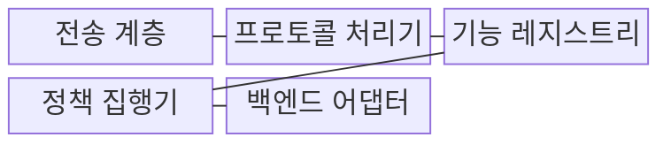
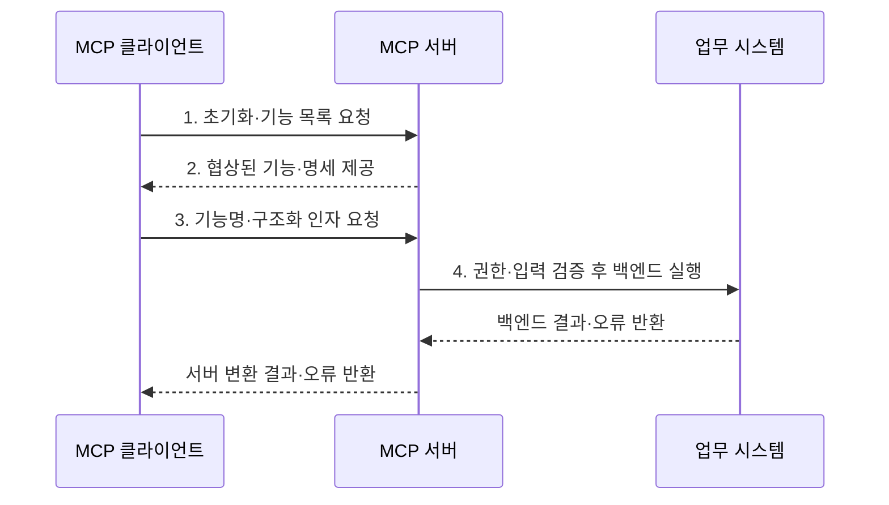

---
sidebar:
  order: 7
  label: "007. MCP Server (모델 컨텍스트 프로토콜 서버)"
  badge:
    text: "기출 · 30%"
    variant: note
title: "MCP Server (모델 컨텍스트 프로토콜 서버)"
date: "2026-07-31T11:54:53+09:00"
tags:
  - "notes-latest_tech"
weight: 7
extra:
  question_no: "007"
  source_status: "기출"
  source_history: "138회"
  priority: 30
  priority_note: "서버 기능·책임은 MCP 하위 구조"
---

## Ⅰ. 개요

핵심 용어

- **모델 컨텍스트 프로토콜 서버(Model Context Protocol Server, MCP Server)**: 도구·리소스·프롬프트를 표준 기능으로 노출하고 백엔드 접근과 실행을 통제하는 프로그램이다.

- 정의/개념: 표준 기능 노출과 백엔드 실행을 통제하는 **모델 컨텍스트 프로토콜 서버(Model Context Protocol Server, MCP Server)**
- 배경/필요성: 맞춤 API마다 기능 발견·권한 방식이 달라 **재사용·일관 통제 불가**

#### 한줄 요약
- 필요한 자료와 기능만 꺼내 주는 안전한 창구임

## Ⅱ. 특징

핵심 용어

- **기능 협상**: 초기화 단계에서 서버와 클라이언트가 지원하는 선택 기능을 확인하고 사용할 범위를 합의하는 과정이다.
- **검증 축**: 인증·인가·입력 검증으로 서버 실행 경계를 통제하는 관점이다.
- **구조화 결과**: 클라이언트가 후속 처리할 수 있도록 정해진 필드와 형식으로 반환한 실행 결과이다.

- **기능 협상**: 초기화에서 버전·선택 기능 합의
- **검증 축**: 인증·인가·입력 검증 기반 실행 경계 통제
- **결과 축**: 구조화 결과·오류 기반 후속 추론 지원

#### 한줄 요약
- 서버는 내부 권한을 확인한 뒤 필요한 결과만 정해진 형식으로 돌려줌

## Ⅲ. 구조 및 구성요소

핵심 용어

- **도구 제공자**: 입력 스키마와 실행 결과 계약을 공개하고 권한을 검증한 뒤 백엔드 동작을 수행하는 서버 구성요소다.
- **프로토콜 처리기**: 자바스크립트 객체 표기법 원격 절차 호출 요청·응답·알림·오류를 해석하고 해당 기능 처리기로 전달한다.
- **기능 레지스트리**: 서버가 제공하는 도구·리소스·프롬프트의 명세와 처리기를 등록·조회하는 구성요소다.
- **정책 집행기**: 호출 주체·테넌트·권한·입력 범위를 검증하여 기능 실행 허용 여부를 결정한다.
- **백엔드 어댑터**: 검증된 모델 컨텍스트 프로토콜 요청을 내부 응용 프로그래밍 인터페이스나 업무 시스템 호출로 변환한다.
- **표준 입출력(Standard Input/Output, stdio)**: 로컬 클라이언트와 서버 프로세스가 메시지를 교환하는 전송 방식이다.
- **스트리밍 가능 하이퍼텍스트 전송 프로토콜(Streamable Hypertext Transfer Protocol, Streamable HTTP)**: 원격 MCP 메시지를 요청·응답과 선택적 이벤트 스트림으로 교환하는 전송 방식이다.
- **자바스크립트 객체 표기법 원격 절차 호출(JavaScript Object Notation Remote Procedure Call, JSON-RPC)**: MCP 요청·응답·알림·오류를 표현하는 메시지 형식이다.
- **표현 상태 전송 응용 프로그래밍 인터페이스(Representational State Transfer Application Programming Interface, REST API)**: 백엔드 자원을 고정 HTTP 계약으로 호출하는 인터페이스이다.

- **도구 제공자** 중심 구조는 **표준 입출력(Standard Input/Output, stdio)** 또는 **스트리밍 가능 하이퍼텍스트 전송 프로토콜(Streamable Hypertext Transfer Protocol, Streamable HTTP)** 연결을 받아 **자바스크립트 객체 표기법 원격 절차 호출(JavaScript Object Notation Remote Procedure Call, JSON-RPC)** 메시지로 처리한다.

| 구성요소 | 책임 |
|:---|:---|
| 전송 계층 | **stdio·Streamable HTTP 연결** 수신 |
| 프로토콜 처리기 | **JSON-RPC 요청·응답·오류** 처리 |
| 기능 레지스트리 | **도구·리소스·프롬프트 명세** 관리 |
| 정책 집행기 | **인증·인가·입력·테넌트** 검증 |
| 백엔드 어댑터 | **REST API·업무 시스템 결과** 변환 |

#### 한줄 요약
- 문을 지키는 처리기가 권한을 확인하고 내부 업무 시스템을 호출함

## Ⅳ. 흐름도

핵심 용어

- **요청·응답 상관관계**: 자바스크립트 객체 표기법 원격 절차 호출(JavaScript Object Notation Remote Procedure Call, JSON-RPC) 식별자를 이용해 각 실행 요청과 성공·오류 결과를 연결하는 관계다.
- **모델 컨텍스트 프로토콜 클라이언트(Model Context Protocol Client, MCP Client)**: 서버와 기능을 협상하고 기능 목록·명세·실행 결과를 교환하는 구성요소이다.

- 클라이언트인 **모델 컨텍스트 프로토콜 클라이언트(Model Context Protocol Client, MCP Client)** 및 서버는 **자바스크립트 객체 표기법 원격 절차 호출(JavaScript Object Notation Remote Procedure Call, JSON-RPC)** 식별자로 요청과 결과를 연결한다.

1. **초기화·기능 목록 요청**: 버전·지원 기능 협상과 목록 조회
2. **협상된 기능·명세 제공**: 설명·입력 스키마 제공
3. **기능명·구조화 인자 요청**: 선택 기능과 검증 인자 전달
4. **권한·입력 검증 후 백엔드 실행**: 허용 작업만 수행

#### 한줄 요약
- 서버는 먼저 허용된 일인지 확인한 뒤 내부 시스템을 움직이고 결과를 돌려줌

## Ⅴ. 종류 및 비교

핵심 용어

- **로컬 모델 컨텍스트 프로토콜 서버(Local Model Context Protocol Server, Local MCP Server)**: 호스트가 시작한 프로세스로 실행되고 표준 입출력(Standard Input/Output, stdio)을 통해 한 클라이언트와 메시지를 교환하는 서버다.
- **표현 상태 전송 응용 프로그래밍 인터페이스 서버(Representational State Transfer Application Programming Interface Server, REST API Server)**: 고정된 하이퍼텍스트 전송 프로토콜(Hypertext Transfer Protocol, HTTP) 메서드·자원 계약으로 기능을 제공하는 서버이다.

- 두 방식인 **로컬 모델 컨텍스트 프로토콜 서버(Local Model Context Protocol Server, Local MCP Server)**, **표현 상태 전송 응용 프로그래밍 인터페이스 서버(Representational State Transfer Application Programming Interface Server, REST API Server)** 사이를 기능 발견 방식과 전송 계약으로 비교한다.

| 판단 기준 | MCP Server | REST API 서버 |
|:---|:---|:---|
| 적용 기준 | AI의 **동적 기능 선택** | **고정 API 계약** 기반 기능 제공 |
| 핵심 특징 | **기능 목록·명세** 동적 제공 | **HTTP 메서드·통합 자원 식별자(Uniform Resource Identifier, URI)** 계약 |
| 한계 | **권한·입력 검증** 책임 | 모델용 **기능 협상 부재** |

> 요약: **MCP 서버 기반 모델 기능 발견**, **REST API 기반 고정 HTTP 계약**

#### 한줄 요약
- AI가 기능 목록을 보고 선택해야 하면 MCP, 정해진 웹 자원이면 REST를 사용함

## Ⅵ. 실무 고려사항 및 대책

핵심 용어

- **서버 최소 권한**: 모델 컨텍스트 프로토콜 서버(Model Context Protocol Server, MCP Server)가 제공 기능에 필요한 백엔드 자원과 작업만 접근하도록 계정·경로·명령을 제한하는 원칙이다.

| 문제 | 대책 | 효과 |
|:---|:---|:---|
| 과도한 공개로 **공격 표면 확대** | **허용 목록·최소 스키마** 적용 | 고권한 기능 오용 차단 |
| 테넌트 식별 누락으로 **교차 접근** | **세션·백엔드 쿼리** 에 테넌트 강제 | 데이터 경계 보장 |
| 불명확한 오류로 **복구 판단 혼선** | **오류 코드·재시도 가능성** 구조화 | 안전한 복구 경로 선택 |

#### 한줄 요약
- 사내 업무 서버는 사용자마다 볼 수 있는 회사와 자료를 가려서 보여줌

## Ⅶ. 결론

핵심 용어

- **구조화 오류**: 실패 원인과 재시도 가능 여부를 클라이언트가 판정하도록 코드와 데이터로 표현한 실행 결과다.
- **표현 상태 전송 응용 프로그래밍 인터페이스(Representational State Transfer Application Programming Interface, REST API)**: 고정 HTTP 계약 기반 연동에 적용하는 인터페이스이다.

- 인공지능 동적 기능 발견은 **모델 컨텍스트 프로토콜 서버(Model Context Protocol Server, MCP Server)**, 고정 HTTP 계약은 **표현 상태 전송 응용 프로그래밍 인터페이스(Representational State Transfer Application Programming Interface, REST API)** 선택

#### 한줄 요약
- 서버가 제공할 기능과 볼 수 있는 자료의 경계를 먼저 정함
