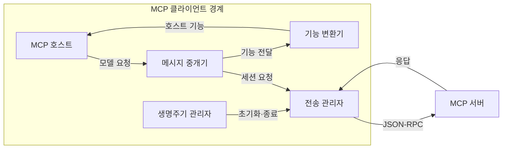
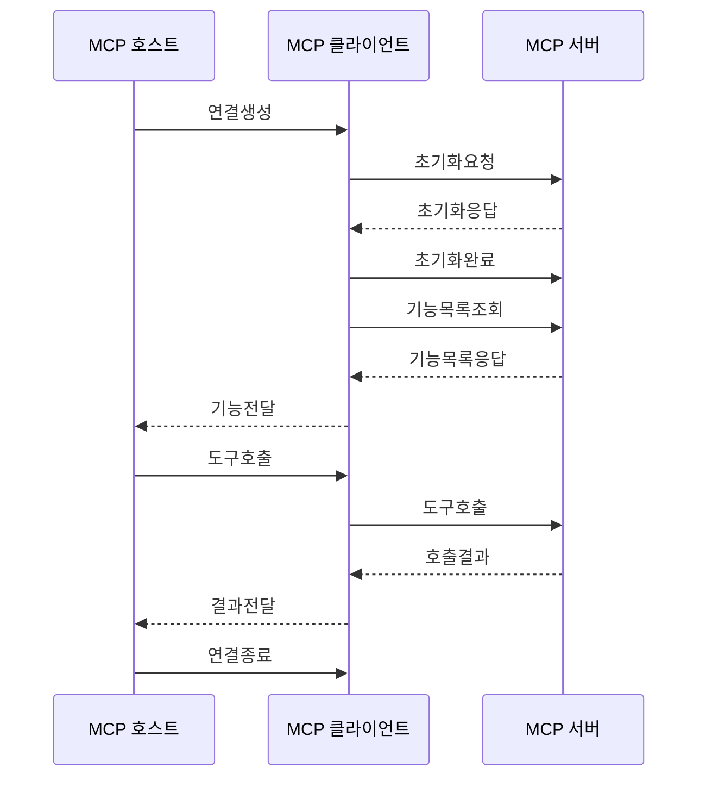

---
sidebar:
  order: 8
  label: "008. MCP Client (모델 컨텍스트 프로토콜 클라이언트)"
  badge:
    text: "기출 · 30%"
    variant: note
title: "MCP Client (모델 컨텍스트 프로토콜 클라이언트)"
date: "2026-07-27T23:59:59+09:00"
tags:
  - "notes-latest_tech"
weight: 8
extra:
  question_no: "008"
  source_status: "기출"
  source_history: "138회"
  priority: 30
  priority_note: "클라이언트 연결은 MCP 하위 구조"
---

## 미리 알고가기

- **모델 컨텍스트 프로토콜(Model Context Protocol, MCP, 엠씨피)**: 영문 머리글자를 딴 호스트·서버 간 기능·컨텍스트 교환 규격
- **인공지능 (Artificial Intelligence, AI)**: MCP 서버 기능을 선택하고 활용하는 애플리케이션
- **대규모 언어 모델 (Large Language Model, LLM)**: 기능 호출 결과를 컨텍스트로 사용하는 모델
- **JSON(JavaScript Object Notation, 제이슨)**: 메시지 인자를 구조화하는 데이터 형식
- **JSON-RPC(JSON Remote Procedure Call, 제이슨 알피시)**: 클라이언트·서버의 요청·응답·알림을 표현하는 형식
- **표준 입출력 (Standard Input/Output, stdio)**: 로컬 서버 프로세스와 통신하는 전송 방식
- **스트리밍 가능 HTTP (Streamable HTTP)**: 원격 서버와 통신하는 전송 방식
- **호출 식별자 (Identifier, ID)**: 요청과 응답을 연결하는 값
- **MCP 클라이언트(MCP Client, 엠씨피 클라이언트)**: 서버 하나와의 세션·메시지를 관리하는 호스트 내부 연결기
- **통합 개발 환경 (Integrated Development Environment, IDE)**: 개발 도구를 통합한 MCP 호스트 사례

## Ⅰ. 개요
- **정의/개념**: 호스트에서 서버별 세션을 관리하는 연결기
- **기존 한계**: 호스트의 직접 서버 연동은 세션·메시지 처리가 중복
- **배경/필요성**: 서버별 연결 수명주기와 기능 전달의 공통화

### 쉽게 이해하기 (학습용)
- 앱과 서버 사이에서 한 서버를 전담하는 통신 담당자임

## Ⅱ. 특징
- 서버별 1:1 연결의 초기화·기능 협상·종료를 관리한다
- 요청 ID·알림·취소·오류로 메시지 상태를 추적한다
- 서버 기능 명세와 실행 결과를 호스트에 전달한다

### 쉽게 이해하기 (학습용)
- 각 담당자가 자기 서버와 대화하고 결과를 호스트에 보고함

## Ⅲ. 아키텍처 및 구성요소

| 설계 요소 | 설명 |
|:---|:---|
| 생명주기 관리자 | 초기화·기능 협상·종료를 관리 |
| 메시지 중개기 | 요청 ID로 요청·응답을 연결 |
| 기능 변환기 | 서버 기능을 호스트 입력으로 전달 |
| 전송 관리자 | stdio·Streamable HTTP 연결을 관리 |

> 요약: 클라이언트가 서버 세션과 호스트 전달을 중개

### 쉽게 이해하기 (학습용)
- 클라이언트 안의 담당자들이 서버 대화와 호스트 보고를 나눠 맡음

## Ⅳ. 원리 및 절차 흐름도

| 절차 | 설명 |
|:---|:---|
| 연결생성 | 서버별 전용 세션을 생성 |
| 초기화요청 | 버전·호스트 기능을 전송 |
| 초기화응답 | 서버 버전·기능을 수신 |
| 초기화완료 | 정상 작업 시작을 통지 |
| 기능목록조회 | 서버 기능 목록을 요청 |
| 기능목록응답 | 사용 가능한 기능을 수신 |
| 기능전달 | 호스트에 기능 정보를 전달 |
| 도구호출 | 호스트 요청을 서버로 전달 |
| 호출결과 | 서버 응답을 수신 |
| 결과전달 | 결과를 호스트에 전달 |
| 연결종료 | 세션과 전송을 닫음 |

> 요약: 클라이언트가 서버 세션과 호스트 메시지를 연결

### 쉽게 이해하기 (학습용)
- 한 서버와 대화한 내용을 호스트가 이해할 수 있게 중간에서 전달함

## Ⅴ. 종류 및 비교

| 판단 기준 | MCP Client | MCP Server |
|:---|:---|:---|
| 적용 기준 | 호스트가 서버를 연결할 때 | 백엔드 기능을 공개할 때 |
| 핵심 특징 | 서버별 세션·메시지 중개 | 도구·리소스·프롬프트 제공 |
| 한계 | 사용자 정책·실행 권한은 호스트 책임 | 백엔드 권한·입력 검증 책임 |

> 요약: 클라이언트는 연결, 서버는 기능 제공을 담당

### 쉽게 이해하기 (학습용)
- 클라이언트는 대화를 맡고 서버는 실제 자료와 기능을 내놓음

## Ⅵ. 실무 사례
- IDE는 서버별 클라이언트로 기능·권한을 분리함

### 쉽게 이해하기 (학습용)
- 개발 도구가 서버마다 담당자를 두어 필요한 기능만 보여줌

## Ⅶ. 결론
- 서버별 세션 격리로 호스트의 연결 상태를 분리

### 쉽게 이해하기 (학습용)
- 서버마다 대화방을 나눠 한쪽 문제가 다른 쪽으로 번지지 않게 함
