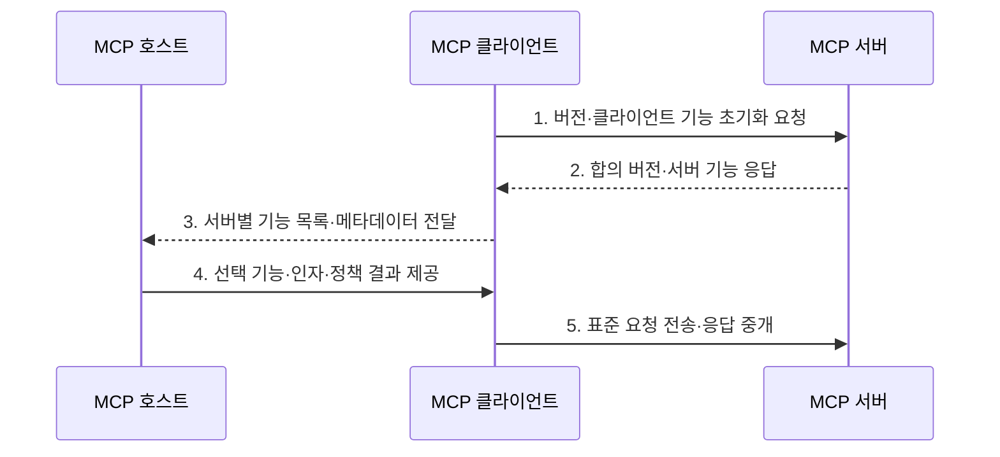

---
sidebar:
  order: 8
  label: "008. MCP Client (모델 컨텍스트 프로토콜 클라이언트)"
  badge:
    text: "기출 · 30%"
    variant: note
title: "MCP Client (모델 컨텍스트 프로토콜 클라이언트)"
date: "2026-07-30T11:04:43+09:00"
tags:
  - "notes-latest_tech"
weight: 8
extra:
  question_no: "008"
  source_status: "기출"
  source_history: "138회"
  priority: 30
  priority_note: "클라이언트 연결은 MCP 하위 구조"
---

## 미리 알고가기

- **모델 컨텍스트 프로토콜(Model Context Protocol, MCP)**: 인공지능 애플리케이션과 외부 데이터·도구·프롬프트를 표준 방식으로 연결하는 프로토콜이다.
- **인공지능(Artificial Intelligence, AI)**: MCP 서버의 기능을 선택하고 활용하여 과업을 수행하는 애플리케이션의 핵심 모델이다.
- **대규모 언어 모델(Large Language Model, LLM)**: MCP 기능 명세와 호출 결과를 문맥으로 사용하여 다음 행동을 결정하는 모델이다.
- **JSON(JavaScript Object Notation)**: 메시지의 도구명과 인자를 구조화하는 데이터 형식이다.
- **JSON-RPC(JSON Remote Procedure Call)**: 클라이언트와 서버 간 원격 호출의 요청·응답·알림·오류를 표현하는 프로토콜이다.
- **표준 입출력(Standard Input/Output, stdio)**: 로컬 서버 프로세스와 입출력 스트림으로 통신하는 전송 방식
- **스트리밍 가능 HTTP(Streamable HTTP)**: 원격 서버와 HTTP POST 및 선택적 SSE로 통신하는 전송 방식
- **호출 식별자(Identifier, ID)**: JSON-RPC 요청과 응답을 연결하는 값
- **MCP 클라이언트(MCP Client)**: 호스트 내부에서 MCP 서버 하나와의 연결 수명주기와 메시지를 관리하는 구성요소다.
- **통합 개발 환경(Integrated Development Environment, IDE)**: 개발 도구를 통합한 MCP 호스트 사례

## Ⅰ. 개요

- 정의/개념: MCP 호스트 내부에서 특정 서버 하나와의 연결 수명주기와 기능 협상 및 JSON-RPC 메시지 교환을 전담하는 통신 구성요소
- 배경/필요성: 호스트가 서버마다 직접 연동하면 수명주기·기능 발견·요청 추적·오류 처리를 중복 구현하고 서버 간 보안 경계를 유지하기 곤란

### 쉽게 이해하기 (학습용)
- 앱과 서버 사이에서 한 서버를 전담하는 통신 담당자임

## Ⅱ. 특징

- **서버별 1:1 세션**으로 초기화·기능 협상·정상 운영·종료 수명주기를 관리
- **요청 ID·알림·취소**로 비동기 메시지와 장기 작업 상태를 추적
- **호스트 중계**로 서버 기능 명세와 실행 결과를 모델 문맥·정책 적용 형태로 전달

### 쉽게 이해하기 (학습용)
- 각 담당자가 자기 서버와 대화하고 결과를 호스트에 보고함

## Ⅲ. 구조 및 구성요소

| 구성요소 | 책임 |
|:---|:---|
| 수명주기 관리자 | 초기화·기능 협상·운영·종료를 관리 |
| 메시지 중개기 | 요청 ID로 요청·응답을 연결 |
| 기능 변환기 | 서버 기능을 호스트 입력으로 전달 |
| 전송 관리자 | stdio·Streamable HTTP 연결을 관리 |

### 쉽게 이해하기 (학습용)
- 클라이언트 안의 담당자들이 서버 대화와 호스트 보고를 나눠 맡음

## Ⅳ. 흐름도

1. **버전·클라이언트 기능 초기화 요청**: 서버와 호환 버전 및 선택 기능 범위를 협상
2. **합의 버전·서버 기능 응답**: 연결에서 사용할 서버 기능과 구현 정보 수신
3. **서버별 기능 목록·메타데이터 전달**: 호스트가 출처와 보안 경계를 구분해 선택하도록 변환
4. **선택 기능·인자·정책 결과 제공**: 호스트가 사용자 동의와 권한을 적용한 호출 전달
5. **표준 요청 전송·응답 중개**: 요청 ID로 결과·오류를 연결해 호스트 문맥에 반환

### 쉽게 이해하기 (학습용)
- 한 서버와 대화한 내용을 호스트가 이해할 수 있게 중간에서 전달함

## Ⅴ. 종류 및 비교

| 판단 기준 | MCP Client | MCP Server |
|:---|:---|:---|
| 적용 기준 | 호스트가 서버를 연결할 때 | 백엔드 기능을 공개할 때 |
| 핵심 특징 | 서버별 세션·메시지 중개 | 도구·리소스·프롬프트 제공 |
| 한계 | 사용자 정책·실행 권한은 호스트 책임 | 백엔드 권한·입력 검증 책임 |

### 쉽게 이해하기 (학습용)
- 클라이언트는 대화를 맡고 서버는 실제 자료와 기능을 내놓음

## Ⅵ. 실무 고려사항 및 대책

| 고려사항 | 대책 | 효과 |
|:---|:---|:---|
| 복수 서버의 기능·결과 혼합 | 서버마다 별도 클라이언트 세션과 출처 식별자를 유지 | 서버 간 문맥·권한 경계 보존 |
| 연결 중단과 미완료 요청 | 요청 ID·취소·시간초과와 재연결 정책으로 상태 정리 | 유실·중복 실행 방지 |
| 서버 기능 변경 | 목록 변경 알림을 처리하고 호스트의 허용 정책을 다시 평가 | 폐기·추가 기능의 안전한 반영 |

### 쉽게 이해하기 (학습용)
- 개발 도구가 서버마다 담당자를 두어 필요한 기능만 보여줌

## Ⅶ. 결론

- 하나의 호스트가 여러 MCP 서버를 연결하면 서버마다 독립 클라이언트를 두고, 세션 수명주기·요청 ID·오류를 격리한 뒤 호스트가 승인한 기능만 중개

### 쉽게 이해하기 (학습용)
- 서버마다 대화방을 나눠 한쪽 문제가 다른 쪽으로 번지지 않게 함
