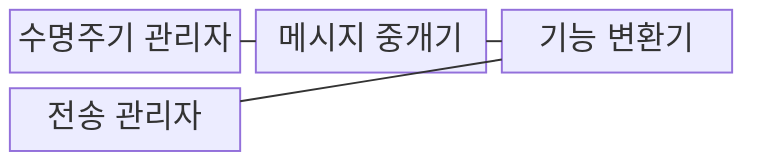
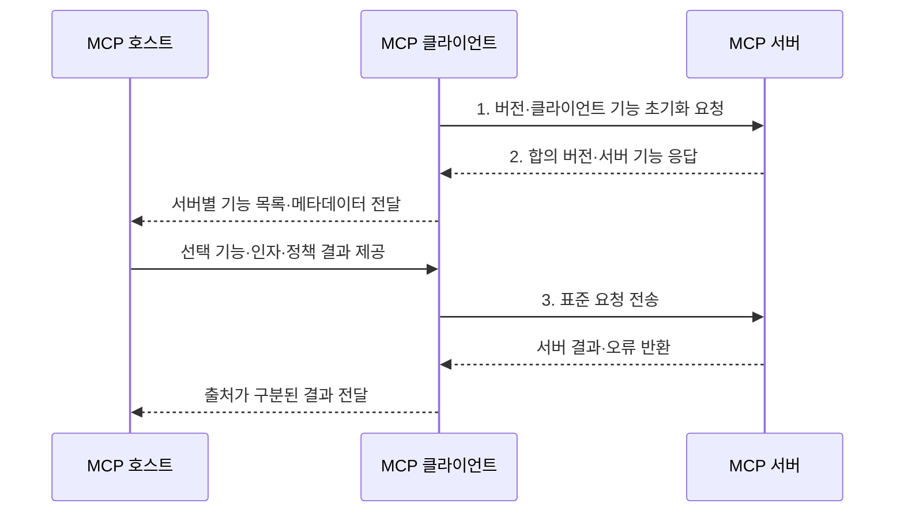

---
sidebar:
  order: 8
  label: "008. MCP Client (모델 컨텍스트 프로토콜 클라이언트)"
  badge:
    text: "기출 · 30%"
    variant: note
title: "MCP Client (모델 컨텍스트 프로토콜 클라이언트)"
date: "2026-07-31T08:40:38+09:00"
tags:
  - "notes-latest_tech"
weight: 8
extra:
  question_no: "008"
  source_status: "기출"
  source_history: "138회"
  priority: 30
  priority_note: "클라이언트 연결은 MCP 하위 구조"
---

## Ⅰ. 개요

핵심 용어

- **모델 컨텍스트 프로토콜 클라이언트(Model Context Protocol Client, MCP Client)**: 호스트 내부에서 하나의 MCP 서버와 연결 수명주기·기능 협상·JSON-RPC 메시지를 관리하는 구성요소다.

- 정의/개념: 서버 연결과 **자바스크립트 객체 표기법 원격 절차 호출(JavaScript Object Notation Remote Procedure Call, JSON-RPC)** 메시지를 관리하는 **모델 컨텍스트 프로토콜 클라이언트(Model Context Protocol Client, MCP Client)**
- 배경/필요성: 서버 직접 연동은 수명주기·추적 구현이 중복돼 **보안 경계 유지 불가**

#### 한줄 요약
- 앱과 서버 사이에서 한 서버를 전담하는 통신 담당자임

## Ⅱ. 특징

핵심 용어

- **서버별 세션**: 각 모델 컨텍스트 프로토콜 서버(Model Context Protocol Server, MCP Server)의 초기화·기능 상태·요청·종료를 다른 서버 연결과 분리해 관리하는 통신 상태다.
- **요청 식별자(Request Identifier, Request ID)**: 비동기 요청과 그에 대응하는 응답·취소를 연결하는 값이다.

- **세션 축**: 서버별 초기화·기능 협상·종료 관리
- **추적 축**: **요청 식별자(Request Identifier, Request ID)**·알림·취소 기반 비동기 상태 추적
- **중계 축**: 기능 명세·실행 결과를 호스트에 전달

#### 한줄 요약
- 각 담당자가 자기 서버와 대화하고 결과를 호스트에 보고함

## Ⅲ. 구조 및 구성요소

핵심 용어

- **메시지 디스패처**: JSON-RPC 식별자와 메시지 유형을 이용해 응답·알림·오류를 해당 요청과 처리기로 전달한다.
- **표준 입출력(Standard Input/Output, stdio)**: 로컬 클라이언트와 서버가 프로세스 입출력 스트림으로 메시지를 교환하는 전송 방식이다.
- **스트리밍 가능 하이퍼텍스트 전송 프로토콜(Streamable Hypertext Transfer Protocol, Streamable HTTP)**: 원격 클라이언트와 서버가 요청·응답 및 선택적 이벤트 스트림으로 메시지를 교환하는 전송 방식이다.

- **메시지 디스패처** 중심 구조는 **자바스크립트 객체 표기법 원격 절차 호출(JavaScript Object Notation Remote Procedure Call, JSON-RPC)** 메시지를 분배하고 **표준 입출력(Standard Input/Output, stdio)** 또는 **스트리밍 가능 하이퍼텍스트 전송 프로토콜(Streamable Hypertext Transfer Protocol, Streamable HTTP)** 연결을 관리한다.

| 구성요소 | 책임 |
|:---|:---|
| 수명주기 관리자 | **초기화·기능 협상·종료** 관리 |
| 메시지 중개기 | **요청 ID 기반 요청·응답 연결** |
| 기능 변환기 | 호스트 대상 **서버 기능 명세 전달** |
| 전송 관리자 | **stdio·Streamable HTTP 연결** 관리 |

#### 한줄 요약
- 클라이언트 안의 담당자들이 서버 대화와 호스트 보고를 나눠 맡음

## Ⅳ. 흐름도

핵심 용어

- **호출 식별자**: 비동기 JSON-RPC 요청과 나중에 도착한 응답을 정확히 연결하는 값이다.

- **모델 컨텍스트 프로토콜 호스트(Model Context Protocol Host, MCP Host)**, **모델 컨텍스트 프로토콜 클라이언트(Model Context Protocol Client, MCP Client)**, **모델 컨텍스트 프로토콜 서버(Model Context Protocol Server, MCP Server)** 사이에서 **자바스크립트 객체 표기법 원격 절차 호출(JavaScript Object Notation Remote Procedure Call, JSON-RPC)** 요청과 응답을 중계한다.

1. **버전·클라이언트 기능 초기화 요청**: 호환 버전·기능 범위 협상
2. **합의 버전·서버 기능 응답**: 서버 기능·구현 정보 수신
3. **표준 요청 전송**: **요청 식별자(Request Identifier, Request ID)** 기반 기능·구조화 인자 전달

#### 한줄 요약
- 한 서버와 대화한 내용을 호스트가 이해할 수 있게 중간에서 전달함

## Ⅴ. 종류 및 비교

핵심 용어

- **스트리밍 가능 하이퍼텍스트 전송 프로토콜 클라이언트(Streamable Hypertext Transfer Protocol Client, Streamable HTTP Client)**: HTTP POST와 선택적 SSE 스트림을 이용해 원격 MCP 서버와 통신하는 클라이언트다.
- **서버 전송 이벤트(Server-Sent Events, SSE)**: 서버가 단방향 이벤트 스트림을 지속해서 전송하는 방식이다.

- **모델 컨텍스트 프로토콜 클라이언트(Model Context Protocol Client, MCP Client)** 역할과 **모델 컨텍스트 프로토콜 서버(Model Context Protocol Server, MCP Server)** 역할을 연결 중개와 기능 제공 기준으로 구분한다.

| 판단 기준 | MCP Client | MCP Server |
|:---|:---|:---|
| 적용 기준 | 호스트의 **서버 연결** | 백엔드 **기능 공개** |
| 핵심 특징 | 서버별 **세션·메시지 중개** | **도구·리소스·프롬프트** 제공 |
| 한계 | 호스트의 **사용자 정책·실행 권한 책임** | 서버의 **권한·입력 검증 책임** |

> 요약: 연결 중개에는 **MCP 클라이언트**, 기능 제공에는 **MCP 서버** 적용

#### 한줄 요약
- 클라이언트는 대화를 맡고 서버는 실제 자료와 기능을 내놓음

## Ⅵ. 실무 고려사항 및 대책

핵심 용어

- **재연결 정책**: 통신 장애 후 세션을 복구할 때 백오프·재시도 상한·요청 중복 처리를 정하는 규칙이다.
- **요청 식별자(Request Identifier, Request ID)**: 연결 중단 뒤 미완료 요청의 취소·시간초과·중복 여부를 판별하는 값이다.

| 문제 | 대책 | 효과 |
|:---|:---|:---|
| 복수 서버 결과 혼합으로 **출처 오인** | 서버별 **독립 세션·출처 식별자** 유지 | 문맥·권한 경계 보존 |
| 연결 중단으로 **미완료 요청 잔존** | **요청 식별자(Request Identifier, Request ID)·취소·시간초과** 기반 상태 정리 | 유실·중복 실행 방지 |
| 기능 변경으로 **허용 정책 불일치** | **목록 변경 알림** 후 정책 재평가 | 변경 기능의 안전한 반영 |

#### 한줄 요약
- 개발 도구가 서버마다 담당자를 두어 필요한 기능만 보여줌

## Ⅶ. 결론

핵심 용어

- **호스트 중계**: 클라이언트가 서버 기능 명세와 실행 결과를 호스트에 전달하고 최종 사용 여부는 호스트가 결정하게 하는 책임 분리다.

- 서버 연결·메시지 중계에는 **모델 컨텍스트 프로토콜 클라이언트(Model Context Protocol Client, MCP Client)**, 기능 공개에는 **모델 컨텍스트 프로토콜 서버(Model Context Protocol Server, MCP Server)** 선택

#### 한줄 요약
- 서버마다 대화방을 나눠 한쪽 문제가 다른 쪽으로 번지지 않게 함
