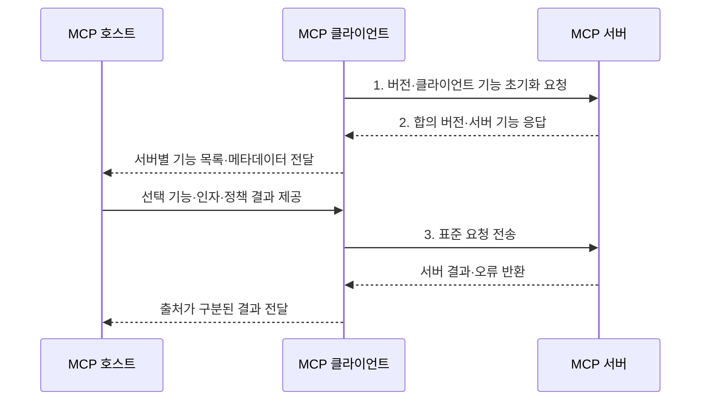

---
sidebar:
  order: 8
  label: "008. MCP Client (모델 컨텍스트 프로토콜 클라이언트)"
  badge:
    text: "기출 · 30%"
    variant: note
title: "MCP Client (모델 컨텍스트 프로토콜 클라이언트)"
date: "2026-07-31T08:40:38+09:00"
tags:
  - "notes-latest_tech"
weight: 8
extra:
  question_no: "008"
  source_status: "기출"
  source_history: "138회"
  priority: 30
  priority_note: "클라이언트 연결은 MCP 하위 구조"
---

## 미리 알고가기

- **모델 컨텍스트 프로토콜(Model Context Protocol, MCP)**: 인공지능 애플리케이션과 외부 데이터·도구·프롬프트를 표준 방식으로 연결하는 프로토콜이다.
- **JSON-RPC(JSON Remote Procedure Call)**: 클라이언트와 서버 간 원격 호출의 요청·응답·알림·오류를 표현하는 프로토콜이다.
- **표준 입출력(Standard Input/Output, stdio)**: 로컬 서버 프로세스와 입출력 스트림으로 통신하는 전송 방식
- **스트리밍 가능 HTTP(Streamable HTTP)**: 원격 서버와 HTTP POST 및 선택적 SSE로 통신하는 전송 방식
- **호출 식별자(Identifier, ID)**: JSON-RPC 요청과 응답을 연결하는 값
- **MCP 클라이언트(MCP Client)**: 호스트 내부에서 MCP 서버 하나와의 연결 수명주기와 메시지를 관리하는 구성요소다.

## Ⅰ. 개요

- 정의/개념: 서버별 연결 수명주기와 **JSON-RPC 메시지**를 관리하는 **MCP 클라이언트**
- 배경/필요성: 서버 직접 연동은 수명주기·추적 구현이 중복돼 **보안 경계 유지 불가**

### 쉽게 이해하기 (학습용)
- 앱과 서버 사이에서 한 서버를 전담하는 통신 담당자임

## Ⅱ. 특징

- **세션 축**: 서버별 초기화·기능 협상·종료 관리
- **추적 축**: 요청 ID·알림·취소 기반 비동기 상태 추적
- **중계 축**: 기능 명세·실행 결과를 호스트에 전달

### 쉽게 이해하기 (학습용)
- 각 담당자가 자기 서버와 대화하고 결과를 호스트에 보고함

## Ⅲ. 구조 및 구성요소

| 구성요소 | 책임 |
|:---|:---|
| 수명주기 관리자 | **초기화·기능 협상·종료** 관리 |
| 메시지 중개기 | **요청 ID**로 요청·응답 연결 |
| 기능 변환기 | **서버 기능 명세**를 호스트에 전달 |
| 전송 관리자 | **stdio·Streamable HTTP 연결** 관리 |

### 쉽게 이해하기 (학습용)
- 클라이언트 안의 담당자들이 서버 대화와 호스트 보고를 나눠 맡음

## Ⅳ. 흐름도

1. **버전·클라이언트 기능 초기화 요청**: 호환 버전·기능 범위 협상
2. **합의 버전·서버 기능 응답**: 서버 기능·구현 정보 수신
3. **표준 요청 전송**: 요청 ID로 기능·구조화 인자 전달

### 쉽게 이해하기 (학습용)
- 한 서버와 대화한 내용을 호스트가 이해할 수 있게 중간에서 전달함

## Ⅴ. 종류 및 비교

| 판단 기준 | MCP Client | MCP Server |
|:---|:---|:---|
| 적용 기준 | 호스트의 **서버 연결** | 백엔드 **기능 공개** |
| 핵심 특징 | 서버별 **세션·메시지 중개** | **도구·리소스·프롬프트** 제공 |
| 한계 | **사용자 정책·실행 권한**은 호스트 책임 | **권한·입력 검증**은 서버 책임 |

> 요약: **MCP 클라이언트**는 연결 중개, **MCP 서버**는 기능 제공

### 쉽게 이해하기 (학습용)
- 클라이언트는 대화를 맡고 서버는 실제 자료와 기능을 내놓음

## Ⅵ. 실무 고려사항 및 대책

| 고려사항 | 대책 | 효과 |
|:---|:---|:---|
| 복수 서버 결과 혼합으로 **출처 오인** | 서버별 **독립 세션·출처 식별자** 유지 | 문맥·권한 경계 보존 |
| 연결 중단으로 **미완료 요청 잔존** | **요청 ID·취소·시간초과**로 상태 정리 | 유실·중복 실행 방지 |
| 기능 변경으로 **허용 정책 불일치** | **목록 변경 알림** 후 정책 재평가 | 변경 기능의 안전한 반영 |

### 쉽게 이해하기 (학습용)
- 개발 도구가 서버마다 담당자를 두어 필요한 기능만 보여줌

## Ⅶ. 결론

- 서버 연결·메시지 중계는 **MCP 클라이언트**, 기능 공개는 **MCP 서버** 선택

### 쉽게 이해하기 (학습용)
- 서버마다 대화방을 나눠 한쪽 문제가 다른 쪽으로 번지지 않게 함
