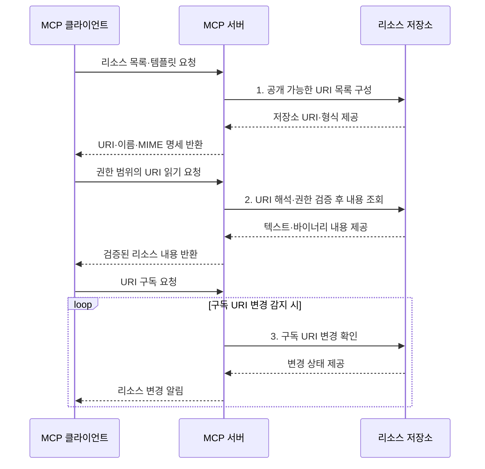

---
sidebar:
  order: 9
  label: "009. MCP Resource (모델 컨텍스트 프로토콜 리소스)"
  badge:
    text: "기출 · 30%"
    variant: note
title: "MCP Resource (모델 컨텍스트 프로토콜 리소스)"
date: "2026-07-31T08:41:35+09:00"
tags:
  - "notes-latest_tech"
weight: 9
extra:
  question_no: "009"
  source_status: "기출"
  source_history: "138회"
  priority: 30
  priority_note: "리소스 제공은 MCP 세부 구성요소"
---

## Ⅰ. 개요

핵심 용어

**MCP 리소스**는 서버가 URI로 식별하여 클라이언트에 읽기 중심의 컨텍스트 데이터를 제공하는 MCP 기능이다.

- 정의/개념: **MCP 리소스**는 서버가 URI로 식별하여 클라이언트에 읽기 중심의 컨텍스트 데이터를 제공하는 MCP 기능
- 배경/필요성: 파일·데이터별 탐색·조회 방식 차이로 **컨텍스트 재사용 곤란**

### 쉽게 이해하기 (학습용)
- 자료의 주소표를 통해 필요한 내용을 골라 읽는 기능임

## Ⅱ. 특징

핵심 용어

**애플리케이션 제어 컨텍스트**는 호스트가 리소스를 조회하고 모델 문맥에 포함할지 결정하여 데이터 사용 범위를 통제하는 방식이다.

- **제어 축**: 애플리케이션이 조회·모델 문맥 포함 결정
- **식별 축**: URI·URI 템플릿으로 컨텍스트 식별
- **최신성 축**: 변경 알림·리소스 구독으로 갱신 전달

### 쉽게 이해하기 (학습용)
- 주소와 형식을 알려 주면 호스트가 필요한 자료를 골라 읽고 변경도 알림받음

## Ⅲ. 구조 및 구성요소

핵심 용어

**URI 템플릿**은 변수 자리를 포함한 주소 규칙으로 여러 관련 리소스의 URI를 생성하게 한다.

| 구성요소 | 책임 |
|:---|:---|
| 리소스 명세 | **URI·이름·MIME** 정보 제공 |
| URI 템플릿 | **변수형 URI**로 리소스 범위 표현 |
| 내용 제공기 | **JSON-RPC**로 URI 콘텐츠 반환 |
| 구독 관리자 | **리소스 구독·변경 알림** 관리 |

### 쉽게 이해하기 (학습용)
- 주소표와 내용 창고가 연결되고 변경 감시자가 새 소식을 알림

## Ⅳ. 흐름도

핵심 용어

**리소스 읽기**는 클라이언트가 URI를 지정하고 서버가 MIME 형식과 함께 텍스트 또는 바이너리 내용을 반환하는 요청 흐름이다.

1. **공개 가능한 URI 목록 구성**: 권한 범위의 URI·템플릿 선별
2. **URI 해석·권한 검증 후 내용 조회**: 원천 데이터 검색
3. **구독 URI 변경 확인**: 변경된 리소스만 알림 대상으로 선별

### 쉽게 이해하기 (학습용)
- 자료 주소를 읽은 뒤 바뀌었다는 소식이 오면 최신 내용을 다시 가져옴

## Ⅴ. 종류 및 비교

핵심 용어

**직접 리소스**는 고정 URI 하나로 특정 파일·레코드·문서 같은 컨텍스트를 식별해 제공하는 리소스 유형이다.

| 비교 기준 | Resource | Tool | Prompt |
|:---|:---|:---|:---|
| 적용 기준 | **문맥 데이터 제공** | **외부 기능 실행** | **사용자 작업 틀 제공** |
| 핵심 특징 | 앱 제어·**URI 조회** | 모델 제어·**스키마 호출** | 사용자 제어·**메시지 생성** |
| 한계 | **직접 행동 수행 불가** | **부작용·권한 위험** | **사용자 선택·입력 필요** |

> 요약: **Resource**는 문맥 조회, **Tool**은 행동, **Prompt**는 작업 틀

### 쉽게 이해하기 (학습용)
- 리소스는 자료를 읽고 도구는 일을 실행하므로 사용 목적이 다름

## Ⅵ. 실무 고려사항 및 대책

핵심 용어

**리소스 구독**은 특정 URI의 내용이 변경될 때 서버가 클라이언트에 갱신 알림을 보내는 기능이다.

| 문제 | 대책 | 효과 |
|:---|:---|:---|
| URI 조작으로 **범위 밖 조회** | **템플릿 변수·테넌트 권한** 재검증 | 경로·테넌트 우회 방지 |
| 과다 제공으로 **문맥 오염·정보 노출** | **목적별 분할·최소 필드** 적용 | 문맥 품질·기밀성 확보 |
| 빈번한 변경으로 **최신성 저하** | 필요한 **URI만 구독·재조회** | 최신성 확보·트래픽 감소 |

### 쉽게 이해하기 (학습용)
- 로그 주소에 사용자 범위를 넣어 다른 팀 자료가 섞이지 않게 읽음

## Ⅶ. 결론

핵심 용어

**MIME 형식**은 리소스 내용의 데이터 유형을 표시하여 클라이언트가 안전하고 올바르게 해석하게 하는 표기다.

- 읽기 문맥은 **MCP 리소스**, 외부 행동은 **Tool** 선택

### 쉽게 이해하기 (학습용)
- 민감한 자료는 좁게 공개하고 자주 바뀌는 자료만 변경 알림을 켬
