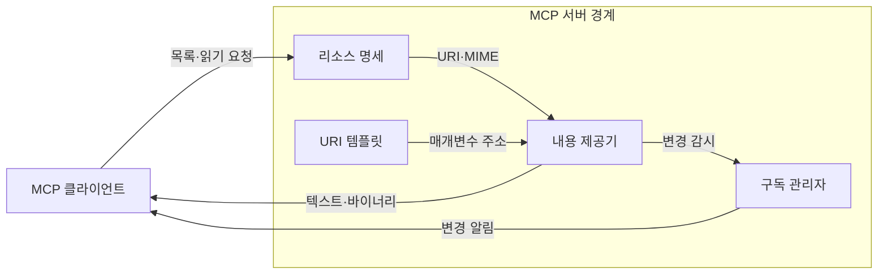
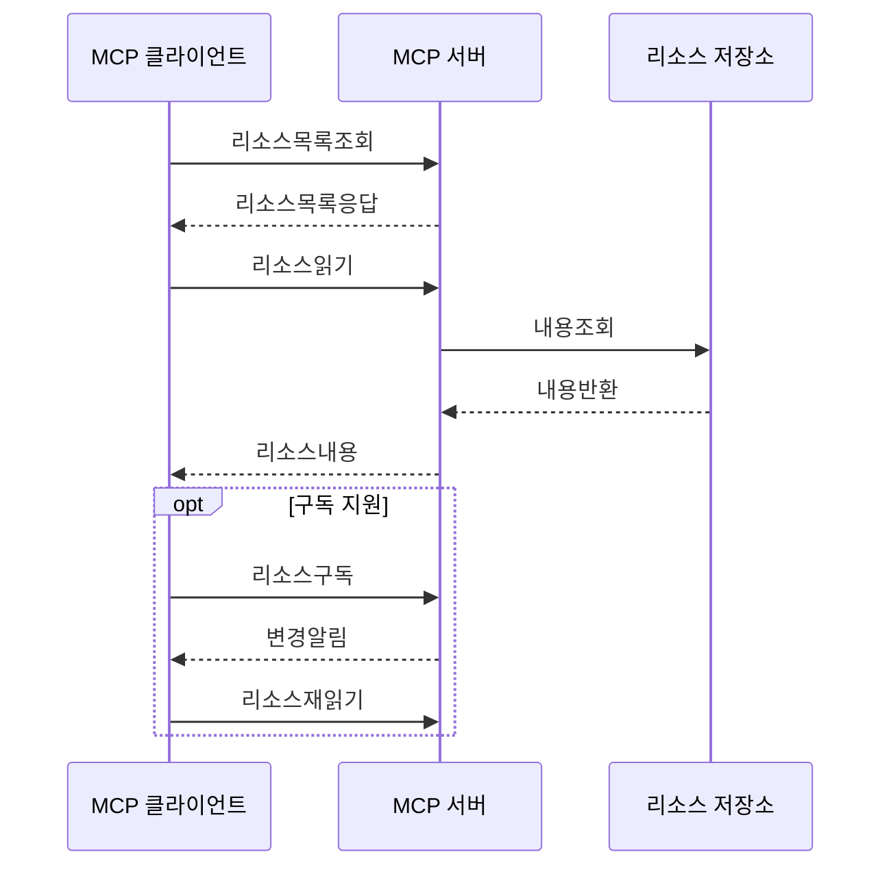

---
sidebar:
  order: 9
  label: "009. MCP Resource (모델 컨텍스트 프로토콜 리소스)"
  badge:
    text: "기출 · 30%"
    variant: note
title: "MCP Resource (모델 컨텍스트 프로토콜 리소스)"
date: "2026-07-27T23:59:59+09:00"
tags:
  - "notes-latest_tech"
weight: 9
extra:
  question_no: "009"
  source_status: "기출"
  source_history: "138회"
  priority: 30
  priority_note: "리소스 제공은 MCP 세부 구성요소"
---

## 미리 알고가기

- **모델 컨텍스트 프로토콜 (Model Context Protocol, MCP)**: 호스트와 서버의 기능·컨텍스트 교환 규격
- **통합 자원 식별자 (Uniform Resource Identifier, URI)**: 리소스를 고유하게 가리키는 주소
- **MCP 리소스 (MCP Resource)**: 서버가 URI로 제공하는 컨텍스트 데이터
- **URI 템플릿 (URI Template)**: 변수로 여러 리소스 주소를 표현하는 규칙
- **다목적 인터넷 메일 확장 (Multipurpose Internet Mail Extensions, MIME)**: 콘텐츠 형식을 식별하는 표기
- **제이에스온 원격 프로시저 호출 (JSON Remote Procedure Call, JSON-RPC)**: 리소스 요청·응답 메시지 형식
- **리소스 구독 (Resource Subscription)**: 특정 URI 변경 알림을 받는 기능
- **약어 읽기·표기**: MCP·URI는 ‘엠시피·유알아이’, MIME은 ‘마임’, JSON-RPC는 ‘제이슨 알피씨’로 읽고 영문 머리글자로 프로토콜·주소·형식·메시지 규격을 구분함

## Ⅰ. 개요
- 정의/개념: 서버가 URI로 노출하는 애플리케이션 제어형 데이터
- 기존 한계: 앱별 연동은 파일·데이터 탐색·조회 방식이 상이

### 쉽게 이해하기 (학습용)
- 자료의 주소표를 통해 필요한 내용을 골라 읽는 기능임

## Ⅱ. 특징
- **애플리케이션 제어**: 클라이언트가 문맥 사용을 결정한다
- **URI 기반 조회**: 목록·템플릿·읽기로 데이터를 찾는다
- **변경 통지**: 지원 협상 시 목록·내용 변경을 알린다

### 쉽게 이해하기 (학습용)
- 주소와 형식을 알려 주면 호스트가 필요한 자료를 골라 읽고 변경도 알림받음

## Ⅲ. 아키텍처 및 구성요소

| 설계 요소 | 설명 |
|:---|:---|
| 리소스 명세 | URI·이름·설명·MIME 정보를 제공 |
| URI 템플릿 | 변수형 URI로 리소스 범위를 표현 |
| 내용 제공기 | URI에 해당하는 텍스트·바이너리를 반환 |
| 구독 관리자 | URI 변경 감지와 알림을 관리 |

> 요약: 명세가 주소를 열고 제공기가 내용을 반환

### 쉽게 이해하기 (학습용)
- 주소표와 내용 창고가 연결되고 변경 감시자가 새 소식을 알림

## Ⅳ. 원리 및 절차 흐름도

| 절차 | 설명 |
|:---|:---|
| 리소스목록조회 | 사용 가능한 URI를 요청 |
| 리소스목록응답 | URI·MIME 목록을 수신 |
| 리소스읽기 | 선택한 URI 내용을 요청 |
| 내용조회 | 저장소에서 URI 내용을 조회 |
| 내용반환 | 저장소 결과를 서버에 반환 |
| 리소스내용 | 텍스트·바이너리를 반환 |
| 리소스구독 | 특정 URI 변경을 구독 |
| 변경알림 | URI 변경 사실을 통지 |
| 리소스재읽기 | 변경 후 최신 내용을 재조회 |

> 요약: URI를 읽고 변경 알림 후 다시 조회

### 쉽게 이해하기 (학습용)
- 자료 주소를 읽은 뒤 바뀌었다는 소식이 오면 최신 내용을 다시 가져옴

## Ⅴ. MCP 서버 기본 기능 비교

| 비교 기준 | Resource | Tool | Prompt |
|:---|:---|:---|:---|
| 적용 기준 | 문맥 데이터를 제공할 때 | 외부 기능을 실행할 때 | 사용자용 작업 틀을 제공할 때 |
| 핵심 특징 | 앱 제어·URI 조회 | 모델 제어·스키마 호출 | 사용자 제어·메시지 생성 |
| 한계 | 직접 행동 수행 불가 | 부작용·권한 위험 | 사용자 선택·입력 필요 |

> 요약: 데이터·실행·템플릿의 제어 주체가 다름

### 쉽게 이해하기 (학습용)
- 리소스는 자료를 읽고 도구는 일을 실행하므로 사용 목적이 다름

## Ⅵ. 실무 사례
- 운영 분석: **URI 템플릿**으로 테넌트 로그 제한

### 쉽게 이해하기 (학습용)
- 로그 주소에 사용자 범위를 넣어 다른 팀 자료가 섞이지 않게 읽음

## Ⅶ. 결론
- 자료가 필요하면 **Resource**, 변경 시 구독 통제

### 쉽게 이해하기 (학습용)
- 민감한 자료는 좁게 공개하고 자주 바뀌는 자료만 변경 알림을 켬
