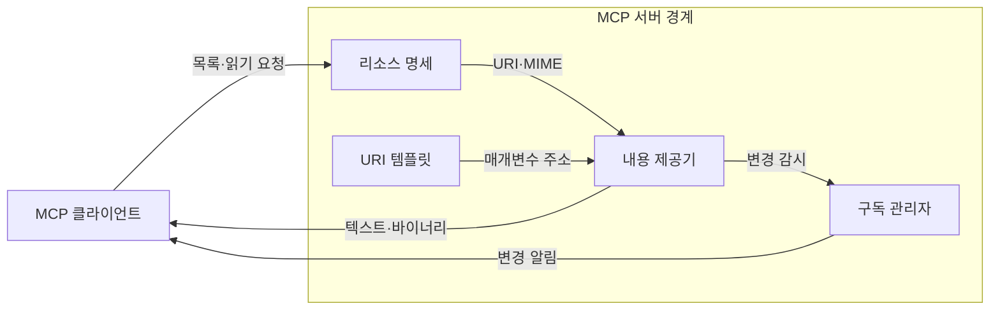
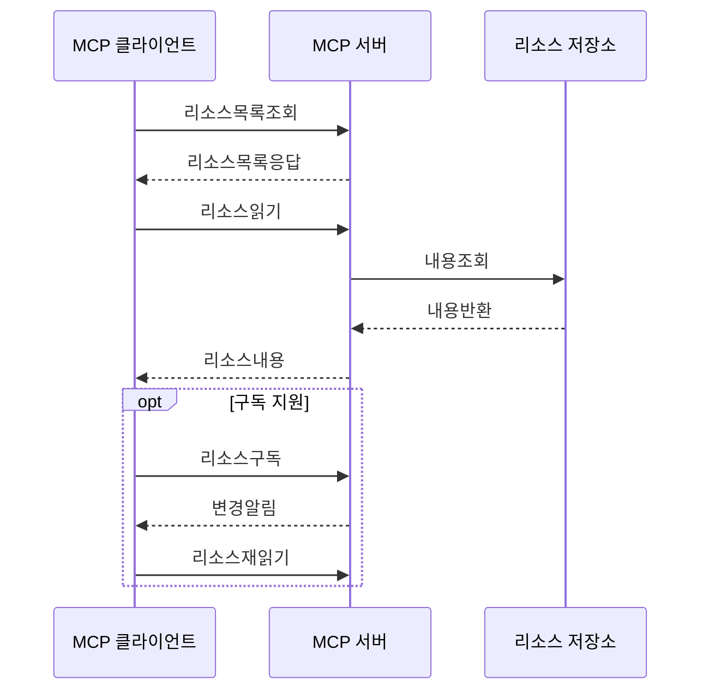

---
sidebar:
  order: 9
  label: "009. MCP Resource (모델 컨텍스트 프로토콜 리소스)"
  badge:
    text: "기출 · 30%"
    variant: note
title: "MCP Resource (모델 컨텍스트 프로토콜 리소스)"
date: "2026-07-25T01:25:00+09:00"
tags:
  - "notes-latest_tech"
weight: 9
extra:
  question_no: "009"
  source_status: "기출"
  source_history: "138회"
  priority: 30
  priority_note: "리소스 제공은 MCP 세부 구성요소"
---

## 미리 알고가기

- **모델 컨텍스트 프로토콜 (Model Context Protocol, MCP)**: 호스트와 서버의 기능·컨텍스트 교환 규격
- **인공지능 (Artificial Intelligence, AI)**: 리소스를 선택해 모델 컨텍스트로 사용하는 애플리케이션
- **통합 자원 식별자 (Uniform Resource Identifier, URI)**: 리소스를 고유하게 가리키는 주소
- **MCP 리소스 (MCP Resource)**: 서버가 URI로 제공하는 컨텍스트 데이터
- **URI 템플릿 (URI Template)**: 변수로 여러 리소스 주소를 표현하는 규칙
- **다목적 인터넷 메일 확장 (Multipurpose Internet Mail Extensions, MIME)**: 콘텐츠 형식을 식별하는 표기
- **제이에스온 원격 프로시저 호출 (JSON Remote Procedure Call, JSON-RPC)**: 리소스 요청·응답 메시지 형식
- **리소스 구독 (Resource Subscription)**: 특정 URI 변경 알림을 받는 기능

## Ⅰ. 개요
- **정의/개념**: 서버가 URI로 제공하는 컨텍스트 데이터
- **배경/필요성**: 파일·데이터를 공통 방식으로 발견·조회

### 쉽게 이해하기 (학습용)
- 자료의 주소표를 통해 필요한 내용을 골라 읽는 기능임

## Ⅱ. 특징
- URI 목록·매개변수형 템플릿을 제공한다
- resources/read가 리소스 내용을 반환한다
- MIME 유형이 반환 데이터 형식을 표시한다
- 호스트가 필요한 리소스만 문맥에 넣는다
- 협상된 구독·목록 변경 알림만 지원한다

### 쉽게 이해하기 (학습용)
- 주소와 형식을 알려 주면 호스트가 필요한 자료를 골라 읽고 변경도 알림받음

## Ⅲ. 아키텍처 및 구성요소

| 설계 요소 | 설명 |
|:---|:---|
| 리소스 명세 | URI·이름·설명·MIME 정보를 제공 |
| URI 템플릿 | 변수형 URI로 리소스 범위를 표현 |
| 내용 제공기 | URI에 해당하는 텍스트·바이너리를 반환 |
| 구독 관리자 | URI 변경 감지와 알림을 관리 |

> 요약: 명세가 주소를 열고 제공기가 내용을 반환

### 쉽게 이해하기 (학습용)
- 주소표와 내용 창고가 연결되고 변경 감시자가 새 소식을 알림

## Ⅳ. 원리 및 절차 흐름도

| 절차 | 설명 |
|:---|:---|
| 리소스목록조회 | 사용 가능한 URI를 요청 |
| 리소스목록응답 | URI·MIME 목록을 수신 |
| 리소스읽기 | 선택한 URI 내용을 요청 |
| 내용조회 | 저장소에서 URI 내용을 조회 |
| 내용반환 | 저장소 결과를 서버에 반환 |
| 리소스내용 | 텍스트·바이너리를 반환 |
| 리소스구독 | 특정 URI 변경을 구독 |
| 변경알림 | URI 변경 사실을 통지 |
| 리소스재읽기 | 변경 후 최신 내용을 재조회 |

> 요약: URI를 읽고 변경 알림 후 다시 조회

### 쉽게 이해하기 (학습용)
- 자료 주소를 읽은 뒤 바뀌었다는 소식이 오면 최신 내용을 다시 가져옴

## Ⅴ. 종류 및 비교

| 판단 기준 | MCP Resource | MCP Tool |
|:---|:---|:---|
| 제어 주체 | 호스트·애플리케이션 | 모델·호스트 |
| 인터페이스 | URI·resources/read | 이름·inputSchema·tools/call |
| 결과 성격 | 컨텍스트 데이터 | 실행 결과·오류 |
| 적용 기준 | 읽을 근거가 필요할 때 | 외부 기능을 실행할 때 |

> 요약: 컨텍스트는 Resource, 실행은 Tool

### 쉽게 이해하기 (학습용)
- 리소스는 자료를 읽고 도구는 일을 실행하므로 사용 목적이 다름

## Ⅵ. 실무 사례
- 운영 로그는 URI 템플릿·테넌트 필터로 범위 제한

### 쉽게 이해하기 (학습용)
- 로그 주소에 사용자 범위를 넣어 다른 팀 자료가 섞이지 않게 읽음

## Ⅶ. 결론
- 민감도·변경 빈도별 URI 범위·구독 권한 설정

### 쉽게 이해하기 (학습용)
- 민감한 자료는 좁게 공개하고 자주 바뀌는 자료만 변경 알림을 켬
