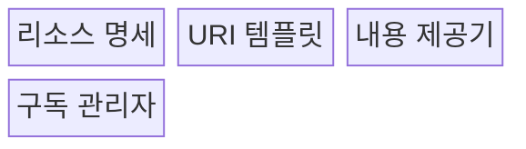
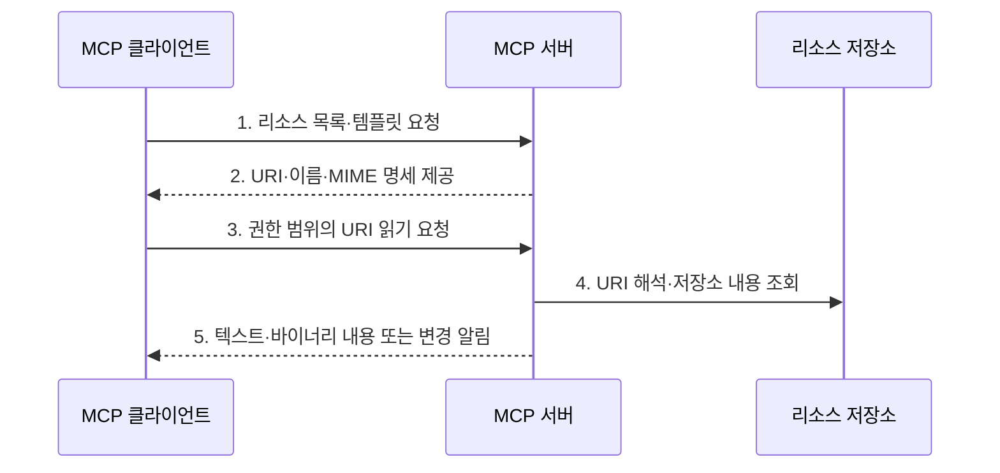

---
sidebar:
  order: 9
  label: "009. MCP Resource (모델 컨텍스트 프로토콜 리소스)"
  badge:
    text: "기출 · 30%"
    variant: note
title: "MCP Resource (모델 컨텍스트 프로토콜 리소스)"
date: "2026-07-30T11:04:43+09:00"
tags:
  - "notes-latest_tech"
weight: 9
extra:
  question_no: "009"
  source_status: "기출"
  source_history: "138회"
  priority: 30
  priority_note: "리소스 제공은 MCP 세부 구성요소"
---

## 미리 알고가기

- **모델 컨텍스트 프로토콜(Model Context Protocol, MCP)**: 호스트와 서버의 기능·컨텍스트 교환을 표준화한 프로토콜
- **통합 자원 식별자(Uniform Resource Identifier, URI)**: 리소스를 고유하게 가리키는 주소
- **MCP 리소스(MCP Resource)**: 서버가 URI를 통해 클라이언트에 제공하는 읽기 중심의 컨텍스트 데이터다.
- **URI 템플릿(URI Template)**: 변수를 사용해 여러 리소스 주소를 표현하는 규칙
- **다목적 인터넷 메일 확장(Multipurpose Internet Mail Extensions, MIME)**: 콘텐츠 형식을 식별하는 표기
- **JSON 원격 프로시저 호출(JSON Remote Procedure Call, JSON-RPC)**: 리소스 조회의 요청·응답·알림을 구조화하는 메시지 프로토콜이다.
- **리소스 구독(Resource Subscription)**: 특정 URI의 내용 변경 알림을 받는 기능

## Ⅰ. 개요

- 정의/개념: MCP 서버가 문서·파일·데이터베이스 결과 같은 읽기 중심 컨텍스트를 URI와 콘텐츠 형식으로 노출하고 호스트 애플리케이션이 선택해 조회하는 서버 기능
- 배경/필요성: 애플리케이션별 파일·데이터 연동은 탐색·식별·조회·변경 통지 방식이 달라 컨텍스트 제공 기능을 재사용하기 곤란

### 쉽게 이해하기 (학습용)
- 자료의 주소표를 통해 필요한 내용을 골라 읽는 기능임

## Ⅱ. 특징

- 애플리케이션 제어 방식으로 호스트가 리소스의 조회와 모델 문맥 포함 여부를 결정
- URI 목록·URI 템플릿·읽기 요청으로 정적·매개변수형 컨텍스트 데이터를 식별
- 협상된 listChanged·subscribe 기능으로 목록 또는 특정 리소스의 변경을 알림

### 쉽게 이해하기 (학습용)
- 주소와 형식을 알려 주면 호스트가 필요한 자료를 골라 읽고 변경도 알림받음

## Ⅲ. 구조 및 구성요소

| 구성요소 | 책임 |
|:---|:---|
| 리소스 명세 | URI·이름·설명·MIME 정보를 제공 |
| URI 템플릿 | 변수형 URI로 리소스 범위를 표현 |
| 내용 제공기 | URI에 해당하는 텍스트·바이너리를 반환 |
| 구독 관리자 | URI 변경 감지와 알림을 관리 |

### 쉽게 이해하기 (학습용)
- 주소표와 내용 창고가 연결되고 변경 감시자가 새 소식을 알림

## Ⅳ. 흐름도

### 동작 원리

1. **리소스 목록·템플릿 요청**: 사용 가능한 고정·매개변수형 URI를 탐색
2. **URI·이름·MIME 명세 제공**: 리소스의 식별자와 설명 및 콘텐츠 형식 수신
3. **권한 범위의 URI 읽기 요청**: 호스트가 선택한 리소스의 최신 내용 요청
4. **URI 해석·저장소 내용 조회**: 서버가 요청 주체·테넌트를 검증하고 원천 데이터 검색
5. **텍스트·바이너리 내용 또는 변경 알림**: 콘텐츠를 반환하거나 구독된 URI의 재조회 필요성을 통지

### 쉽게 이해하기 (학습용)
- 자료 주소를 읽은 뒤 바뀌었다는 소식이 오면 최신 내용을 다시 가져옴

## Ⅴ. 종류 및 비교

| 비교 기준 | Resource | Tool | Prompt |
|:---|:---|:---|:---|
| 적용 기준 | 문맥 데이터를 제공할 때 | 외부 기능을 실행할 때 | 사용자용 작업 틀을 제공할 때 |
| 핵심 특징 | 앱 제어·URI 조회 | 모델 제어·스키마 호출 | 사용자 제어·메시지 생성 |
| 한계 | 직접 행동 수행 불가 | 부작용·권한 위험 | 사용자 선택·입력 필요 |

### 쉽게 이해하기 (학습용)
- 리소스는 자료를 읽고 도구는 일을 실행하므로 사용 목적이 다름

## Ⅵ. 실무 고려사항 및 대책

| 고려사항 | 대책 | 효과 |
|:---|:---|:---|
| URI 조작을 통한 범위 밖 조회 | URI 템플릿 변수와 최종 사용자·테넌트 권한을 서버에서 재검증 | 경로·테넌트 우회 방지 |
| 대용량·민감 컨텍스트 과다 제공 | 리소스를 목적별로 분할하고 최소 필드·크기·보존 정책 적용 | 모델 문맥 오염과 정보 노출 축소 |
| 빈번한 데이터 변경 | 필요한 URI만 구독하고 변경 알림 후 명시적으로 재조회 | 최신성 확보와 불필요한 트래픽 감소 |

### 쉽게 이해하기 (학습용)
- 로그 주소에 사용자 범위를 넣어 다른 팀 자료가 섞이지 않게 읽음

## Ⅶ. 결론

- 외부 데이터를 모델 행동 없이 읽기 문맥으로 제공해야 하면 MCP 리소스를 선택하고, URI·MIME·테넌트 권한을 검증하며 최신성이 필요한 항목만 구독

### 쉽게 이해하기 (학습용)
- 민감한 자료는 좁게 공개하고 자주 바뀌는 자료만 변경 알림을 켬
