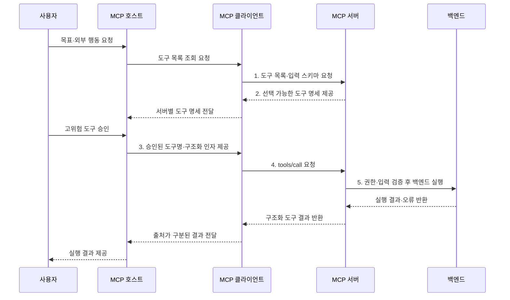

---
sidebar:
  order: 10
  label: "010. MCP Tool (모델 컨텍스트 프로토콜 도구)"
  badge:
    text: "기출 · 30%"
    variant: note
title: "MCP Tool (모델 컨텍스트 프로토콜 도구)"
date: "2026-07-31T08:42:25+09:00"
tags:
  - "notes-latest_tech"
weight: 10
extra:
  question_no: "010"
  source_status: "기출"
  source_history: "138회"
  priority: 30
  priority_note: "도구 노출은 MCP 실행 구조의 핵심"
---

## 미리 알고가기

- **모델 컨텍스트 프로토콜(Model Context Protocol, MCP)**: 호스트와 서버의 기능·컨텍스트 교환을 표준화한 프로토콜
- **대규모 언어 모델(Large Language Model, LLM)**: 문맥과 도구 명세를 바탕으로 호출할 도구와 인자를 생성하는 모델이다.
- **JSON(JavaScript Object Notation)**: 도구명과 호출 인자를 구조화하는 데이터 형식이다.
- **JSON 스키마(JSON Schema)**: 도구 입력·출력 구조와 자료형·필수 필드를 정의하는 규격
- **부작용(Side Effect)**: 도구 실행으로 외부 시스템의 데이터나 상태가 바뀌는 현상
- **인간 개입(Human-in-the-Loop, HITL)**: 고위험 호출을 사람이 검토·승인하는 통제
- **프롬프트 주입(Prompt Injection)**: 비신뢰 콘텐츠의 악성 지시로 도구 호출을 유도하는 공격

## Ⅰ. 개요

- 정의/개념: 구조화 명세로 외부 행동을 실행하는 **MCP 도구 기능**
- 배경/필요성: 함수별 인자·권한 계약 차이로 **LLM의 일관된 행동 호출 곤란**

### 쉽게 이해하기 (학습용)
- AI가 설명서를 보고 필요한 기계를 호출하는 기능임

## Ⅱ. 특징

- **선택 축**: LLM이 목표·문맥에 맞는 도구·인자 제안
- **계약 축**: tools/list·tools/call·JSON 스키마 표준화
- **통제 축**: 호스트 동의·서버 재검증으로 부작용 통제

### 쉽게 이해하기 (학습용)
- 도구 설명서를 보고 호출하지만 위험한 일은 서버와 사람이 한 번 더 확인함

## Ⅲ. 구조 및 구성요소

| 구성요소 | 책임 |
|:---|:---|
| 도구 명세 | **이름·설명·JSON 스키마** 제공 |
| 입력 검증기 | **인자 구조·값 유효성** 검사 |
| 정책 집행기 | **권한·동의·부작용 정책** 적용 |
| 실행기 | 허용된 **백엔드 도구** 실행 |
| 결과 처리기 | **구조화 콘텐츠·오류** 반환 |

### 쉽게 이해하기 (학습용)
- 설명서와 검사 담당자를 거쳐 허용된 명령만 실행하고 결과를 돌려줌

## Ⅳ. 흐름도

1. **도구 목록·입력 스키마 요청**: 사용 가능한 행동·인자 계약 탐색
2. **선택 가능한 도구 명세 제공**: 허용 기능의 명세 반환
3. **승인된 도구명·구조화 인자 제공**: 모델 제안·HITL 결과 전달
4. **tools/call 요청**: 도구명과 JSON 구조화 인자 전송
5. **권한·입력 검증 후 백엔드 실행**: 허용된 행동만 수행

### 쉽게 이해하기 (학습용)
- AI가 도구를 고르면 사람이 승인하고 서버가 검사한 뒤 실행함

## Ⅴ. 종류 및 비교

| 비교 기준 | Resource | Tool | Prompt |
|:---|:---|:---|:---|
| 적용 기준 | **문맥 데이터 제공** | **외부 기능 실행** | **사용자 작업 틀 제공** |
| 핵심 특징 | 앱 제어·**URI 조회** | 모델 제어·**스키마 호출** | 사용자 제어·**메시지 생성** |
| 한계 | **직접 행동 수행 불가** | **부작용·권한 위험** | **사용자 선택·입력 필요** |

> 요약: **Resource**는 문맥 조회, **Tool**은 행동, **Prompt**는 작업 틀

### 쉽게 이해하기 (학습용)
- 도구는 일을 시키고 리소스는 필요한 자료를 읽는 기능임

## Ⅵ. 실무 고려사항 및 대책

| 고려사항 | 대책 | 효과 |
|:---|:---|:---|
| 과도한 도구 호출로 **행동 범위 확대** | **허용 목록·최소권한** 적용 | 모델 행동 범위 제한 |
| 프롬프트 주입으로 **무단 상태 변경** | 비신뢰 명령 분리·**HITL 승인** | 간접 권한 상승 방지 |
| 대상·인자 오류로 **잘못된 부작용** | **현재 상태·업무 규칙** 재검증 | 오실행·책임 공백 축소 |

### 쉽게 이해하기 (학습용)
- 서버를 다시 켜는 명령은 대상을 확인하고 사람 허락 뒤 실행함

## Ⅶ. 결론

- 외부 행동은 **MCP Tool**, 읽기 문맥은 **Resource** 선택

### 쉽게 이해하기 (학습용)
- 위험한 도구일수록 권한을 좁히고 사람 확인을 거침
